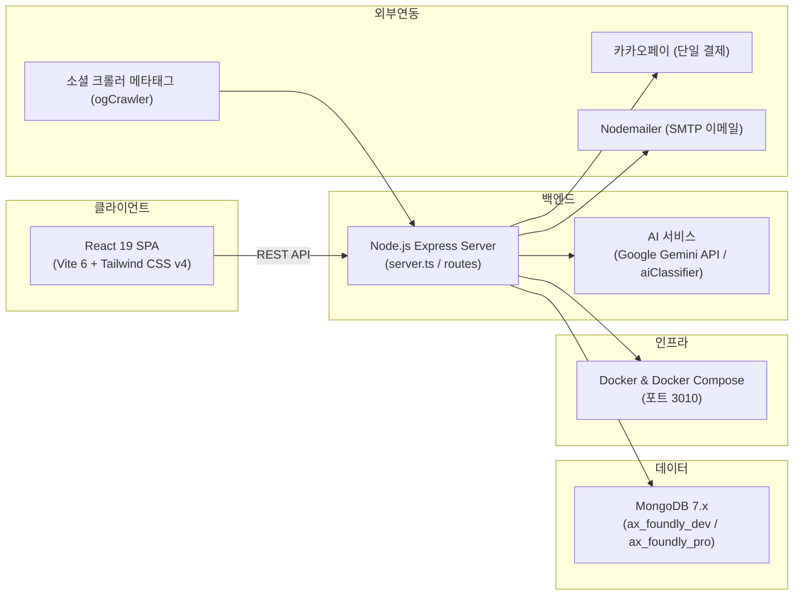

# 00. 프로젝트 개요

> 문서 상태: ❓ 인터뷰 진행 중
> 이 문서가 가장 먼저 작성되어야 한다. 뒤 문서들의 추천 기준이 된다.
> 업무 정의: `docs/bizs/biz_flows.md` 참조

## 1. 기본 정보

### 프로젝트명
- 상태: ✅ 결정
- 결정: 「AI로 창업하라」 — 창업 교육~투자 유치 올인원 플랫폼
- 결정일: 2026-08-11

### 한 줄 소개
- 상태: ✅ 결정
- 결정: 창업 교육부터 팀 빌딩, 투자 유치까지 창업의 전 주기를 하나의 플랫폼에서 연결하는 AI 기반 올인원 서비스
- 결정일: 2026-08-11

### 배경 / 만들려는 이유
- 상태: ✅ 결정
- 결정: 기존 플랫폼들은 교육(클래스101), 구인구직/팀빌딩(원티드), 투자(크라우디)가 각각 파편화되어 있어 창업자가 다음 단계로 넘어갈 때 이탈률이 높다. 「AI로 창업하라」는 교육을 수료한 인재가 자연스럽게 프로젝트를 발제하고, 이를 지켜보던 투자자가 즉각 컨택할 수 있는 '올인원 파이프라인'을 제공하여 강력한 록인(Lock-in) 효과를 만든다.
- 결정일: 2026-08-11

## 2. 목표

### 최종 산출 목표
- 상태: ✅ 결정
- 선택지: 개인 사용 도구 / 포트폴리오 / 사이드 프로젝트(수익화) / SaaS 서비스 / 사내 시스템
- 결정: SaaS 서비스 (창업 교육, 팀 빌딩, IR 투자 연계 올인원 플랫폼)
- 이유: 교육 수료생의 창업 및 팀빌딩, 초기 IR 피칭 및 투자자 매칭까지 하나의 생태계에서 원스톱으로 지원
- 결정일: 2026-08-20

### 성공 지표 (측정 가능한 숫자로)
- 상태: ✅ 결정
- 결정: 활성 강의 수, 수강생 완강률, 팀빌딩 성사율, IR 프로젝트 등록 및 투자 제안 매칭율
- 결정일: 2026-08-20

## 3. 범위

### 포함 범위 (이번에 만드는 것)
- 상태: ✅ 결정 (biz_flows.md 기반)
- 결정:
  - **교육(Edu)**: 강의 공고·모집, 수강생 정보·메시지 관리, 녹화 강의 링크·공지, 통합 결제/정산 시스템, 수강생 개강 요청소
  - **협업(Team)**: 프로젝트 제안 공고·협의 관리, AI 기반 팀빌딩 매칭, 창업 포트폴리오 빌더, 아이디어 제작 의뢰소
  - **투자(Funding)**: 창업 회사 광고·투자 유치 공고, 투자자 제안·유치 유도, IR 덱 및 비즈니스 모델 등록
  - **공통**: 유연한 멀티 게시판 시스템, 수강생 CRM·알림 센터, 회원 관리 및 관리자 대시보드
- 결정일: 2026-08-11

### 제외 범위 (이번에 만들지 않는 것)
- 상태: ✅ 결정
- 결정: 직접적인 에스크로 펀딩 예치금 수탁(실제 투자 집행은 외부 오프라인/기관 연계로 진행, 플랫폼은 제안/미팅 매칭 중심)
- 결정일: 2026-08-20

### 개발 단계 (biz_flows.md 로드맵)
- 상태: ✅ 결정
- 결정:
  1. **1단계**: 기획 및 모던 UI 프로토타이핑 — React & Tailwind v4 기반 프론트 설계 (강사/수강생/투자자 통합 워크스페이스)
  2. **2단계**: 독립형 백엔드 구축 및 DB 설계 — Node.js Express RESTful API + MongoDB 컬렉션 모델
  3. **3단계**: 알림 자동화·결제 모듈 연동 — 인앱/이메일(Nodemailer)/알림톡 템플릿 + 카카오페이 단일 결제 연동
  4. **4단계**: AI 매칭 고도화·배포 — Google Gemini API 연동 자동 태깅/분류/초안 생성 + Docker 컨테이너 배포
- 결정일: 2026-08-11

## 4. 사용자 정의

### 주 사용자 / 대상
- 상태: ✅ 결정
- 결정:
  - **예비 창업자(수강생)**: AI 툴을 활용해 MVP를 빠르게 만들고 창업하려는 직장인, 대학생, 예비 대표
  - **강사/전문가(멘토)**: AI 툴 활용법·비즈니스 모델링 교육, 수강생 중 우수 인재 발굴
  - **투자자(VC/엔젤)**: 극초기 유망 AI 기반 스타트업을 미리 발견하고 선점
- 결정일: 2026-08-11

### 예상 사용자 규모 (동시 접속 등)
- 상태: ✅ 결정
- 결정: 초기 단계 수천 명 규모(동시 접속 200~500명), 추후 클러스터링 확장
- 결정일: 2026-08-20

### 핵심 유저 스토리
- 상태: ✅ 결정
- 결정: ("[사용자]로서, [목적]을 위해, [행동]을 한다" 형식)
  1. 수강생으로서, AI 활용 창업 역량을 키우기 위해, 강의를 검색하고 수강 신청·결제한다
  2. 수강생으로서, 창업 팀을 구성하기 위해, 프로젝트를 발제하고 AI 매칭으로 팀원을 찾는다
  3. 수강생으로서, 투자를 유치하기 위해, IR 덱을 게시하고 투자자의 미팅 제안을 받는다
  4. 강사로서, 수강생을 모집하고 수익을 얻기 위해, 강의를 등록하고 결제·정산을 관리한다
  5. 강사로서, 수강생의 학습을 관리하기 위해, 진도율과 과제를 확인한다
  6. 투자자로서, 유망한 스타트업을 조기 발굴하기 위해, AI 추천 기반으로 프로젝트를 탐색한다
  7. 투자자로서, 창업팀과 소통하기 위해, 미팅을 제안하고 피드백을 남긴다
- 결정일: 2026-08-11

## 5. 개발 형태

### 개발 인원
- 상태: ✅ 결정
- 선택지: 혼자 / 협업 (인원수, 역할 분담 기재)
- 결정: 1인 개발 + AI 에이전트 페어 프로그래밍 (풀스택)
- 결정일: 2026-08-20

### 목표 일정 (대략)
- 상태: ✅ 결정
- 결정: MVP 구축 및 E2E 검증 완료 후 안정화 및 고도화 단계
- 결정일: 2026-08-20

## 6. 시스템 구성도 (블루프린트)

- 상태: ✅ 결정
- 결정:

- 결정일: 2026-09-06
