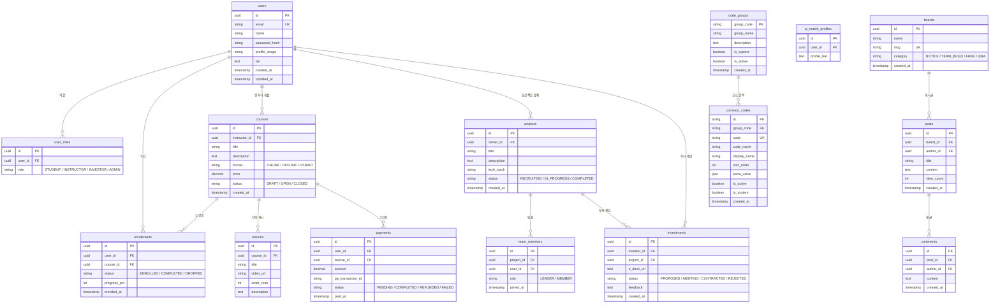

# 04. 데이터베이스 설계

> 문서 상태: ✅ 결정 완료
> MongoDB 7.5 기반 컬렉션 모델 및 스키마 명세

## 1. 기본 규칙

### DBMS / 버전
- 상태: ✅ 결정
- 선택지 예: PostgreSQL 17 / PostgreSQL 16 / MySQL 8.4 / MongoDB 8
- 결정: MongoDB 7.5.x (공식 드라이버 `mongodb: ^7.5.0`)
- 데이터베이스명: 개발 `ax_foundly_dev` / 운영 `ax_foundly_pro`
- 결정일: 2026-08-24

### ORM / 데이터 접근 방식
- 상태: ✅ 결정
- 결정: MongoDB Native Driver (`MongoClient`, `Db`, `Collection<T>`) + TypeScript 인터페이스(`DatabaseSchema`)
- 이유: 고성능 BSON 직렬화 및 유연한 문서 모델링, 중첩 서브도큐먼트(커리큘럼, 팀원배열 등) 직접 저장
- 결정일: 2026-08-24

### 마이그레이션 도구
- 상태: ✅ 결정
- 결정: 서버 부트스트랩 시 `server/db.ts` 내장 자동 마이그레이션 (AI 태그/요약 누락분 자동 백그라운드 인리치먼트 등)
- 결정일: 2026-08-24

## 2. 네이밍 및 공통 규칙

### 네이밍 규칙
- 컬렉션명: `camelCase` 복수형 (예: `courses`, `irProjects`, `ideaRequests`, `commonCodes`)
- 필드명: `camelCase`
- 공통 코드 그룹: 대문자 `SNAKE_CASE` (예: `COURSE_CATEGORY`, `IR_FIELD`)

### 공통 필드
- 고유 식별자: `id` (문자열)
- 생성/수정일시: `createdAt` (ISO 8601 UTC 문자열), `updatedAt` (선택적)

### ID 전략
- 상태: ✅ 결정
- 결정: 도메인 식별자 (순수 8자리 Base62 또는 접두사+식별자, `idGenerator.ts`)
- 결정일: 2026-08-24

### 트랜잭션 / 동시성 방침
- 상태: ✅ 결정
- 결정: 카카오페이 결제 승인 및 세션 매칭 시 개별 문서 Atomic 연산 적용
- 결정일: 2026-08-24

## 3. ERD 구조도 (산출물 — 개발하며 갱신)

> biz_flows.md 기반 초안. 테이블 추가/변경 시 이 다이어그램을 같은 작업 안에서 갱신한다.

## 4. 테이블 정의서 (산출물 — 개발하며 갱신)

### 테이블 목록 (설계 초안)

| 테이블명 | 모듈 | 설명 | 상태 |
|---|---|---|---|
| `code_groups` | common | 공통 코드 그룹 헤더 | ✅ |
| `common_codes` | common | 상세 공통 코드 항목 | ✅ |
| `users` | auth | 사용자 기본 정보 | 📝 |
| `user_roles` | auth | 역할 (다중 역할 허용) | 📝 |
| `courses` | course | 강의 정보 | 📝 |
| `lessons` | course | 강의 차시 (VOD 링크 포함) | 📝 |
| `enrollments` | course | 수강 등록·진도율 | 📝 |
| `payments` | payment | 결제 이력 | 📝 |
| `settlements` | payment | 강사 정산 이력 | 📝 |
| `projects` | team | 프로젝트(팀빌딩) | 📝 |
| `team_members` | team | 팀 구성원 | 📝 |
| `investments` | investment | 투자 제안·IR | 📝 |
| `boards` | board | 게시판 정의 | 📝 |
| `posts` | board | 게시글 | 📝 |
| `comments` | board | 댓글 | 📝 |
| `course_requests` | reverse-course | 수강생 개강 요청소 | ✅ |
| `course_proposals` | reverse-course | 강사 개강 역제안서 | ✅ |
| `idea_requests` | reverse-ir | 아이디어 제작 의뢰소 | ✅ |
| `idea_proposals` | reverse-ir | 빌더 팀 MVP 제작 역제안서 | ✅ |
| `notifications` | notification | 알림 이력 (카카오·이메일) | 📝 |
| `ai_match_profiles` | ai | AI 매칭용 임베딩 프로필 | 📝 |

### 테이블 상세 템플릿

> 새 테이블 추가 시 3장 다이어그램에 블록을 추가하고, 위 목록 표에 한 줄을 추가한다.

| 필드명 | 타입 | 필수 | 기본값 | 인덱스 | 설명 |
|---|---|---|---|---|---|
| id | UUID / String | YES | gen_random_uuid() | PK | |
| created_at | TIMESTAMPTZ / String | YES | now() | | 생성일시 |
| updated_at | TIMESTAMPTZ / String | YES | now() | | 수정일시 |
