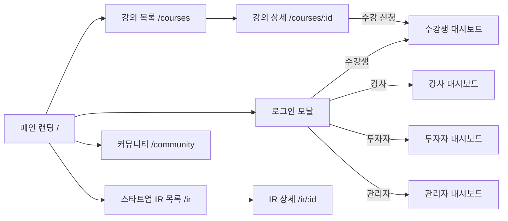

# 11. 화면 설계서

> 문서 상태: 산출물 문서 (개발하며 갱신)  
> **규칙**: 새 화면을 구현하기 전에 반드시 여기에 설계를 먼저 작성하고 사용자 확인을 받은 후 구현한다.  
> 대상: 반응형 웹.

## 1. 화면 목록

> 상태: 📝 설계 / 🔄 개발중 / ✅ 완료 / 🗑 폐기

| ID | 화면명 | 경로(URL) | 접근 권한 | 상태 | 주요 UX 컴포넌트 |
|---|---|---|---|---|---|
| SCR-001 | 메인 랜딩 | `/` | 전체 | ✅ | 히어로 배너, 진행 강의 슬라이더, 우수 스타트업, 최근 공지 |
| SCR-002 | 로그인/회원가입 모달 | `/login`, `/signup` | 비로그인 | ✅ | 역할별(수강생/강사/투자자/관리자) 원클릭 전환 모달 |
| SCR-003 | 강의 목록 | `/courses` | 전체 | ✅ | 실시간 검색어 입력, 카테고리 필터, 강의 일정 표시, 페이지네이션 |
| SCR-004 | 강의 상세 | `/courses/:id` | 전체 | ✅ | 회차별 일시 커리큘럼, 강의 달력 수강 신청, 강사 모달(진행강의/리뷰), 강사 인포그래픽 카드 |
| SCR-005 | 수강생 대시보드 | `/dashboard/student` | 수강생 | ✅ | 수강 강의(일정/진도), 결제 내역, 프로젝트/팀빌딩, 강사 메시지/알림함 |
| SCR-006 | 강사 대시보드 | `/dashboard/instructor` | 강사 | ✅ | AI 채팅 초벌 생성 모달, 징검다리 요일/시간 달력 연동 설정, 수강생 타깃 CRM 메시지 |
| SCR-007 | 투자자 대시보드 | `/dashboard/investor` | 투자자 | ✅ | 관심 스타트업(북마크), AI 추천 매칭(스코어), 투자 제안/미팅 관리 |
| SCR-008 | 스타트업 / IR 목록 | `/ir` | 전체 | ✅ | 검색어 입력, 분야 필터, 페이지네이션, 투자 단계 배지, 아이디어 제작 의뢰 AI 대화형 마법사(2단계) |
| SCR-009 | 스타트업 / IR 상세 | `/ir/:id` | 전체 | ✅ | 실명/비실명(스텔스) 토글, 원클릭 채용 마감/재개 토글 & 공고 이력 보존, 구인 옵션/지원 링크 전환, 데모 영상 임베드, 투자 제안 |
| SCR-010 | 커뮤니티 (멀티 게시판) | `/community` | 전체/회원 | ✅ | 검색어 필터, 게시판 분류(공지/팀빌딩/QnA), 글쓰기 모달, 페이지네이션 |
| SCR-011 | 관리자 대시보드 | `/admin` | 관리자 | ✅ | 지표 통계, 회원 관리(권한 변경), 강의 검수 승인, 멀티 게시판 생성기 |

## 2. 화면 흐름도

## 3. 핵심 UX 기능 명세

### 3.1. 강의 달력 연계, 진행 방식 선택 & 커리큘럼 일정 자유 수정
- **진행 방식 선택**: VOD 동영상, 실시간 온라인(Zoom/Meet), 현장 오프라인(주소 입력), 온·오프라인 혼합 4가지 유형 중 선택.
- **커리큘럼 자유 편집**: 회차 추가, 개별 삭제, 순서 이동(위/아래) 및 각 회차별 캘린더 날짜 피커(`input type="date"`)를 통해 회차별 강의일을 자유롭게 개별 지정.
- **수강생 탐색 단계**: 강의 상세 화면 및 목록 카드에서 진행 방식 뱃지, 오프라인 장소 및 인터랙티브 달력 위젯에서 회차별 일정을 시각적으로 탐색하고 즉시 수강 신청.

### 3.2. 강사 권한 강화 & 수강생 관리 (수료 승인 · 직권 환불)
- **수료 완료 승인**: 강사가 수강생 관리(CRM) 탭에서 `[🎓 수료 완료]` 클릭 시 진도율 100% 반영 및 공식 수료증 발급 알림 발송.
- **강사 직권 환불**: 강사가 `[💸 직권 환불]` 클릭 시 환불 사유 입력 모달을 거쳐 즉시 결제 상태가 '환불'로 변경되고 수강생의 수강 권한이 안전하게 취소됨.
- **수강생 CRM 필터 & 타깃 메시징**: 전체, 수강 중, 진도율 50% 미만(미달자), 우수 수강생(80%+), 수료 완료, 환불 취소자 필터링 및 인앱/이메일/알림톡 발송.

### 3.3. 강사 프로필 모달 & 인포그래픽 카드
- **강사 모달**: 강사 클릭 시 과거 진행한 전체 강의 이력과 전체 수강생 리뷰를 팝업으로 제공.
- **인포그래픽**: 경력, 수강생 수, 만족도(98%), 핵심 키워드, 공식 인증 마크를 수강 카드 하단에 시각화.

### 3.4. IR 구인 옵션, 실명/비실명 전환 및 프로토타입/데모 영상 연동
- **구인 공고**: 역할, 형태, 지분, 스킬 및 원클릭 자체 지원 vs 외부 링크 지원 방식 토글. 포지션 입력 시 `hiringDetails` 자동 생성으로 채용 안내 섹션 완벽 렌더링.
- **팀 소개**: 스텔스 창업팀 프라이버시 보호를 위한 비실명 닉네임 모드 지원.
- **서비스 동작 및 피칭 영상**: 고정 Rickroll iframe 대신 YouTube, Vimeo, Loom URL을 `https://www.youtube-nocookie.com/embed/ID` 등 정식 플레이어 임베드 포맷으로 자동 변환하여 재생.
- **프로토타입 방문 버튼**: 영상 섹션 헤더 우측에 `[프로토타입 / 배포 사이트 방문]` 버튼을 배치하여 사용자가 실작동 웹/앱으로 바로 랜딩.
- **'나도 쓸래요!' 투표**: 스타트업 IR 탐색 카드에 '나도 쓸래요' 버튼 및 카운트 배지를 배치하여 사용자 반응을 즉시 수집.

### 3.5. 전사 마스터-디테일 스플릿 뷰 표준 (Master-Detail Split View Standard)
- **적용 대상**: 커뮤니티 멀티 게시판(`/community`), 관리자 8대 관리 탭(`/admin` - 통계/회원/강의/스타트업&IR/자연어분야/게시판/결제/CRM), 마이페이지 결제 및 알림(`/mypage` - 결제영수증/알림함).
- **무깜박힘 반응형 분할**: 리스트 행 클릭 시 DOM 언마운트 없이 메타 컬럼(`w-56/w-64` ↔ `w-0 opacity-0`)이 부드럽게 축소되고, 좌측 목록이 50~55% 폭으로 줄어들며 우측에 상세 카드 패널이 슬라이드 인(`animate-slideInFromRight`).
- **상세 탐색 & 단축키**: 상세 카드가 열린 상태에서 다른 행 클릭 시 깜박임 없는 인라인 전환, `ESC` 키 입력 시 닫기 및 100% 폭 복원.

### 3.6. 마이페이지 6대 통합 워크스페이스 & 역제안 관리
- **마이 홈 (`/mypage?tab=overview`)**: 퀵 액션(`[💡 새 아이디어 의뢰 (AI PRD)]`, `[🚀 새 프로젝트 등록]`, `[🎓 새 강의 개설]`), 진행 중 강의/스타트업 카드, '내 스타트업 워크스페이스' 최근 5개 프로젝트 요약 및 `전체보기 →` 네비게이션.
- **내 강의실 (`/mypage?tab=courses`)**: 수강 중/수료 강의 진도 관리 + '개강 요청 건' 탭(키워드 실시간 검색 및 페이지네이션 제공, 접수된 강사 역제안서 `CourseProposal` 목록 열람).
- **내 스타트업 (`/mypage?tab=startup`)**: 내 IR 프로젝트, 팀빌딩 지원, 투자 미팅 제안 + '의뢰한 아이디어' 탭(키워드 실시간 검색 및 페이지네이션 제공, 빌더 역제안 `IdeaProposal` 목록 열람, `선발(협의중)` 및 `최종 수락(정식 IR 승격)` 인터랙션).
- **강의 개설 & 운영 (`/mypage?tab=instructor`)**: 내 강의 목록, 수강생 CRM, 정산 관리 + '수요 있는 개강 요청 탐색' 탭(키워드 실시간 검색 및 페이지네이션 제공, 수강생 희망 주제 탐색 & 원클릭 AI 제안서 생성) + 강의 개설/수정 모달(전체 회차 일괄 지정 버튼 및 각 회차별 온/오프/VOD 진행 방식 자유 설정).
- **관심 스타트업 & 투자 (`/mypage?tab=investor`)**: 북마크 스타트업, AI 매칭 추천, 투자 제안 현황.
- **결제 및 계정 설정 (`/mypage?tab=settings`)**: 계정 정보, 권한, 결제 영수증 2단 스플릿 뷰, 알림함(스마트 딥링크 CTA 연동), **알림 수신 & 스팸 방지 설정 센터**(카테고리별 채널 On/Off, 야간 방해금지 시간대, 30일 Snooze, 이메일 미리보기).

### 3.8. 알림 수신 및 스팸 방지 센터 (Notification Preference & Inflow Center)
- **카테고리별 개별 채널 제어**: 강의/학습, 팀빌딩, 투자/IR, 커뮤니티, 위클리 다이제스트, 마케팅별 인앱/이메일/알림톡 개별 스위치 제공.
- **🌙 야간 방해금지 시간대 (21:00 ~ 08:00)**: 활성화 시 심야 외부 발송을 자동 제한하고 인앱에만 적재하며 익일 아침 요약 알림으로 전달.
- **⏸️ 30일 알림 일시 중지 (Snooze)**: 수신거부/탈퇴 방지를 위한 30일간 알림 임시 중단 및 원클릭 복귀.
- **스마트 딥링크 (Smart Deep Link)**: 알림 클릭 시 해당 강의실/제안서 모달/댓글 위치로 즉시 랜딩되는 원클릭 CTA 버튼.
- **✉️ 이메일 미리보기 모달**: 반응형 HTML 이메일 템플릿 실시간 렌더러 (호기심 갭 후킹 문구 + 스마트 딥링크 + RFC 8058 1-Click 수신거부).

### 3.7. 최고 관리자 대시보드 8대 관리 체계
- **통계 홈 (`/admin?tab=stats`)**: 핵심 지표 + AI 활용량 및 양방향 역제안 매칭률(개강 요청 매칭률, 아이디어 의뢰➔IR 승격률) KPI.
- **회원 관리 (`/admin?tab=members`)**: 
  - 용어 통일: "접근 권한"으로 명칭 일원화.
  - 회원 목록: 접근 권한을 나열식 배지(Badge) 형태의 읽기 전용으로 표시, 프로필 아바타 이미지 및 최종 접속일(`lastLogin`) 컬럼 제공.
  - 상세 패널 (2단 스플릿 뷰): 기본 정보 탭에서 접근 권한 다중 선택(체크박스), 최종 접속일 정보 확인, 회원 직권 강제 탈퇴(사유 입력 및 확인 모달 연동) 및 교육/IR/의뢰/제안 활동 이력 조회.
- **Google 회원 프로필 이미지 연동**: Google OAuth 로그인 성공 시마다 최신 프로필 사진 URL(`picture`)을 취득하여 회원 도큐먼트에 실시간 갱신 저장하고 GNB 및 대시보드 전반에 렌더링.
- **강의 검수 & 승인 (`/admin?tab=courses`)**: 신규 강의 및 개강 요청/강사 제안 커리큘럼 검수 및 승인/반려.
- **스타트업 & IR 관리 (`/admin?tab=startup`)**: 전체 IR 프로젝트, 스텔스(비실명) 모드, 구인 공고, 아이디어 의뢰 2단 스플릿 뷰 검수 및 상태 변경.
- **자연어 분야 인사이트 (`/admin?tab=categories`)**: AI 및 사용자가 실시간 생성한 자연어 산업/분야 빈도 순위 분석 및 프론트엔드 추천 칩 매핑 도구.
- **게시판 관리 (`/admin?tab=boards`)**: 멀티 게시판 생성/수정/삭제.
- **결제 관리 (`/admin?tab=payments`)**: 실시간 결제 영수증 2단 스플릿 뷰 및 결제 취소/환불.
- **알림/마케팅 CRM (`/admin?tab=crm`)**: 전체 공지 및 타깃 CRM 메시지 발송.

### 3.8. 공통 하단 푸터 (Common Footer)
- **한 줄 레이아웃**: 전사 화면 하단에 일관된 1줄 형태의 다크 테마 바(`bg-[#05111f]/95`)로 배치.
- **사업자 정보**: 상호명(렉토메이트 LectoMate), 대표자(오상훈), 사업자등록번호(634-62-00683), 문의 이메일(`mahau.master@gmail.com`).
- **정책 참조 링크**:
  - 회사소개: `https://www.lectomate.com/policy/company`
  - 이용약관: `https://www.lectomate.com/policy/terms`
  - 개인정보처리방침: `https://www.lectomate.com/policy/privacy`

### 3.9. 아이디어 제작 의뢰 AI 대화형 마법사 (2-Step Idea Request Wizard)
- **1단계 (AI 채팅 초벌)**: 자연어 대화로 일상적인 아이디어 및 페인포인트를 입력하면 AI가 다중 턴 인터뷰(3~4질문)를 거쳐 완성도 높은 PRD 초안(프로젝트명, 카테고리, 페인포인트, 솔루션 요약, 추천 태그, 보상 조건)을 기획하고 프리뷰 카드로 렌더링. 탈옥 방지 가드레일 적용 및 'Mind:' 접두사 차단.
- **2단계 (상세 의뢰서 작성)**: 초안을 원클릭으로 폼에 적용하거나 직접 작성 모드로 전환. 불필요한 포지션 선택 및 카테고리 예제 탭을 제거하여 마감일/선발발표일/보상 형태 등 핵심 의뢰 정보에 집중. 한글 IME 중복 엔터 방어 및 Shift+Enter 개행 지원.
- **초기화 보장**: 모달 재오픈 시 이전 세션 대화 및 입력 상태를 완전 초기화하여 매번 새로운 아이디어 기획 가능.

### 3.10. 스타트업 IR & 아이디어 제작 의뢰서 작성자/관리자 수정·삭제 거버넌스
- **작성자 전용 액션**: 스타트업 IR 상세 뷰 타이틀 우측에 `[수정]`, `[삭제]` 버튼 배치, 아이디어 상세 슬라이드인 패널 헤더에 `[삭제]` 버튼 배치.
- **마이페이지 연동**: `내 스타트업` 탭의 IR 프로젝트 카드에 `[수정]`, `[삭제]` 버튼 연동, `의뢰한 아이디어` 탭에 `[삭제]` 버튼 연동 및 실시간 목록 제거.
- **최고 관리자 검수 패널**: `스타트업 & IR 관리` 탭 2단 스플릿 뷰에서 비정상 프로젝트 또는 아이디어 의뢰 건에 대해 `[영구 삭제]` 액션 지원.

