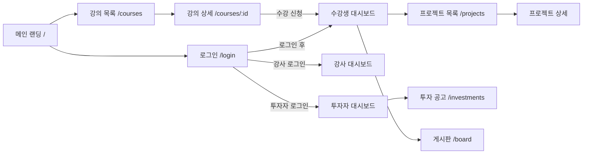

# 11. 화면 설계서

> 문서 상태: 산출물 문서 (개발하며 갱신)
> **규칙**: 새 화면을 구현하기 전에 반드시 여기에 설계를 먼저 작성하고 사용자 확인을 받은 후 구현한다.
> 대상: 반응형 웹 (03 참조). 와이어프레임 이미지: `wireframes/`

## 1. 화면 목록

> 상태: 📝 설계 / 🔄 개발중 / ✅ 완료 / 🗑 폐기
> biz_flows.md 기반 예상 화면 목록 (개발 시작 시 구체화)

| ID | 화면명 | 경로(URL) | 접근 권한 | 상태 |
|---|---|---|---|---|
| SCR-001 | 메인 랜딩 | `/` | 전체 | 📝 |
| SCR-002 | 로그인/회원가입 | `/login`, `/signup` | 비로그인 | 📝 |
| SCR-003 | 강의 목록 | `/courses` | 전체 | 📝 |
| SCR-004 | 강의 상세 | `/courses/:id` | 전체 | 📝 |
| SCR-005 | 수강생 대시보드 | `/dashboard/student` | 수강생 | 📝 |
| SCR-006 | 강사 대시보드 | `/dashboard/instructor` | 강사 | 📝 |
| SCR-007 | 투자자 대시보드 | `/dashboard/investor` | 투자자 | 📝 |
| SCR-008 | 프로젝트(팀빌딩) 목록 | `/projects` | 로그인 | 📝 |
| SCR-009 | 프로젝트 상세 | `/projects/:id` | 로그인 | 📝 |
| SCR-010 | 투자 유치 공고 | `/investments` | 로그인 | 📝 |
| SCR-011 | 게시판 | `/board/:boardId` | 로그인 | 📝 |
| SCR-012 | 강의 등록/관리 (강사) | `/instructor/courses` | 강사 | 📝 |
| SCR-013 | 정산 관리 (강사) | `/instructor/settlements` | 강사 | 📝 |

## 2. 화면 흐름도

## 3. 화면 상세 설계

> 개발 시작 시 화면별 상세를 아래 템플릿으로 추가한다.

---

### 템플릿 (새 화면 추가 시 복사)

### SCR-XXX. (화면명)

- **경로**: `/...`
- **목적**:
- **진입 경로**:
- **접근 권한**:
- **상태**: 📝 설계

#### 와이어프레임

> 이미지: `wireframes/scr_xxx_name.svg`

#### 구성 요소

| 요소 | 종류 | 동작 / 규칙 |
|---|---|---|
| | | |

#### 연결 API

| 시점 | API ID | 용도 |
|---|---|---|
| | | |

#### 상태별 화면
- **로딩 중**:
- **데이터 없음**:
- **에러**:

#### 비고
-
