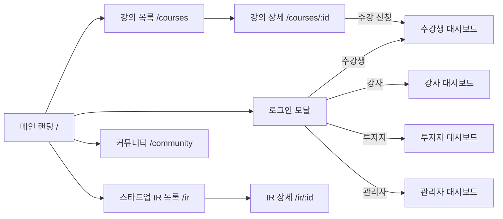

# 11. 화면 설계서

> 문서 상태: 산출물 문서 (개발하며 갱신)  
> **규칙**: 새 화면을 구현하기 전에 반드시 여기에 설계를 먼저 작성하고 사용자 확인을 받은 후 구현한다.  
> 대상: 반응형 웹.

## 1. 화면 목록

> 상태: 📝 설계 / 🔄 개발중 / ✅ 완료 / 🗑 폐기

| ID | 화면명 | 경로(URL) | 접근 권한 | 상태 | 주요 UX 컴포넌트 |
|---|---|---|---|---|---|
| SCR-001 | 메인 랜딩 | `/` | 전체 | ✅ | 히어로 배너, 진행 강의 슬라이더, 우수 스타트업, 최근 공지 |
| SCR-002 | 로그인/회원가입 모달 | `/login`, `/signup` | 비로그인 | ✅ | 역할별(수강생/강사/투자자/관리자) 원클릭 전환 모달 |
| SCR-003 | 강의 목록 | `/courses` | 전체 | ✅ | 실시간 검색어 입력, 카테고리 필터, 강의 일정 표시, 페이지네이션 |
| SCR-004 | 강의 상세 | `/courses/:id` | 전체 | ✅ | 회차별 일시 커리큘럼, 강의 달력 수강 신청, 강사 모달(진행강의/리뷰), 강사 인포그래픽 카드 |
| SCR-005 | 수강생 대시보드 | `/dashboard/student` | 수강생 | ✅ | 수강 강의(일정/진도), 결제 내역, 프로젝트/팀빌딩, 강사 메시지/알림함 |
| SCR-006 | 강사 대시보드 | `/dashboard/instructor` | 강사 | ✅ | AI 채팅 초벌 생성 모달, 징검다리 요일/시간 달력 연동 설정, 수강생 타깃 CRM 메시지 |
| SCR-007 | 투자자 대시보드 | `/dashboard/investor` | 투자자 | ✅ | 관심 스타트업(북마크), AI 추천 매칭(스코어), 투자 제안/미팅 관리 |
| SCR-008 | 스타트업 / IR 목록 | `/ir` | 전체 | ✅ | 검색어 입력, 분야 필터, 페이지네이션, 투자 단계 배지 |
| SCR-009 | 스타트업 / IR 상세 | `/ir/:id` | 전체 | ✅ | 실명/비실명(스텔스) 토글, 구인 옵션/지원 링크 전환, 데모 영상 임베드, 투자 제안 |
| SCR-010 | 커뮤니티 (멀티 게시판) | `/community` | 전체/회원 | ✅ | 검색어 필터, 게시판 분류(공지/팀빌딩/QnA), 글쓰기 모달, 페이지네이션 |
| SCR-011 | 관리자 대시보드 | `/admin` | 관리자 | ✅ | 지표 통계, 회원 관리(권한 변경), 강의 검수 승인, 멀티 게시판 생성기 |

## 2. 화면 흐름도

## 3. 핵심 UX 기능 명세

### 3.1. 강의 달력 연계 및 징검다리 일정
- **강사 등록 단계**: 시작일~종료일 범위 내에서 징검다리 요일([화, 목] 등)을 선택하고 시간대를 지정하면 세션 일정이 자동 배정됨.
- **수강생 탐색 단계**: 강의 상세 화면의 인터랙티브 달력 위젯에서 회차별 일정을 시각적으로 탐색하고 즉시 수강 신청.

### 3.2. 강사 프로필 모달 & 인포그래픽 카드
- **강사 모달**: 강사 클릭 시 과거 진행한 전체 강의 이력과 전체 수강생 리뷰를 팝업으로 제공.
- **인포그래픽**: 경력, 수강생 수, 만족도(98%), 핵심 키워드, 공식 인증 마크를 수강 카드 하단에 시각화.

### 3.3. IR 구인 옵션 및 실명/비실명 전환
- **구인 공고**: 역할, 형태, 지분, 스킬 및 원클릭 자체 지원 vs 외부 링크 지원 방식 토글.
- **팀 소개**: 스텔스 창업팀 프라이버시 보호를 위한 비실명 닉네임 모드 지원.

### 3.4. CRM 타깃 메시징
- **수강생 필터**: 전체, 진도율 50% 미만(미달자), 우수 수강생(80%+) 대상 선택 및 인앱/이메일/알림톡 발송.
