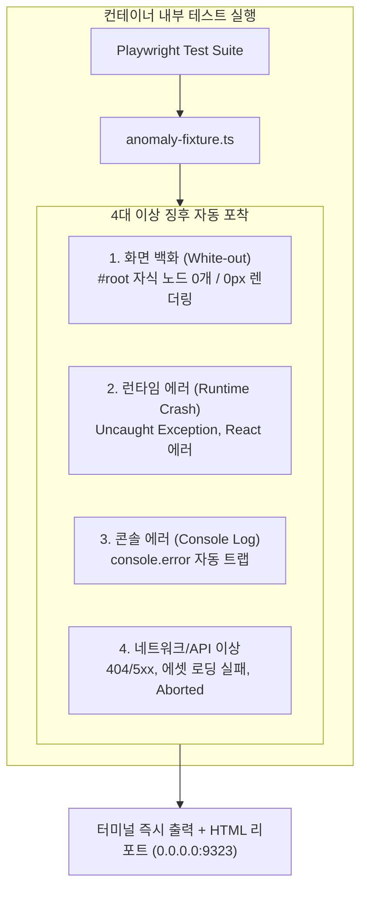

# Docker 컨테이너 내부 프론트엔드 테스트 및 이상 감지 가이드

현재 개발 환경이 이미 **Docker Container 내부**인 점을 고려하여, 외부 Docker 데몬 없이 컨테이너 내부에서 프론트엔드(HTML 렌더링, DOM 인터랙션, 백화 현상, 런타임 에러)를 즉시 테스트하고 검증하는 실무 가이드입니다.

---

## 1. Docker 컨테이너 내부 환경의 특성과 해결책

| 컨테이너 제약 사항 | 발생 가능한 문제 | 본 프로젝트 적용 해결책 |
|---|---|---|
| **`/dev/shm` 64MB 기본 제한** | 다중 Chromium 워커 실행 시 공유 메모리 부족으로 브라우저 크래시 | [`playwright.config.ts`](file:///apps/project_launch_bizs/playwright.config.ts)의 `launchOptions`에 `--disable-dev-shm-usage` 주입 |
| **Root/컨테이너 권한 제약** | Chromium 샌드박스 보안 충돌로 브라우저 실행 불가 | `launchOptions`에 `--no-sandbox`, `--disable-gpu` 설정 |
| **물리 디스플레이(GUI) 부재** | Headed 브라우저 창 또는 UI 모드 실행 불가 | 순수 Headless 모드 기본 사용 + UI 모드 필요 시 `xvfb-run` 가상 프레임버퍼 활용 |
| **포트 접근 및 호스트 바인딩** | 리포트 서버(`localhost`) 접근 시 호스트 브라우저에서 차단 | Playwright HTML Reporter를 `0.0.0.0:9323`으로 바인딩하여 호스트 브라우저에서 바로 확인 |
| **서버 중복 실행 충돌 방지** | 이미 `npm run dev`가 켜져 있을 때 테스트 웹서버 충돌 | `webServer.reuseExistingServer: true`로 기존 활성 서버 즉시 재사용 |

---

## 2. 이상 감지 체계 (Anomaly Trap Fixture)

[`tests/setup/anomaly-fixture.ts`](file:///apps/project_launch_bizs/tests/setup/anomaly-fixture.ts)는 테스트 중 발생하는 4대 이상 징후를 실시간 감지하여 테스트를 즉시 실패 처리하고 원인을 상세히 리포팅합니다:



---

## 3. 컨테이너 내부 테스트 실행 명령어

### ① 이상 감지 통합 데모 테스트 실행 (추천)
```bash
npm run test:anomaly
```

### ② 전체 E2E 테스트 스위트 실행
```bash
npm run test:e2e
```

### ③ 가상 디스플레이(Xvfb) 기반 Playwright UI 모드 실행
```bash
npm run test:e2e:ui
```

### ④ 호스트 브라우저에서 HTML 리포트 및 트레이스 확인
```bash
npm run report
```
* 컨테이너 포트 `9323`을 통해 호스트 머신의 브라우저(`http://localhost:9323`)에서 실패 시점의 스크린샷, 콘솔 로그, 네트워크 요청을 타임라인별로 인터랙티브하게 분석할 수 있습니다.
