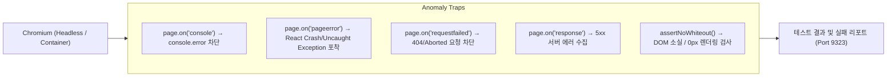

# 프론트엔드 테스트 및 이상 감지 (Docker 환경 연동 가이드)

본 문서는 플랫폼의 프론트엔드(HTML 렌더링, DOM 인터랙션, 상태 변경) 무결성을 검증하고, 런타임 이상(백화 현상, JavaScript 에러, 네트워크 실패)을 포착하여 Docker 컨테이너 환경에서 안정적으로 테스트하는 가이드입니다.

---

## 1. 이상 감지 아키텍처 (Anomaly Trap)

[`tests/setup/anomaly-fixture.ts`](file:///apps/project_launch_bizs/tests/setup/anomaly-fixture.ts)는 Playwright의 기본 `test` 함수를 확장하여 테스트 실행 중 발생하는 모든 비정상 상태를 자동으로 감시하고 단언(Assert)합니다.



### 감지 항목 상세

| 감지 항목 | 대상 에러 | 판단 및 조치 기준 |
|---|---|---|
| **화면 백화 (White-out)** | React 렌더링 실패, 컴포넌트 마운트 실패 | `#root` 내 자식 노드가 0개이거나 높이가 0px인 경우 즉시 에러 발생 |
| **런타임 JS 예외** | `TypeError: Cannot read properties of undefined` 등 | `pageerror` 이벤트를 포착하여 에러 스택과 함께 테스트 실패 처리 |
| **콘솔 에러** | React 경고/에러, 미처리 비동기 거부 | `console.error` 발생 시 수집 후 Teardown 시점에 리포팅 |
| **네트워크 실패** | 잘못된 에셋 경로, 백엔드 연결 끊김 | `requestfailed` 및 HTTP 5xx 응답을 감지하여 실패 처리 |

---

## 2. 테스트 작성 방법 (사용법)

신규 E2E 테스트를 작성할 때 `@playwright/test` 대신 [`tests/setup/anomaly-fixture`](file:///apps/project_launch_bizs/tests/setup/anomaly-fixture.ts)에서 `test`와 `expect`를 import합니다.

```typescript
import { test, expect } from '../setup/anomaly-fixture';

test('회원가입 모달 열기 및 인터랙션 테스트', async ({ page, tracker }) => {
  await page.goto('/');

  // 1. 화면 백화 검증
  await tracker.assertNoWhiteout('#root');

  // 2. DOM 요소 렌더링 및 인터랙션
  const signupBtn = page.getByRole('button', { name: '무료 가입하기' });
  await expect(signupBtn).toBeVisible();
  await signupBtn.click();

  // 3. 모달 오픈 확인
  await expect(page.locator('.glass-panel-heavy h2')).toHaveText('로그인');

  // 별도의 assert 구문이 없어도 테스트 종료 시 콘솔 에러, 네트워크 실패, 런타임 예외가 자동 검증됩니다.
});
```

---

## 3. Docker 컨테이너 환경 실행

### Docker 환경 핵심 해결 요소
1. **한글 CJK 폰트 탑재 (`fonts-nanum`, `fonts-noto-cjk`)**: 시각적 스냅샷 및 텍스트 비교 시 글자 깨짐(ㅁㅁㅁ) 방지.
2. **공유 메모리 충돌 방지 (`ipc: host` / `shm_size`)**: Chromium 렌더러가 메모리 부족으로 크래시되는 현상 방지.
3. **가상 디스플레이 (`xvfb`)**: Headless/UI 모드 모두 지원.
4. **볼륨 마운트**: 테스트 종료 후 컨테이너 외부 호스트로 스크린샷, 비디오, 트레이스, HTML 리포트 자동 보존.

### 실행 명령어

#### ① 로컬 환경에서 이상 감지 데모 테스트 실행
```bash
npm run test:anomaly
```

#### ② Docker 이미지 빌드
```bash
npm run test:docker:build
# 또는
docker build -f Dockerfile.test -t project-launch-bizs-test .
```

#### ③ Docker Compose로 컨테이너 테스트 실행 (결과 볼륨 마운트 포함)
```bash
npm run test:docker:run
# 또는
docker compose -f docker-compose.test.yml up --abort-on-container-exit
```

#### ④ 테스트 리포트 확인
테스트가 완료되면 호스트 머신에서 아래 커맨드로 인터랙티브 HTML 리포트를 확인할 수 있습니다:
```bash
npm run report
# 브라우저에서 http://localhost:9323 접속
```

---

## 4. 데모 테스트 파일 안내

* [`tests/setup/anomaly-fixture.ts`](file:///apps/project_launch_bizs/tests/setup/anomaly-fixture.ts) — 이상 감지 커스텀 픽스처
* [`tests/e2e/anomaly_detection_demo.spec.ts`](file:///apps/project_launch_bizs/tests/e2e/anomaly_detection_demo.spec.ts) — 정상 시나리오 및 이상 감지(백화, 런타임 에러, 네트워크 실패) 5대 검증 스위트
* [`Dockerfile.test`](file:///apps/project_launch_bizs/Dockerfile.test) — CJK 폰트 및 Xvfb가 구성된 테스트 전용 도커파일
* [`docker-compose.test.yml`](file:///apps/project_launch_bizs/docker-compose.test.yml) — 볼륨 마운트 및 호스트 IPC 설정 컴포즈 파일
