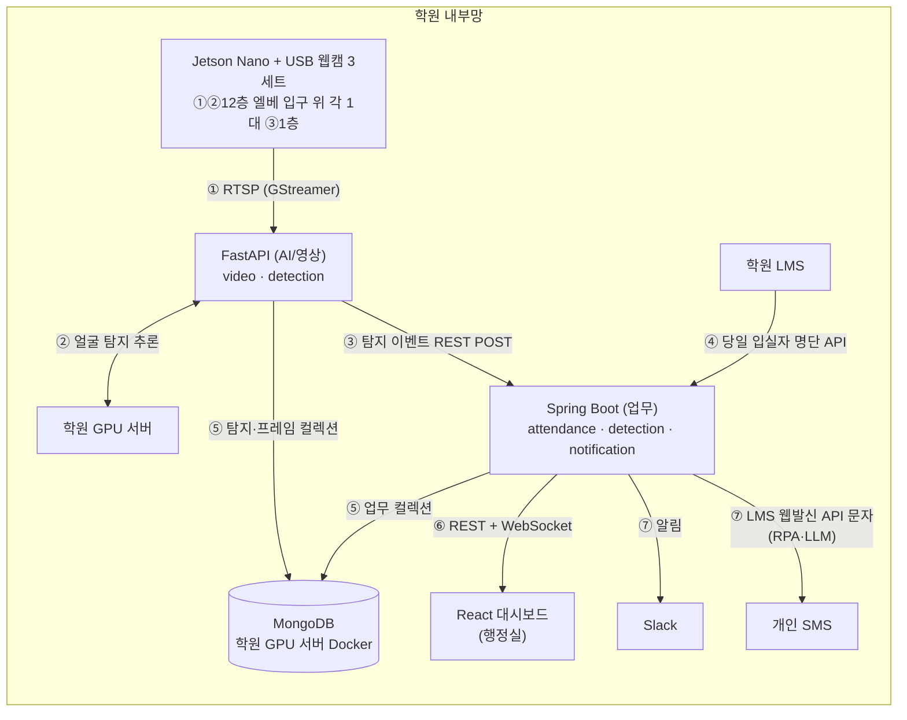

# 00. 프로젝트 개요

> 문서 상태: ✅ 완료 (2026-08-05) — 성공 지표 구체 수치 1건만 ⬜ 보류(데이터 수집 후, 8/18 전 확정)
> 이 문서가 가장 먼저 작성되어야 한다. 뒤 문서들의 추천 기준이 된다.

## 1. 기본 정보

### 프로젝트명
- 상태: ✅ 결정
- 결정: CCTV 출결 자동 관리 & 알림 시스템 (정식 서비스명은 추후 별도 논의 가능)
- 결정일: 2026-08-04

### 한 줄 소개
- 상태: ✅ 결정
- 결정: CCTV + 카드/QR/비콘 태그로 수강생 출결을 자동 관리하고, 정해진 시간까지 출결이 안 되면 행정·당사자에게 Slack 알림을 보내는 보조 시스템
- 결정일: 2026-08-04

### 배경 / 만들려는 이유
- 상태: ✅ 결정
- 결정: 행정실 니즈 — 출결·시간 규율 준수, 쉬는시간 외 이동 감지, 4층 비정기 이용 시 사용자 식별·뒷정리 확인. 수동 출결 관리의 한계 → 자동 감지·알림 필요
- 결정일: 2026-08-04

## 2. 목표

### 최종 산출 목표
- 상태: ✅ 결정
- 선택지: 개인 사용 도구 / 포트폴리오 / 사이드 프로젝트(수익화) / SaaS 서비스 / 사내 시스템
- 결정: 학원 팀 프로젝트 최종발표(2026-08-31) — 실동작 데모 + 취업 포트폴리오 활용
- 이유: 인재개발원 "AI기반 지능형 솔루션 개발과정" 프로젝트3. GitHub 브랜치 구성·소스 공유가 필수 요건이라 협업 증거도 함께 남음
- 결정일: 2026-08-04

### 성공 지표 (측정 가능한 숫자로)
- 상태: ❓ 미결정 (방향은 2026-08-04 확정, 구체 수치 미정 — 데이터 수집 후 확정)
- 결정: 방향 3축 확정 —
  - 탐지 정확도: CCTV 사람 탐지/미태그자 포착 정확도 (테스트셋 기준 N% 이상)
  - 출결 판정 정확도: 태그+CCTV 조합 판정의 실제 출결 일치율 + 예외처리 커버리지
  - 데이터 규모: 학습 데이터 1,000장 이상 수집·라벨링 완료 (강사 요건)
  - ⬜ 구체 수치는 데이터 수집·베이스라인 측정 후 확정 (8/18 공유 전 목표)
- 결정일:

## 3. 범위

### 포함 범위 (이번에 만드는 것)
- 상태: ✅ 결정 (2026-08-04 팀 확정 — 세부 우선순위는 진행하며 조정)
- 결정:
  - 출결 태그 수집 (카드/QR/비콘 3종 혼재)
  - CCTV 감지로 카드 미태그자 포착 — 3대: ①②12층 엘리베이터 2대 각각 입구 위 1대씩(정면 얼굴 확보) ③1층 엘리베이터 (2026-08-05 배치 변경 — 99 참조)
  - 출결 판정 — **출석 여부 이진 판정** (LMS `check_in_time` 유무 기준. 지각·유예 분류는 LMS 소관 — 2026-08-06 변경, 99 참조) + 예외처리 (오전반/오후반, 외출·조퇴·병결 — 대시보드 수동 등록)
  - 미출결·이탈 시 Slack 알림 + 개인 문자
- 결정일: 2026-08-04

### 제외 범위 (이번에 만들지 않는 것)
- 상태: ✅ 결정 (팀 확정 제약 반영. 추가 제외 항목은 진행하며 갱신)
- 결정:
  - 사람-카드 매칭(개인 식별) — 사실상 불가 판정. 서버에서 출결정보만 추출해 별도 DB 저장
  - 검토 후 미채택 주제: 분리수거 관리 / 이력서 NLP / 휴게실·화장실 혼잡도 / 방화문 여닫힘 감지
- 결정일: 2026-08-04

## 4. 사용자 정의

### 주 사용자 / 대상
- 상태: ✅ 결정
- 결정: 학원 행정실(관리자 — 출결 현황 확인·알림 수신)과 수강생(출결 대상 — 개인 문자 수신)
- 결정일: 2026-08-04

### 예상 사용자 규모 (동시 접속 등)
- 상태: ✅ 결정
- 결정:
  - 데이터 수집 대상: 개인정보 이슈로 지인 위주 동의자 최대 **약 10명** (추후 수강생 전체 → 학원 전체로 확장 가능성 있음)
  - 서비스 사용자: 행정·관리자 동시 접속 1~2명 수준. 대규모 트래픽 없음 — 성능 부하는 동시접속이 아니라 영상 처리 파이프라인에 있음
  - 카메라 3세트 처리(퇴실 시간대만 가동): ①② 12층 엘리베이터 2대 각각 입구 위 1대씩 ③ 1층 엘리베이터 — 장비는 Jetson Nano + USB 웹캠 (2026-08-05 학원 지침, 99 참조)
- 결정일: 2026-08-04

### 핵심 유저 스토리
- 상태: ✅ 결정
- 결정: ("[사용자]로서, [목적]을 위해, [행동]을 한다" 형식으로 3~7개. AI는 이 스토리를 기능 우선순위 판단 기준으로 사용한다)
  1. 행정실 직원으로서, 수동 확인 없이 출결을 관리하기 위해, 대시보드에서 실시간 출결 현황을 본다
  2. 행정실 직원으로서, 미출결자를 놓치지 않기 위해, 대시보드가 보이는 모니터 앞에서 학생들의 퇴실시간에 계속 자리한다
  3. 행정실 직원으로서, 출결 규율 위반을 확인하기 위해, 카드 미태그 상태로 12층 엘베/1층 CCTV에 포착된 건을 알람으로 받는다
  4. 수강생으로서, 출결 누락을 방지하기 위해, 미출결 상태일 때 개인 문자를 받는다
  5. 행정실 직원으로서, 예외 상황(외출·조퇴·병결·오전반/오후반)을 반영하기 위해, 예외 처리를 등록한다
- 결정일: 2026-08-04

## 5. 개발 형태

### 개발 인원
- 상태: ✅ 결정
- 선택지: 혼자 / 협업 (인원수, 역할 분담 기재)
- 결정: 협업 5명 (PM 포함). 황서범 담당 = 기술 전반 — 비전·딥러닝 모델, 백엔드·DB, RPA·알림 자동화, 데이터 수집·라벨링. 나머지 팀원 역할 분담은 8/10 업무 분장 공유 때 확정 후 추가 기재
- 결정일: 2026-08-04

### 목표 일정 (대략)
- 상태: ✅ 결정
- 결정: 2026-08-04 ~ 2026-08-31. 마일스톤 — 8/10 방향성 공유(데이터 수집 방안·업무 분장), 8/18 방향성 공유(데이터 활용·진행 상황), 8/24 상황 따라 진행, 8/31 팀별 최종발표. 발표 내용은 전주부터 준비
- 결정일: 2026-08-04

## 6. 시스템 구성도 (블루프린트)

> 전체 시스템의 큰 그림. 규칙 문서(01~08) 결정 완료 후 작성, 사용자 확인 완료(2026-08-05).

- 상태: ✅ 결정
- 결정일: 2026-08-05

### 구성 요소 설명
| 구성 요소 | 역할 | 비고 |
|---|---|---|
| Jetson Nano + USB 웹캠 3세트 | 영상 소스 — GStreamer RTSP 스트리밍 노드(1차), **퇴실 시간대만 가동** (입실 시간대는 카메라 미사용, LMS 명단 DB 적재만) | ①②12층 엘베 2대 각각 입구 위 1대씩(정면 얼굴 확보) ③1층 엘베. 엣지 추론 전환은 성능 보고 검토 |
| FastAPI | 영상 수집·얼굴 탐지·탐지 이벤트 발행 | 추론은 학원 GPU 서버, 얼굴 툴은 YuNet+SFace 확정(05, 2026-08-06) |
| Spring Boot | 출결 판정(LMS 기준·카메라 보조)·예외처리·대시보드 API·알림 | 문자는 "퇴실 미체크(DB 잔존) AND 퇴실 시간대 영상 식별 포착" 시에만 — RPA로 복귀 요청 발송 |
| 학원 LMS | 태그 기록(primary)·당일 입실자 명단 API·웹발신 문자 API | DB 직접 접근 금지, 명단은 퇴실 시 즉각 삭제(04) |
| MongoDB | 유일 저장소 — 컬렉션 소유권 분리(업무=Spring, 탐지=FastAPI) | 학원 GPU 서버 Docker, 개인정보 TTL 백스톱 |
| React 대시보드 | 행정실 실시간 출결 현황·알람·예외 등록 | WebSocket 실시간 갱신, 라이트/다크 지원(03) |
