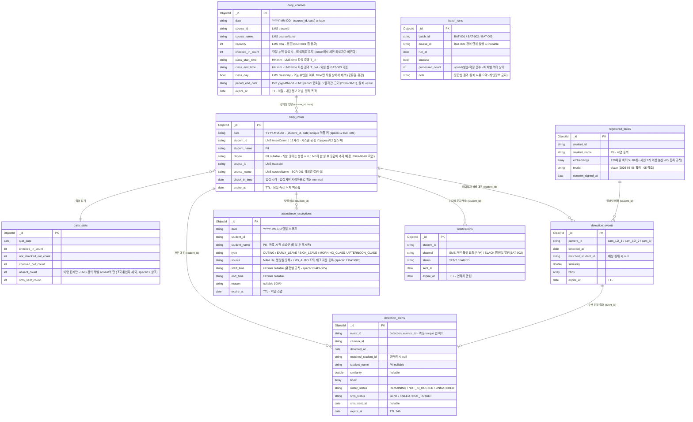

# 04. 데이터베이스 설계

> 문서 상태: ✅ 완료 (2026-08-05) — 3~4장(컬렉션 정의)은 산출물로 개발하며 갱신
> MongoDB는 스키마리스이므로 **이 문서의 컬렉션 정의가 스키마의 유일한 원본**이다. 컬렉션 추가·변경 시 같은 작업 안에서 이 문서를 갱신한다.

## 1. 기본 규칙

### DBMS / 버전
- 상태: ✅ 결정
- 결정: **MongoDB 8.x** (01_TECH_STACK.md 참조 — 2026-08-05 회의에서 PostgreSQL→MongoDB 변경, 99_DECISIONS 기록). 학원 GPU 서버의 Docker + MongoDB에 팀원 IP·패스워드 공유로 접속
- 결정일: 2026-08-05

### ORM / 데이터 접근 방식
- 상태: ✅ 결정
- 선택지 예: JPA(Hibernate) / MyBatis / Prisma / Drizzle / SQLAlchemy / 순수 SQL
- 결정: **투트랙 직접 접근** — Spring = Spring Data MongoDB(업무 컬렉션), FastAPI = Motor 비동기 드라이버(탐지·프레임 인덱스 컬렉션)
- 이유: 강사 구조(JSON 바로 저장)와 부합, 프레임 단위 저장 시 REST 오버헤드 회피. **컬렉션 소유권을 도메인별로 분리** — 업무 컬렉션은 Spring만, 탐지 컬렉션은 FastAPI만 쓰기. 다른 쪽 컬렉션은 읽기만 허용
- 결정일: 2026-08-05

### 마이그레이션 도구
- 상태: ➖ 해당 없음
- 결정: 스키마리스라 마이그레이션 도구 미사용. 컬렉션 정의는 이 문서 3~4장이 원본 — 개발하며 갱신
- 결정일: 2026-08-05

### 스키마·인덱스 소유권 (2026-08-07 변경 — 99_DECISIONS 기록)
- 상태: ✅ 결정
- 결정: **DB 스키마(컬렉션·인덱스·계정)는 CTO가 소유하고 `database/schema/` 스크립트로만 관리한다.** 애플리케이션은 데이터를 읽고 쓸 뿐 스키마를 바꾸지 않는다 (이전 결정 "각 서버 기동 시 ensure index"에서 변경)
  - `database/apply.sh` — 컬렉션·인덱스·계정을 순서대로 적용. 전부 멱등이라 재실행 안전
  - ⚠ `init/`(docker-entrypoint-initdb.d)은 **볼륨이 빈 최초 기동에만** 실행된다. 이미 떠 있는 컨테이너에는 반영되지 않으므로 스키마는 반드시 `apply.sh`로 넣는다
- 이유:
  - **unique 인덱스가 명세의 계약을 강제한다** — `(student_id,date)` 멱등 upsert·`(date,student_id,type)` 409·`event_id` 멱등. 코드에만 맡기면 "멱등하다고 믿는데 실은 아닌" 상태가 조용히 지나간다. 게다가 **중복 데이터가 쌓인 뒤에는 unique 인덱스 생성이 실패**하므로 개발 초기에 걸어야 한다
  - **TTL 인덱스가 개인정보 자동 삭제의 백스톱이다** — 하나라도 누락되면 개인정보가 남는다. 도메인별 구현에 분산시킬 위험이 크다
- 결정일: 2026-08-07

### 애플리케이션 계정 권한
- 상태: ✅ 결정
- 결정: **3층 분리** (`database/schema/03_roles.js`) — 핵심은 **사람 계정과 앱 계정을 섞지 않는 것**
  | 계층 | 계정 | 보유 | 권한 |
  |---|---|---|---|
  | 관리(사람) | `admin_*` | **CTO·PM 각자 개인 계정** | `root` — 스키마 적용·계정 관리 |
  | 앱(프로그램) | `autogt` | Spring·FastAPI (`.env` 공유) | **커스텀 롤 `appDataWrite`** — 화이트리스트 9개 컬렉션의 데이터 CRUD만. 컬렉션·인덱스 생성/삭제 불가 |
  | 조회(사람) | `view_*` | **팀원 개인 계정** (mongosh·Compass) | **읽기 전용** — 실수로 지울 수 없다 |
  - **앱 계정을 사람에게 주지 않는다**: 팀원 개인 계정으로 Spring을 돌리면 `.env`가 사람마다 갈리고, 계정을 회수하는 순간 앱이 멈춘다. 앱이 쓰는 계정은 프로그램의 것이다
  - **root를 공유하지 않는다**: 한 계정을 두 사람이 쓰면 유출 시 통째로 교체해야 하고 행위 구분도 안 된다. CTO·PM 각자 계정으로 둔다
  - 계정 목록·비밀번호는 `database/.accounts.json`(**gitignore, CTO 로컬 전용**)에 두고 `apply.sh`가 읽어 생성한다. 템플릿은 `.accounts.example.json`, 비밀번호는 개인 DM으로만 전달
  - ⚠ **로컬 Docker에서는 이 권한 체계가 실효가 없다** — 각자 컨테이너의 root를 본인이 갖고 있다. 실질적 통제는 **GPU 서버 공용 DB**에서 발생하며, 지금 스크립트를 갖춰두는 것은 서버가 열리는 즉시 적용하기 위함이다
  - ⚠ MongoDB Community에는 **감사 로그가 없다** — 개인 계정을 나눠도 "누가 무엇을 조회했나"는 추적되지 않는다. 개인 계정의 실익은 추적이 아니라 **접근 회수와 사고 시 범위 축소**다
- ⚠ 구현 주의 (2026-08-07 실측):
  - MongoDB 기본 `readWrite` 롤은 `createIndex`·`dropIndex`·`dropCollection`을 **포함**한다 — 그대로 쓰면 앱이 스키마를 바꿀 수 있다
  - **DB 전체 범위(`{collection:''}`)에 `insert`를 주면 컬렉션 생성까지 허용된다.** 그래서 CRUD 권한은 반드시 **컬렉션 단위로 열거**한다. 부수 효과로 오타난 컬렉션명에 쓰면 조용히 새 컬렉션이 생기는 대신 즉시 거부된다
  - 앱이 컬렉션을 자동 생성할 수 없으므로 **컬렉션은 `01_collections.js`가 미리 만든다**
  - 통합 테스트 DB(`project3_test`)는 예외로 `readWrite` 유지 — 테스트는 컬렉션 생성·삭제가 일상이다 (rules/07)
- 결정일: 2026-08-07

## 2. 네이밍 및 공통 규칙

### 네이밍 규칙
- 상태: ✅ 결정
- 결정: 컬렉션 snake_case 복수형(예: `detection_events`), 필드 snake_case
  - 예외: `daily_roster`는 `roster`(명단) 자체가 집합을 뜻하는 단어라 단수형을 유지한다 (`daily_rosters`는 "명단들"이 되어 의미가 어색). 2026-08-07 확인
- 결정일: 2026-08-05

### 공통 필드
- 상태: ✅ 결정
- 결정: 전 컬렉션 `created_at`, `updated_at`. 개인정보 포함 컬렉션은 `expire_at`(TTL 인덱스용) 추가
- 결정일: 2026-08-05

### ID 전략
- 상태: ✅ 결정
- 선택지: ObjectId / UUID / ULID
- 결정: MongoDB 기본 **ObjectId** (`_id`)
- 이유: 내부 시스템이라 충분, 별도 라이브러리 불필요
- 결정일: 2026-08-05

### 트랜잭션 / 동시성 방침
- 상태: ✅ 결정
- 결정: 단일 문서 원자성 기본 (멀티 문서 트랜잭션은 필요 시에만). 동시 쓰기 경합 없는 규모. 오후 6시 일괄 퇴실 트래픽은 미해결 과제로 검토 예정(8/5 회의)
- 결정일: 2026-08-05

### 개인정보 라이프사이클 (핵심 정책 — 2026-08-05 회의 + 인터뷰 확정)
- 상태: ✅ 결정
- 결정:
  - **수집**: LMS DB 직접 접근 금지 — LMS 출결 API를 그때그때 조회하되, **응답 전체를 저장하지 않고 당일 입실자만 걸러 저장**한다 (LMS는 미출석자를 포함한 전원을 주므로 거르는 책임은 우리에게 있다). 연락처(`phone`)는 아래 "연락처 취급" 참조
    - **저장 최소화 2원칙 (2026-08-07 CTO 확정 — LMS 실스펙 확인 후 명문화)**:
      ① **행 최소화** — LMS 응답은 미출석자를 포함한 당일 수강생 전원을 주지만, `daily_roster`에는 **`checkInTime`이 있는 입실자만** 저장한다. 미출석자는 우리 DB에 남기지 않는다 (BAT-002는 LMS 응답에서 그 시점 계산해 알림만 발송 — specs/12)
      ② **열(필드) 최소화** — 응답 필드는 **화이트리스트 방식**으로 우리가 쓰는 것만 취한다. `birth`(생년월일)·`type`(고용형태)·`status`·`checkOutTime` 등은 읽지도 저장하지도 않는다 (매핑표: specs/12 BAT-001)
    - 미출석자 관련 데이터가 우리 DB에 남는 경우는 두 가지뿐: 익명 집계(`daily_stats.absent_count`)와, 행정실이 병결 등 예외를 등록한 소수(`attendance_exceptions` — 이름 스냅샷, TTL 익일)
  - **연락처(`phone`) 취급 (2026-08-07 LMS 담당자 확인)**: LMS 응답에 연락처가 없다. **개발 단계에서는 팀원 연락처를 테스트 수신처로 쓰고, 시스템이 완성되면 LMS가 API 응답에 학생 연락처를 추가해 준다.**
    - 그때까지 `daily_roster.phone`은 **항상 null**이다 — 실제 학생 연락처를 우리가 따로 수집하지 않는다. 통과 경로는 선배선돼 있어(2026-08-09) LMS가 스냅샷에 싣는 순간 코드 수정 없이 흐른다. 저장돼도 명단과 같은 라이프사이클(퇴실 즉시 삭제 + TTL)을 탄다
    - 팀원 연락처도 개인정보다: `.env`(`SMS_TEST_RECIPIENT`)로만 관리하고 커밋 금지, 프로젝트 종료 시 제거
    - ⚠ **실 연락처가 들어오는 순간 자동으로 실제 학생에게 문자가 나가면 안 된다** — 발송은 `SMS_MODE` 스위치로만 전환한다 (rules/05 안전장치)
  - **삭제**: **퇴실 시 즉각 삭제**(애플리케이션 로직) + `expire_at` **TTL 인덱스를 백스톱**으로 이중화 — 삭제 로직이 누락돼도 하루 안에 자동 소멸
  - **보관**: 익명 통계(일별 미출결 건수 등 개인 식별 불가 데이터)·시스템 로그는 보관 — 개인정보 아님. 최종발표 데모용 누적 데이터로 활용
- 결정일: 2026-08-05

### 개인정보 보존기간 = LMS `period` (2026-08-11 팀회의 확정)
- 상태: ✅ 결정 (형식 파싱은 실 LMS 연결 시 확정)
- 결정: **개인정보 보존기간을 LMS API `period`(과정 시작~종료일)에 묶는다** — 동의서 기한과 일치시킨다.
  - 적용 대상: **하루 이상 지속되는 개인정보** — `registered_faces`(얼굴 등록 임베딩·사진), 탐지 기록(사진 포함, 검색/알리바이 기능용)
  - 구현: BAT-001이 강의 `period` 종료일을 **`daily_courses.period_end_date`에 저장**(✅ 2026-08-11 구현 — 형식 `"2026-07-13~2026-09-07 (10회차)"`, 실패 시 null+WARN) → 보존기간 소비자(registered_faces·탐지 기록)가 이 날짜를 자기 문서 `expire_at`으로 삼는다 → **기존 TTL 인덱스가 그 날짜에 자동 삭제**. 우리가 날짜를 계산·관리하지 않고 LMS 값을 그대로 만료 시각으로 쓴다 (소비자 연결은 탐지 기록 저장·등록 갤러리 구현 시)
  - `daily_roster` 등 **당일 전이 데이터는 기존 단기 라이프사이클 유지**(퇴실 즉시 삭제 + 익일 TTL) — period는 바깥 상한일 뿐
  - ⚠ **"경찰 관제 로그식 전량 저장" 폐기** (2026-08-11) — 지나가는 전원을 저장하지 않는다. 우리 주제 범위(미퇴실 대상)만. 데이터 과중·개인정보 부담 회피 (99 참조)
  - ⚠ `period` 형식(문자열 범위 vs 시작·종료 분리)은 08-07 실응답에서 "안 읽는 필드"였다 → 실 LMS 연결 시 대조 후 파싱 (specs/12)

---

## 3. 컬렉션 구조도 (산출물 — 개발하며 갱신)

> 컬렉션 추가/변경 시 이 다이어그램을 같은 작업 안에서 갱신한다. (참조 관계는 앱 레벨 — MongoDB에 FK 없음)

## 4. 컬렉션 정의서 (산출물 — 개발하며 갱신)

### 컬렉션 목록 (설계 초안 v2 — 2026-08-05)

| 컬렉션명 | 소유(쓰기) | 설명 | 개인정보/TTL | 상태 |
|---|---|---|---|---|
| `daily_roster` | Spring | 당일 **입실자** 명단 (LMS 응답 중 `check_in_time` 존재분만) — **잔존 = 미퇴실** 상태 그 자체 | ✅ 퇴실 즉시 삭제 + TTL | 설계 |
| `daily_courses` | Spring | 당일 강의 정보 (정원·수업 시작/종료 시각) — SCR-001 칩 분모·퇴실 시각 `T_out` 도출 원천 (specs/12) | ❌ 개인정보 아님 (TTL 익일 정리) | 설계 |
| ~~`attendance_records`~~ | — | **🗑 폐기 (2026-08-07)** — 이진 판정 전환으로 별도 판정 결과가 불필요해졌다. "roster에 있다=출석 / 없다=미출석"이 판정 그 자체이고(specs/12 BAT-001), 이 컬렉션도 퇴실 시 삭제 대상이라 남는 이력이 없었다. 영속 이력은 익명 `daily_stats`가 담당 | — | 🗑 |
| `detection_events` | FastAPI | 퇴실 시간대 탐지·식별 이벤트 (카메라 ID·매칭 결과·유사도) | ✅ TTL | 설계 |
| `detection_alerts` | Spring | API-009 수신 이벤트의 판정 결과 (잔존 대조 `roster_status`·문자 발송 상태) — SCR-002 알람 목록(API-004)의 원천 | ✅ TTL 24h | 설계 |
| `attendance_exceptions` | Spring | 당일 예외 등록 (외출·조퇴·병결·오전반·오후반) — 판정·문자 제외 근거, `(date, student_id, type)` unique. `source`로 수동(MANUAL)·LMS 자동(LMS_AUTO) 구분 | ✅ TTL 익일 | 설계 |
| `registered_faces` | FastAPI | 동의자 얼굴 등록 임베딩·사진 (앙상블 다차원 — 05 확정 2026-08-11) | ✅ **LMS `period` 종료일에 만료**(expire_at+TTL, 2026-08-11) | 설계 |
| `notifications` | Spring | 알림 발송 이력 (Slack·LMS 웹발신 문자) | 연락처 필드 TTL | 설계 |
| `daily_stats` | Spring | 익명 일별 통계 (미퇴실 건수·발송 건수 등) — 최종발표 데모용 누적 | ❌ 보관 | 설계 |
| `batch_runs` | Spring | 배치 실행 이력 (BAT-001·002·003 — 시각·성공 여부·처리 건수) — 판정 근거 추적용 | ❌ 개인정보 금지 | 설계 |

> 필드 상세는 3장 다이어그램의 필드 목록을 원본으로 한다. 공통 필드(`created_at`·`updated_at`)는 전 컬렉션 적용이라 다이어그램에서 생략.
> 참조 관계는 전부 앱 레벨 `student_id` 문자열 참조 (MongoDB FK 없음).

### 컬렉션 상세 템플릿

> 새 컬렉션 추가 시 3장 다이어그램에 필드 블록을 추가하고, 위 목록 표에 한 줄을 추가한다.

| 필드명 | 타입 | 필수 | 기본값 | 인덱스 | 설명 |
|---|---|---|---|---|---|
| _id | ObjectId | YES | 자동 | PK | |
| created_at | Date | YES | now | | 생성일시 |
| updated_at | Date | YES | now | | 수정일시 |
| expire_at | Date | 개인정보 시 | | TTL | 자동 삭제 기준 시각 |
