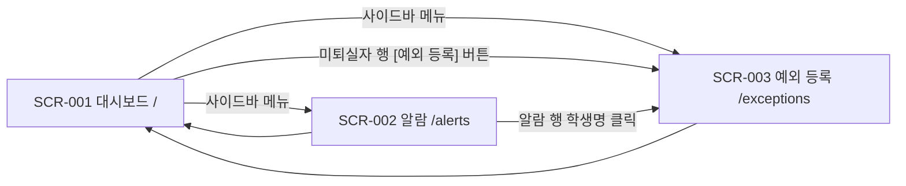

# 11. 화면 설계서

> 문서 상태: 산출물 문서 (개발하며 갱신)
> **규칙**: 새 화면을 구현하기 전에 반드시 여기에 설계를 먼저 작성하고 사용자 확인을 받은 후 구현한다.
> 대상: 행정실 데스크톱 전용 (03 — 최신 Chrome·Edge, 라이트/다크 지원). 와이어프레임 이미지: `wireframes/`

## 1. 화면 목록

> 상태: 📝 설계 / 🔄 개발중 / ✅ 완료 / 🗑 폐기

| ID | 화면명 | 경로(URL) | 접근 권한 | 상태 |
|---|---|---|---|---|
| SCR-001 | 출결 현황 대시보드 | `/` | 인증 없음 (내부망 전제 — 02) | 📝 |
| SCR-002 | 미태그 포착 알람 | `/alerts` | 인증 없음 | 📝 |
| SCR-003 | 예외 처리 등록 | `/exceptions` | 인증 없음 | 📝 |

## 2. 화면 흐름도



- 3화면 모두 공통 레이아웃(사이드바 + 톱바) 사용 — `components/layout/` (03 폴더 구조)
- 톱바의 퇴실 감시 상태·카메라 상태는 전 화면 공통 표시

## 3. 화면 상세 설계

---

### SCR-001. 출결 현황 대시보드

- **경로**: `/`
- **목적**: 행정실 직원이 모니터를 상시 띄워두고 당일 출결 현황·미퇴실자·실시간 포착 이벤트를 한눈에 감시한다 (유저 스토리 ①②)
- **진입 경로**: 기본 진입 화면
- **접근 권한**: 인증 없음 (내부망 전제)
- **상태**: 📝 설계

#### 와이어프레임

> 이미지: [wireframes/scr_001_dashboard.svg](wireframes/scr_001_dashboard.svg)

```
┌────────┬──────────────────────────────────────────────────┐
│        │ 톱바: 날짜·시각 | 퇴실감시 ON/OFF | 카메라 ●●● | 테마 │
│ 사이드바 ├──────────────────────────────────────────────────┤
│ ─────── │ [당일 입실 32] [미퇴실 5] [퇴실 완료 27] [문자 2]   │
│ 대시보드 │ 강의별: (AI솔루션 18/20)(자바 10/18)… 클릭=필터    │
│ 알람    ├───────────────────────────┬──────────────────────┤
│ 예외등록 │  라이브 뷰 (3분할 MJPEG)    │  실시간 이벤트 피드     │
│        │  cam_12f_1|cam_12f_2|cam_1f│  (WebSocket 수신)     │
│        ├───────────────────────────┴──────────────────────┤
│        │  미퇴실자 테이블: 이름|강의명|입실|경과|예외|[예외 등록]│
└────────┴──────────────────────────────────────────────────┘
```

#### 구성 요소

| 요소 | 종류 | 동작 / 규칙 |
|---|---|---|
| 요약 카드 ×4 | 카드 | 당일 입실·미퇴실(잔존)·퇴실 완료·문자 발송 수. WebSocket 이벤트 수신 시 즉시 갱신 |
| 강의별 출석 칩 | 칩(가변) | 강의별 **입실 N / 정원 M**(`checked_in_count`/`capacity`). 칩 클릭 시 미퇴실자 테이블을 해당 강의로 필터, 재클릭 시 해제. 강의 수만큼 가변 렌더링 |
| 퇴실 감시 상태 뱃지 | 뱃지 | 퇴실 시간대 여부 (감시 중=강조색). 카메라 상태 ●3개는 API-001 폴링(5초) |
| 라이브 뷰 3분할 | 영상 | `` (API-002). 미연결 카메라는 회색 placeholder + 재연결 안내 |
| 실시간 이벤트 피드 | 목록 | WebSocket(API-008) 수신 이벤트 시간순 표시 — 포착·문자 발송·퇴실 태그. 최대 50건 유지 |
| 미퇴실자 테이블 | 테이블 | 이름·강의명·입실 시각·경과 시간·예외 여부. 행 버튼 [예외 등록] → SCR-003 이동(학생 프리필). 데이터=daily_roster 잔존자, 강의별 칩과 필터 연동 |

#### 연결 API

| 시점 | API ID | 용도 |
|---|---|---|
| 진입 시 | API-003 | 당일 출결 요약·강의별 집계 + 미퇴실자 목록(`course_name` 포함) |
| 진입 시 | API-001 | 카메라 상태 (이후 5초 폴링) |
| 진입 시 | API-002 | 라이브 뷰 3채널 |
| 상시 | API-008 | WebSocket 실시간 이벤트 → TanStack Query 캐시 무효화/갱신 |

#### 상태별 화면
- **로딩 중**: 카드·테이블 스켈레톤
- **데이터 없음**: "당일 입실 데이터가 없습니다 (LMS 명단 수신 전)" 안내
- **에러**: 카드 영역 상단 배너 "서버 연결 실패 — 재시도 중" + 자동 재시도. WebSocket 끊김 시 톱바에 ⚠ 표시(재연결 로직 — 03)

#### 비고
- 개인정보: 이 화면은 행정실 전용 모니터 전제. 연락처는 표시하지 않음 (이름만)
- 라이브 뷰는 시청 제한(카메라당 3커넥션)이 있어 대시보드 1대 상시 + 여분 2 구조
- 강의명은 LMS 출결 API의 `courseName`을 경계면 규칙(rules/09)에 따라 `course_name`으로 저장·전달. 강의별 칩은 **입실 N / 정원 M** — 결석자만큼 차이 나는 것이 정상이므로 이 차이는 경고가 아니다. 수집 이상 감지는 BAT-001이 LMS 응답 자체(`total` ↔ `attendees.length`)로 검증해 상단 배너로 알린다 (specs/12)

---

### SCR-002. 미태그 포착 알람

- **경로**: `/alerts`
- **목적**: 퇴실 미체크 상태로 카메라에 포착된 이력을 확인하고 문자 발송 결과를 추적한다 (유저 스토리 ③)
- **진입 경로**: 사이드바 메뉴 / 대시보드 이벤트 피드 항목 클릭
- **접근 권한**: 인증 없음
- **상태**: 📝 설계

#### 와이어프레임

> 이미지: [wireframes/scr_002_alerts.svg](wireframes/scr_002_alerts.svg)

```
┌────────┬──────────────────────────────────────────────────┐
│ 사이드바 │ 필터: [날짜▾] [카메라▾] [발송상태▾]      [검색____]  │
│        ├──────────────────────────────────────────────────┤
│        │ 알람 테이블: 포착시각|카메라|식별결과|유사도|발송상태    │
│        │  ...행 클릭 → 우측 상세 패널 (메타데이터)              │
│        ├──────────────────────────────────────────────────┤
│        │                            ◀ 1 2 3 ▶ (페이지네이션) │
└────────┴──────────────────────────────────────────────────┘
```

#### 구성 요소

| 요소 | 종류 | 동작 / 규칙 |
|---|---|---|
| 필터 바 | 폼 | 날짜(기본 오늘)·카메라·발송 상태(발송/실패/대상아님). 변경 시 목록 재조회 |
| 알람 테이블 | 테이블 | 포착 시각·카메라·식별 결과(이름 또는 "미매칭")·유사도(%)·문자 발송 상태 뱃지. 신규 알람은 WebSocket으로 최상단 삽입 + 하이라이트 |
| 상세 패널 | 패널 | 행 클릭 시 우측 슬라이드 — 탐지 메타데이터(camera_id·bbox·유사도·판정 근거·발송 이력). **스냅샷 이미지는 없음 — 프레임 미저장 정책(specs/10 API-002 비고)** |
| 학생명 링크 | 링크 | 클릭 → SCR-003 이동 (해당 학생 프리필) |

#### 연결 API

| 시점 | API ID | 용도 |
|---|---|---|
| 진입/필터 변경 시 | API-004 | 알람 목록 조회 (페이징) |
| 상시 | API-008 | 신규 포착 이벤트 실시간 삽입 |

#### 상태별 화면
- **로딩 중**: 테이블 스켈레톤
- **데이터 없음**: "포착된 알람이 없습니다" (정상 상황 — 긍정 톤)
- **에러**: 배너 + 재시도 버튼

#### 비고
- 유사도는 소수점 1자리 % 표시. 임계값 미만 "미매칭" 건도 회색으로 목록에 남김 (판정 투명성 — 05 안전장치)

---

### SCR-003. 예외 처리 등록

- **경로**: `/exceptions`
- **목적**: 외출·조퇴·병결·오전반/오후반 예외를 등록해 미퇴실 판정·문자 발송 대상에서 제외한다 (유저 스토리 ⑤)
- **진입 경로**: 사이드바 / SCR-001 미퇴실자 행 [예외 등록] / SCR-002 학생명 클릭 (모두 학생 프리필로 진입 가능)
- **접근 권한**: 인증 없음
- **상태**: 📝 설계

#### 와이어프레임

> 이미지: [wireframes/scr_003_exceptions.svg](wireframes/scr_003_exceptions.svg)

```
┌────────┬───────────────────┬──────────────────────────────┐
│ 사이드바 │ 등록 폼            │ 당일 예외 목록                 │
│        │ 학생 [검색▾]       │ 테이블: 학생|유형|시간|사유|[삭제] │
│        │ 유형 (외출/조퇴/    │                              │
│        │  병결/오전반/오후반) │                              │
│        │ 시간 [__:__~__:__] │                              │
│        │ 사유 [_________]   │                              │
│        │      [ 등록 ]      │                              │
└────────┴───────────────────┴──────────────────────────────┘
```

#### 구성 요소

| 요소 | 종류 | 동작 / 규칙 |
|---|---|---|
| 학생 선택 | 검색 셀렉트 | **API-010**으로 당일 수강생 전원 검색 (미출석자 포함 — 병결 등록 대상). 미출석자는 회색 + "미출석" 표시로 구분. 프리필 진입 시 자동 선택 |
| 유형 선택 | 세그먼트 버튼 | 외출 / 조퇴 / 병결 / 오전반 / 오후반 (단일 선택, 필수) |
| 시간 범위 | 타임 입력 | 외출만 종료 시각 필수, 조퇴·병결은 시작 시각만. 유형에 따라 입력란 활성/비활성 |
| 사유 | 텍스트 | 선택 입력, 100자 제한 |
| [등록] 버튼 | 버튼 | API-005 호출 → 성공 토스트 + 목록 갱신 + 폼 초기화. 등록 즉시 판정·문자 제외 반영 |
| 당일 예외 목록 | 테이블 | 학생·유형·시간·사유·등록 시각. [삭제] 클릭 → 확인 다이얼로그 → API-007 |

#### 연결 API

| 시점 | API ID | 용도 |
|---|---|---|
| 진입/검색 시 | API-010 | 당일 수강생 검색 (미출석자 포함 — LMS 실시간, 미저장) |
| 진입 시 | API-006 | 당일 예외 목록 |
| [등록] 클릭 | API-005 | 예외 등록 |
| [삭제] 클릭 | API-007 | 예외 삭제 (확인 다이얼로그 필수 — 되돌리면 판정 대상 복귀) |

#### 상태별 화면
- **로딩 중**: 폼 비활성 + 스피너
- **데이터 없음**: 목록 "등록된 예외가 없습니다"
- **에러**: 등록 실패 시 폼 하단 인라인 에러 (검증 실패 필드 강조 — Bean Validation 메시지 매핑)

#### 비고
- 검증: 학생·유형 필수. 동일 학생+동일 유형 중복 등록 시 409 안내
- 예외 등록/삭제는 판정 결과에 직접 영향 → 07 필수 테스트 대상과 연동됨을 주석으로 명시
