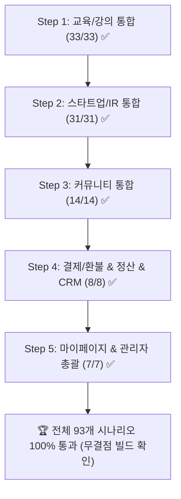

# 📑 전체 통합 테스트 마스터 로드맵 (Master Test Roadmap)

> **문서 버전:** v1.1 (전체 5단계 통합 검증 100% 완료)  
> **기준 일자:** 2026-08-27  
> **플랫폼:** 「AI로 창업하라」 — 교육·IR·커뮤니티·마이페이지·관리자·결제/CRM 올인원 플랫폼  
> **원칙:** 
> 1. 모든 입력값에 `임시_` prefix 적용
> 2. 기존 Seed 회원 3인(`T1: 김수강생/member`, `T2: 김소현/manager`, `T3: 최관리/admin`) 역할 교차 검증
> 3. 프론트엔드 UI/UX + 백엔드 API + DB + 마이페이지 + 관리자 메뉴 연계 완벽 검증
> 4. 각 단계별 시나리오 문서 작성 및 자동화 테스트 스크립트 실행 후 결과 기록

---

## 🗺️ 전체 5단계 통합 테스트 진행 현황

| 단계 | 테스트 영역 | 시나리오 문서 | 실행 결과 | 상태 | 주요 검증 항목 |
|:---:|---|---|:---:|:---:|---|
| **Step 1** | **교육 / 강의 (Course)** | [`TC_COURSE_INTEGRATION.md`](file:///apps/project_launch_bizs/docs/test_scenario/TC_COURSE_INTEGRATION.md) | **33 / 33 통과** | **✅ 완료** | 강의 탐색, 달력 커리큘럼, 개강 요청/제안, 강사 인포그래픽, 수강 결제 |
| **Step 2** | **스타트업 / IR (Invest & PR)** | [`TC_IR_INTEGRATION.md`](file:///apps/project_launch_bizs/docs/test_scenario/TC_IR_INTEGRATION.md) | **31 / 31 통과** | **✅ 완료** | IR 프로젝트 등록(실명/스텔스), 팀빌딩 구인/지원, 아이디어 의뢰/빌더 역제안, 투자 제안/북마크 |
| **Step 3** | **커뮤니티 (멀티 게시판)** | [`TC_COMMUNITY_INTEGRATION.md`](file:///apps/project_launch_bizs/docs/test_scenario/TC_COMMUNITY_INTEGRATION.md) | **14 / 14 통과** | **✅ 완료** | 3대 기본 게시판, 글쓰기 템플릿, 댓글/답글, 관리자 동적 게시판 생성, 마이페이지 연계 |
| **Step 4** | **결제·환불 & 정산 & 강사 CRM** | [`TC_PAYMENT_CRM_INTEGRATION.md`](file:///apps/project_launch_bizs/docs/test_scenario/TC_PAYMENT_CRM_INTEGRATION.md) | **8 / 8 통과** | **✅ 완료** | PG 결제/취소/영수증 모달, 강사 수수료 자동 공제/정산, 타깃 필터링 CRM 메시지 발송 |
| **Step 5** | **통합 마이페이지 & 관리자 대시보드 총괄** | [`TC_MYPAGE_ADMIN_INTEGRATION.md`](file:///apps/project_launch_bizs/docs/test_scenario/TC_MYPAGE_ADMIN_INTEGRATION.md) | **7 / 7 통과** | **✅ 완료** | 마이 홈 Overview 지표, VOD 진도율, 최고 관리자 전사 KPI 시각화, 회원 권한/상태 제어, 최종 빌드 |
| **총계** | **플랫폼 전체 통합 테스트** | **총 5개 마스터 문서** | **🎉 93 / 93 통과 (100%)** | **🏆 전체 완료** | **프론트엔드 TypeScript & Node 백엔드 전체 빌드 무결점 통과** |

---

## 🎯 전체 검증 완료 요약

