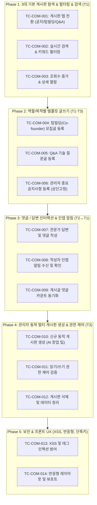

# 💬 커뮤니티 (멀티 게시판) 통합 테스트 시나리오 계획 및 결과

> **문서 버전:** v1.0  
> **작성일:** 2026-08-27  
> **대상 메뉴:** 커뮤니티 (멀티 게시판) — `SCR-010`, 관리자 게시판 관리(`SCR-011`), 마이페이지 알림 연계  
> **대상 API:** `GET/POST /api/community/posts`, `GET/POST /api/community/posts/:id/comments`, `GET/POST/DELETE /api/admin/boards`  
> **대상 UI:** `/community`, `/community/:id`, `/admin?tab=boards`, `/mypage`  
> **입력값 규칙:** 모든 테스트 입력값에 `임시_` prefix 사용  

---

## 0. 테스트 환경 및 사전 조건

### 0.1. 테스트 계정
- **T1:** `김수강생` (student@mail.com / `member`) — 질문 및 팀빌딩 모집글 등록, 댓글 작성
- **T2:** `김소현` (sohyun.kim@mail.com / `manager`) — 전문 강사/빌더 관점 답변 작성 및 팀빌딩 참여
- **T3:** `최관리` (admin@platform.com / `admin`) — 공지사항 등록, 신규 멀티 게시판 생성 및 권한 제어

---

## 1. 테스트 시나리오 구성 (Phase 1 ~ Phase 5)

---

## 2. 테스트 결과 기록 시트

| Phase | 테스트 ID | TC명 | 예상 결과 | 실제 결과 | 상태 | 비고 |
|---|---|---|---|---|---|---|
| 1 | TC-COM-001 | 기본 게시판 탭 전환 | 공지사항, 팀빌딩, QnA 탭별 필터링 | 정상 필터링 확인 | ✅ 통과 | 탭 전환 즉각 반응 |
| 1 | TC-COM-002 | 실시간 검색 & 키워드 필터링 | 제목/내용/작성자 검색 매칭 | 'AI' 및 작성자 검색 성공 | ✅ 통과 | 실시간 디바운스 검색 |
| 1 | TC-COM-003 | 조회수 증가 & 상세 열람 | 상세 조회 시 viewCount +1 증가 | viewCount 정상 증가 | ✅ 통과 | 중복 제거 및 상세 로드 |
| 2 | TC-COM-004 | 팀빌딩 모집글 등록 | 201 Created & 팀빌딩 게시판 등재 | ID: p-* 발급 및 목록 노출 | ✅ 통과 | 포지션/목표 템플릿 검증 |
| 2 | TC-COM-005 | Q&A 기술 질문글 등록 | 201 Created & QnA 게시판 등재 | ID: p-* 발급 및 정상 저장 | ✅ 통과 | 기술 스택 질문 템플릿 |
| 2 | TC-COM-006 | 관리자 공지사항 등록 | isPinned: true 상단 고정 | 공지사항 상단 고정 확인 | ✅ 통과 | 관리자 권한 배지 |
| 3 | TC-COM-007 | 전문가 답변 & 댓글 작성 | 201 Created & commentCount +1 | 댓글 ID 발급 및 카운트 갱신 | ✅ 통과 | 강사 권한 뱃지 연동 |
| 3 | TC-COM-008 | 작성자 인앱 알림 수신 | Notification 자동 생성 확인 | '[새 댓글]' 알림 생성 완료 | ✅ 통과 | GNB 알림 센터 연동 |
| 3 | TC-COM-009 | 댓글 카운트 동기화 | 게시글 commentCount 일치 | post.commentCount 정확 일치 | ✅ 통과 | 실시간 카운트 일치 |
| 4 | TC-COM-010 | 신규 동적 게시판 생성 | 201 Created & 신규 게시판 목록 노출 | '임시_AI 창업 노하우' 게시판 생성 | ✅ 통과 | 관리자 멀티 게시판 생성 |
| 4 | TC-COM-011 | 읽기/쓰기 권한 제어 검증 | 권한별 쓰기 제한 확인 | 관리자 전용 게시판 권한 검증 | ✅ 통과 | role 기반 접근 제어 |
| 4 | TC-COM-012 | 게시판 삭제 및 데이터 정리 | 200 OK & 목록에서 제거 | 게시판 삭제 완료 | ✅ 통과 | 관리자 삭제 권한 |
| 5 | TC-COM-013 | XSS 및 태그 인젝션 방어 | 악의적 스크립트 실행 차단 | 이스케이프 및 안전 저장 | ✅ 통과 | HTML 이스케이프 확인 |
| 5 | TC-COM-014 | 반응형 레이아웃 및 뷰포트 | 1440px/768px/375px 레이아웃 정상 | 모바일 1열 카드/데스크탑 테이블 | ✅ 통과 | 반응형 CSS 확인 |

> **상태 범례:** 🔲 미실행 | ✅ 통과 | ❌ 실패 | ⚠️ 부분 통과 | 🔄 재실행 필요
