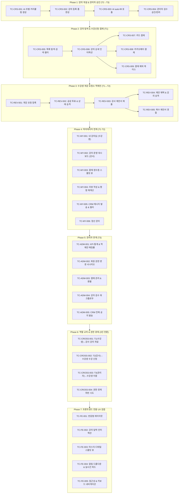

# 🎓 교육/강의 메뉴 통합 테스트 시나리오 계획

> **문서 버전:** v2.0 (프론트엔드 포함, 심화 케이스 보강)
> **작성일:** 2026-08-27
> **대상 메뉴:** 교육/강의 (Course) — `SCR-003`, `SCR-004`, 마이페이지(`SCR-005~006`), 관리자(`SCR-011`) 연계
> **대상 API:** `API-CRS-*`, `API-REV-CRS-*`, `API-AI-01/05`, `API-ADM-*`, `API-CRM-01`, Payments
> **대상 UI:** `/courses`, `/courses/:id`, `/mypage?tab=*`, `/admin?tab=*`
> **입력값 규칙:** 모든 테스트 입력값에 `임시_` prefix 사용

---

## 0. 테스트 환경 및 사전 조건

### 0.1. 테스트 계정 (기존 Seed 회원 활용)

| 테스터 ID | 실제 회원명 | Email | 기본 역할 | 로그인 방식 | 비고 |
|---|---|---|---|---|---|
| **T1** | `김수강생` | `student@mail.com` | `member` | `POST /api/auth/login { roles:["member"] }` | 수강 신청·결제·리뷰·개강 요청 담당 |
| **T2** | `김소현` | `sohyun.kim@mail.com` | `manager` (강사) | `POST /api/auth/login { roles:["manager"] }` | 강의 개설·역제안·CRM 발송 |
| **T3** | `최관리` | `admin@platform.com` | `admin` | `POST /api/auth/login { roles:["admin"] }` | 강의 승인/반려·권한변경·결제관리 |

> **역할 교차 테스트 시 사용할 추가 회원**
> - 공감 투표 추가 계정: `정우석` (ws.jung@mail.com, member), `강민수` (ms.kang@mail.com, member)

### 0.2. 기존 Seed 강의 (테스트 기준 데이터)

| ID | 강의명 | 강사 | 상태 | 가격 |
|---|---|---|---|---|
| `c1` | AI 프로덕트 매니저 부트캠프 | 김소현 | 모집중 | ₩890,000 (할인가 ₩590,000) |
| `c2` | 스타트업 비즈니스 모델 설계 | 정우석 | 진행중 | ₩490,000 |
| `c3` | 그로스 해킹 마스터클래스 | 한지민 | 모집중 | ₩390,000 (할인가 ₩290,000) |
| `c4` | 풀스택 AI 웹앱 개발 | 강민수 | 모집중 | ₩790,000 |
| `c5` | AI 네이티브 UI/UX 디자인 | 윤서연 | 진행중 | ₩450,000 |
| `c6` | LLM 에이전트 & 멀티에이전트 시스템 | 김소현 | 모집중 | ₩690,000 (할인가 ₩490,000) |

### 0.3. 기존 Seed 개강 요청

| ID | 제목 | 요청자 | 상태 | 투표수 |
|---|---|---|---|---|
| `cr-1` | 실전 LangGraph & 멀티 에이전트 자율 코딩 시스템 개강 요청 | 김수강생 | 모집중 | 18 |
| `cr-2` | 비개발자 창업자를 위한 AI 마케팅 & CRM 자동화 | 이창업 | 강사매칭중 | 24 |
| `cr-3` | AI 헬스케어 규제 샌드박스 통과 및 의료기기 인허가 전략 | 최의료 | 모집중 | — |

### 0.4. 기존 Seed 결제 기록

| ID | 강의 | 결제자 | 금액 | 상태 |
|---|---|---|---|---|
| `pay-1` | AI 프로덕트 매니저 부트캠프 | user-1 | ₩890,000 | 완료 |
| `pay-2` | 스타트업 비즈니스 모델 설계 | user-2 | ₩490,000 | 완료 |

### 0.5. 프론트엔드 테스트 환경

| 항목 | 설정값 |
|---|---|
| 테스트 URL | `http://localhost:3005` |
| 브라우저 | Chrome 최신 / Firefox / Safari (크로스브라우저) |
| 뷰포트 (데스크탑) | 1440 × 900 |
| 뷰포트 (모바일) | 375 × 812 (iPhone SE 기준) |
| 뷰포트 (태블릿) | 768 × 1024 |
| 자동화 도구 | Playwright E2E |
| API 모킹 | 없음 (실제 백엔드 연동) |

### 0.6. 사전 조건 체크리스트

- [ ] `npm run dev` 실행 → `localhost:3005` 정상 응답 확인
- [ ] MongoDB 연결 상태 (`launch_bizs_dev` DB, Seed 데이터 로드)
- [ ] 카카오페이 테스트 CID: `TC0ONETIME`, `KAKAO_PAY_SECRET_KEY` 환경변수 설정
- [ ] `GET /api/courses` → 강의 6건 이상 확인
- [ ] `GET /api/admin/stats` → 관리자 통계 정상 응답
- [ ] Chrome DevTools Network 탭 → API 응답 모니터링 준비

---

## 1. 전체 테스트 흐름 다이어그램



---

## 2. Phase 1: 강의 개설 & 관리자 승인

### TC-CRS-001: AI 초벌 커리큘럼 생성 (T2: 김소현)

| 항목 | 내용 |
|---|---|
| **테스터** | T2 — 김소현 (`manager`) |
| **API** | `POST /api/ai/course-draft` (API-AI-01) |
| **화면** | `/mypage?tab=instructor` → AI 채팅 초벌 생성 모달 (`SCR-006`) |
| **관련 컴포넌트** | `InstructorDashboard.tsx`, `CourseCreateEditModal.tsx` |

#### 2.1.1. 정상 시나리오

| Step | 행위 | 입력값 | 예상 결과 | 프론트 검증 포인트 |
|---|---|---|---|---|
| 1 | 강사 대시보드 `?tab=instructor` 접속 | — | 강의 개설 & 운영 탭 활성화 | 탭 하이라이트 CSS, 기존 강의 목록(c1, c6) 렌더링 확인 |
| 2 | "AI 강의 개설" 모달 오픈 | — | AI 채팅 인터페이스 표시 | 모달 배경 블러, `z-index` 레이어 충돌 없음 |
| 3 | AI 초벌 요청 전송 | `임시_강의주제_001`: "AI 에이전트로 B2B SaaS 만들기" | 스트리밍 텍스트 응답 또는 결과 바인딩 | 로딩 스피너 표시 → 완료 후 커리큘럼 카드 렌더링 |
| 4 | 응답 구조 확인 | — | `refinedTitle`, `naturalCategory`, `curriculum[]` (3개 이상) | 상세 폼 자동 바인딩: 제목·카테고리·커리큘럼 항목 |
| 5 | 재생성 요청 | `임시_강의주제_002`: "다시 생성, 실습 중심으로" | 기존 초안 대체 | 이전 데이터 Clear 후 신규 응답 렌더링 |

#### 2.1.2. 예외 시나리오

| Case | 입력값 | 예상 결과 | 프론트 확인 |
|---|---|---|---|
| 빈 프롬프트 전송 | `""` | API 호출 없음 또는 `400` | 전송 버튼 비활성화 또는 경고 토스트 |
| AI 서비스 타임아웃 (5s 초과) | 장문 입력 | 타임아웃 에러 메시지 | 에러 상태 UI, 재시도 버튼 표시 |
| 네트워크 단절 | Dev Tools → Network 오프라인 | 네트워크 에러 표시 | 낙관적 업데이트 롤백 여부 |

---

### TC-CRS-002: 강의 등록 폼 완성 (T2: 김소현)

| 항목 | 내용 |
|---|---|
| **테스터** | T2 — 김소현 (`manager`) |
| **API** | `POST /api/courses` (API-CRS-03) |
| **화면** | `CourseCreateEditModal.tsx` — 강의 개설 마법사 |

#### 정상 시나리오 (상세 입력값)

| Step | 필드 | 입력값 | 예상 결과 | 프론트 검증 포인트 |
|---|---|---|---|---|
| 1 | 강의명 | `임시_강의명_001`: "임시_AI 에이전트 B2B SaaS 완성 과정" | 제목 입력 완료 | 글자수 카운터 표시 (있을 경우) |
| 2 | 강의 설명 | `임시_강의설명_001`: "임시_LangGraph와 CrewAI를 활용해 B2B 고객사에 납품 가능한 멀티에이전트 SaaS를 처음부터 끝까지 제작합니다." | 설명 입력 완료 | 멀티라인 텍스트 영역 |
| 3 | 정가 | `임시_가격_정가_001`: 890000 | ₩890,000 표시 | 콤마 자동 포맷팅 |
| 4 | 할인가 | `임시_가격_할인_001`: 620000 | ₩620,000 표시 (할인율: 30% 자동 계산) | 할인율 배지 렌더링 |
| 5 | 시작일 | `임시_시작일_001`: "2026-10-06" | 날짜 픽커 선택 | 달력 UI 팝오버 동작 |
| 6 | 종료일 | `임시_종료일_001`: "2026-11-17" | 시작일 이후 날짜만 선택 가능 | 시작일 이전 날짜 비활성화 |
| 7 | 수업 요일 | `[화, 목]` | 징검다리 일정 자동 배정 | 달력 미리보기: 해당 요일에 점 표시 |
| 8 | 수업 시간 | `임시_시간_001`: "19:30~21:30" | 시간대 반영 | 각 회차에 시간 병기 |
| 9 | 커리큘럼 — 1주차 | `임시_커리_001`: "멀티에이전트 아키텍처 설계", `임시_커리_002`: "LangGraph 상태 머신 실습" | 2개 항목 추가 | Drag & Drop 순서 변경 가능 여부 |
| 10 | 커리큘럼 — 2주차 | `임시_커리_003`: "API 서버 & 도구 연동", `임시_커리_004`: "CrewAI 팀 오케스트레이션" | 2개 항목 추가 | 회차 번호 자동 증가 |
| 11 | 제출 | — | `201 Created`, 강의 ID 반환 | 모달 닫힘, 강의 목록 갱신 |
| 12 | 목록 반영 | `GET /api/courses` | 신규 강의 상단 노출 | 카드에 '모집중' 배지, 일정 정보 표시 |

#### 경계값 테스트

| Case | 입력 | 예상 결과 | 프론트 확인 |
|---|---|---|---|
| 제목 누락 | `title: ""` | `400` — "Course title is required" | 인라인 에러 메시지 하이라이트 |
| 할인가 > 정가 | `임시_가격_역전_001`: 정가 500000, 할인가 600000 | 폼 레벨 경고 | 에러 경고 메시지 |
| 종료일 < 시작일 | 역전 날짜 | 날짜 선택 차단 또는 경고 | 달력 비활성화 |
| 수업 요일 없이 제출 | 요일 미선택 | 경고 메시지 | 요일 필드 에러 하이라이트 |
| 가격 0원 (무료 강의) | `임시_가격_무료_001`: 0 | 정상 등록 | "무료" 배지 렌더링 여부 |
| XSS 제목 입력 | `임시_XSS_001`: `<script>alert('xss')</script>` | 스크립트 실행 안 됨, 문자열 그대로 저장 | HTML 이스케이프 확인 |

---

### TC-CRS-003: AI 자동 채우기 (auto-fill) (T2: 김소현)

| 항목 | 내용 |
|---|---|
| **테스터** | T2 — 김소현 (`manager`) |
| **API** | `POST /api/ai/auto-fill` (API-AI-05) |
| **관련 컴포넌트** | `CourseCreateEditModal.tsx`, `CourseRequestModal.tsx` |

| Step | 행위 | 입력값 | 예상 결과 | 검증 포인트 |
|---|---|---|---|---|
| 1 | 거친 제목으로 auto-fill 호출 (course 타입) | `임시_제목초안_001`: "파이썬으로 챗봇 만드는거", `type: "course"` | `refinedTitle`: 매력적 공식 제목 | `refinedTitle` ≠ 입력값, 길이 20자 이상 |
| 2 | 자연어 분야 확인 | — | `naturalCategory`: 자연어 분야 문자열 (선택형 아님) | DB에 `naturalCategory` 필드 저장 확인 |
| 3 | 태그 자동 생성 | — | `tags[]`: 3개 이상 관련 태그 | 태그 칩으로 폼에 렌더링 |
| 4 | course_request 타입 | `임시_제목초안_002`: "노코드로 자동화 배우고 싶음", `type: "course_request"` | 개강 요청에 맞는 `description`, `tags`, `targetLevel` | 타입별 필드 차이 확인 |
| 5 | 응답 속도 | — | 5초 이내 응답 | 로딩 상태 표시 정상 동작 |

---

### TC-CRS-004: 관리자 강의 검수 & 승인/반려 (T3: 최관리)

| 항목 | 내용 |
|---|---|
| **테스터** | T3 — 최관리 (`admin`) |
| **API** | `PATCH /api/courses/:id/approve`, `PATCH /api/courses/:id/reject` |
| **화면** | `/admin?tab=courses` (`SCR-011`) |
| **관련 컴포넌트** | `AdminDashboard.tsx` |

#### 4.1. 승인 워크플로우

| Step | 행위 | 입력값 | 예상 결과 | 프론트 검증 포인트 |
|---|---|---|---|---|
| 1 | 관리자 대시보드 `?tab=courses` 접속 | — | 강의 검수 목록 표시 | 2단 스플릿 뷰 — 좌측 강의 목록, 우측 빈 상태 |
| 2 | TC-CRS-002에서 등록된 강의 행 클릭 | — | 우측 상세 패널 슬라이드 인 | `animate-slideInFromRight` 애니메이션, 커리큘럼·일정·가격 모두 표시 |
| 3 | **승인** 클릭 | TC-CRS-002 강의 ID | `status` → `"모집중"`, `200 OK` | 행 상태 배지 즉시 갱신 (낙관적 업데이트) |
| 4 | 강의 목록(`/courses`) 공개 확인 | — | `GET /api/courses` 에 포함, 수강 신청 가능 | 목록 카드에 '모집중' 배지 표시 |
| 5 | 관리자 KPI 통계 반영 | — | `activeCourses` +1 | `GET /api/admin/stats` 확인 |

#### 4.2. 반려 워크플로우

| Step | 행위 | 입력값 | 예상 결과 | 프론트 검증 포인트 |
|---|---|---|---|---|
| 1 | 별도 테스트 강의 행 클릭 | — | 상세 패널 표시 | — |
| 2 | **반려** 클릭 → 사유 입력 | `임시_반려사유_001`: "임시_커리큘럼 2주차 이후 내용이 부족합니다. 보완 후 재제출 바랍니다." | `status` → `"종료"`, `reason` 응답 포함 | 반려 사유 텍스트 에리어 입력 UX |
| 3 | 반려 후 목록 상태 | — | 강의 카드 배지 '종료' 표시 | 실시간 DOM 업데이트 |
| 4 | 강사 알림 생성 | — | (알림 연동 여부) | 강사 마이페이지 알림에 반려 사유 수신 |

---

## 3. Phase 2: 강의 탐색 & 수강 신청·결제

### TC-CRS-005: 강의 목록 탐색 & 필터 (T1: 김수강생)

| 항목 | 내용 |
|---|---|
| **테스터** | T1 — 김수강생 (`member`) |
| **API** | `GET /api/courses`, `GET /api/courses/categories` |
| **화면** | `/courses` (`SCR-003`) |
| **관련 컴포넌트** | `CoursePage.tsx` |

#### 5.1. 기본 탐색

| Step | 행위 | 입력값 | 예상 결과 | 프론트 검증 포인트 |
|---|---|---|---|---|
| 1 | `/courses` 접속 | — | Seed 강의 6건 + 신규 강의 표시 | 강의 카드 그리드 레이아웃, 썸네일·제목·강사·가격·일정 배지 |
| 2 | 카드 일정 배지 확인 | — | 강의 기간·요일·시간·회차수·상태 배지 | 예: "9.2~10.14 · 화·목 · 19:30 · 12회차 · 모집중" |
| 3 | 서브 탭 전환 | [💡 수강생 개강 요청소] | 탭 전환, 개강 요청 리스트 표시 | 탭 애니메이션, URL 파라미터 변경 여부 |
| 4 | 탭 재전환 | [🎓 개설된 강의 탐색] | 강의 목록 복원 | 이전 스크롤 위치 보존 여부 |

#### 5.2. 검색 & 필터 (복합 시나리오)

| Step | 행위 | 입력값 | 예상 결과 | 프론트 검증 포인트 |
|---|---|---|---|---|
| 1 | 실시간 검색 — 강의명 | `임시_검색어_001`: "AI 프로덕트" | `c1` 강의 노출 | 키입력마다 디바운스(300ms) 후 결과 갱신 |
| 2 | 실시간 검색 — 강사명 | `임시_검색어_002`: "김소현" | `c1`, `c6` 노출 | 강사명 검색 정상 |
| 3 | 실시간 검색 — 태그 | `임시_검색어_003`: "LangChain" | `c4` 노출 | 태그 검색 정상 |
| 4 | 카테고리 필터 | "AI 모델링" | `c1`, `c6` 노출 | 필터 버튼 활성 상태 CSS, 페이지 1 자동 리셋 |
| 5 | 검색 + 카테고리 복합 | 검색어 "LLM" + 카테고리 "AI 모델링" | 교집합 결과 | 검색어 유지 상태에서 필터 변경 시 동작 |
| 6 | 검색어 초기화 | 검색창 클리어 | 전체 강의 복원 | X 버튼 또는 ESC로 초기화 |
| 7 | 페이지네이션 | page=2 (페이지당 10건 기준) | 2페이지 데이터 | 현재 페이지 번호 하이라이트, 이전/다음 버튼 |
| 8 | 검색어 변경 후 페이지 | 카테고리 변경 | 1페이지 자동 리셋 | 페이지네이션 초기화 확인 |
| 9 | 검색 결과 없음 | `임시_검색어_없음_001`: "존재하지않는강의" | "검색 결과가 없습니다" Empty State | Empty State UI 표시 |

---

### TC-CRS-006: 강의 상세 페이지 인터랙션 (T1: 김수강생)

| 항목 | 내용 |
|---|---|
| **테스터** | T1 — 김수강생 (`member`) |
| **API** | `GET /api/courses/:id` |
| **화면** | `/courses/c1` (`SCR-004`) |
| **관련 컴포넌트** | `CoursePage.tsx` (상세 뷰) |

#### 6.1. 커리큘럼 & 달력 인터랙션

| Step | 행위 | 입력값 | 예상 결과 | 프론트 검증 포인트 |
|---|---|---|---|---|
| 1 | `c1` 강의 상세 접속 | `/courses/c1` | 강의 상세 전체 렌더링 | 페이지 타이틀 `<h1>`, SEO meta 태그 확인 |
| 2 | 커리큘럼 리스트 확인 | — | 6개 회차 목록, 각 회차에 일자·요일·시간 표기 | 포맷: `2025.09.02(화) 19:30~21:30 \| 1회차: AI 프로덕트 이해 & 가설 수립` |
| 3 | 인터랙티브 달력 확인 | — | 월별 달력, 강의 날짜(9/2, 9/4, ...) 에 점/배지 | 달력 위젯 렌더링, 해당 월 자동 이동 |
| 4 | 달력 날짜 클릭 | `2025-09-02` | 해당 회차 커리큘럼 툴팁 또는 하이라이트 표시 | 툴팁: "1회차: AI 프로덕트 이해 & 가설 수립" |
| 5 | 달력 월 이동 | 다음달 화살표 | 다음 달 달력으로 이동 | 강의 없는 날 배지 없음 |
| 6 | "이 일정으로 수강 신청하기" 클릭 | — | 결제 모달 바로 오픈 | 달력 내 원클릭 버튼 동작 |

#### 6.2. 강사 인포그래픽 & 모달

| Step | 행위 | 입력값 | 예상 결과 | 프론트 검증 포인트 |
|---|---|---|---|---|
| 1 | 강사 인포그래픽 카드 확인 | — | 경력 11년, 수강생 3420명, 만족도 99%, 핵심 키워드 5개, 인증 마크 | 데이터 시각화 렌더링 (수치 애니메이션 여부) |
| 2 | 강사 이름 클릭 | "김소현" 클릭 | `InstructorDetailModal` 팝업 | 모달 배경 오버레이, 강사 프로필 전체 |
| 3 | 모달 내 과거 강의 목록 | — | `c1`, `c-past1`, `c-past2` 표시 (상태·평점·수강생수) | 과거 강의 링크 클릭 시 해당 상세 이동 |
| 4 | 모달 내 수강생 리뷰 | — | 리뷰 3건 표시 (박지훈, 이수진, 최민호) | 리뷰 카드, 별점, 날짜 렌더링 |
| 5 | 모달 ESC 닫기 | `ESC` 키 입력 | 모달 닫힘 | 포커스 원위치 복원 |
| 6 | 수강 신청 카드 가격 확인 | — | 정가 ₩890,000, 할인가 ₩590,000 표시 | 할인율 배지, 총 회차 12회차, 수강생 342명 |

#### 6.3. 예외 케이스

| Case | 조건 | 예상 결과 | 프론트 확인 |
|---|---|---|---|
| 존재하지 않는 강의 | `/courses/invalid-id` | `404` 응답 | 404 페이지 또는 에러 바운더리 |
| 수강 중인 강의 재신청 | `c2` (이미 수강 중, isEnrolled: true) | "이미 수강 중" 표시, 신청 버튼 비활성화 또는 변경 | 버튼 텍스트/상태 변경 |
| 종료된 강의 신청 | `status: "종료"` | 수강 신청 버튼 비활성화 | 버튼 상태 비활성화 UI |

---

### TC-CRS-007: 카드 결제 (T1: 김수강생)

| 항목 | 내용 |
|---|---|
| **테스터** | T1 — 김수강생 (`member`) |
| **API** | `POST /api/courses/:id/enroll` (API-CRS-04) |
| **대상 강의** | `c3` (그로스 해킹 마스터클래스, 할인가 ₩290,000) |

| Step | 행위 | 입력값 | 예상 결과 | 프론트 검증 포인트 |
|---|---|---|---|---|
| 1 | `c3` 상세 → "수강 신청하기" | — | 결제 수단 선택 모달 표시 | 정가 ₩390,000, 할인가 ₩290,000 모두 표시 |
| 2 | 카드 결제 선택 | `임시_결제_카드_001`, `paymentMethod: "카드"` | 결제 진행 중 스피너 | 버튼 로딩 상태 |
| 3 | 결제 완료 | — | `200 OK`, `{ success: true, course, payment }` | 성공 토스트/알림, 모달 닫힘 |
| 4 | 강의 상태 업데이트 | — | `isEnrolled: true`, `studentCount: 179` (+1) | 수강 신청 버튼 → "수강 중" 상태로 변경 |
| 5 | 결제 기록 확인 | `GET /api/payments` | `pay-*` 신규 레코드: courseId=`c3`, amount=290000, method="카드" | — |
| 6 | 인앱 알림 확인 | — | 알림 센터 드롭다운에 "수강신청 완료" 알림 추가 | GNB 알림 배지 카운트 증가 |
| 7 | 관리자 매출 통계 반영 | `GET /api/admin/stats` | `totalRevenue` +290000, `monthlyRevenue` +290000 | T3가 확인 |

---

### TC-CRS-008: 카카오페이 결제 플로우 (T1: 김수강생)

| 항목 | 내용 |
|---|---|
| **테스터** | T1 — 김수강생 (`member`) |
| **API** | `POST /api/payments/ready`, `GET /api/payments/success` |
| **대상 강의** | `c4` (풀스택 AI 웹앱 개발, ₩790,000) |
| **주의** | 카카오페이 테스트 CID `TC0ONETIME` 사용 |

| Step | 행위 | 입력값 | 예상 결과 | 프론트 검증 포인트 |
|---|---|---|---|---|
| 1 | `c4` 상세 → "카카오페이로 결제" | `임시_결제_카카오_001` | `POST /api/payments/ready` 호출 | 카카오페이 팝업 창 또는 redirect |
| 2 | 결제 준비 응답 확인 | — | `next_redirect_pc_url` 포함 응답, TID 세션 저장 | 리다이렉트 URL 유효성 |
| 3 | 카카오페이 테스트 결제 완료 | — | `pg_token` 포함 `/api/payments/success` 호출 | 성공 리다이렉트: `/?payment=success` |
| 4 | 결제 승인 후 강의 상태 | — | 결제 기록 DB 저장, 알림 생성 | 메인 페이지에서 성공 배너/토스트 표시 |
| 5 | TID 세션 정합성 | — | 가장 최근 세션의 TID로 승인 | 복수 동시 결제 시 세션 혼용 없음 |

#### 카카오페이 에러 시나리오

| Case | 조건 | 예상 결과 | 프론트 확인 |
|---|---|---|---|
| pg_token 없이 success 접근 | URL에 pg_token 파라미터 없음 | `/?payment=error&reason=invalid_session` 리다이렉트 | 에러 배너 표시 |
| 카카오페이 API 장애 | Ready API 500 응답 | `500 Internal Server Error` | 에러 토스트, 재시도 유도 |
| 결제 취소 | 카카오페이 팝업 내 취소 버튼 | `/?payment=cancel` 또는 원래 페이지 유지 | 강의 상태 변경 없음 확인 |

---

### TC-CRS-009: 결제 예외 & 경계값 (T1: 김수강생)

| Case | 조건 | 예상 결과 | 검증 방법 |
|---|---|---|---|
| 이미 수강 중인 강의 재결제 | `c2` (isEnrolled: true) 수강 신청 | UI 레벨에서 차단 또는 API 레벨 중복 처리 | 버튼 비활성화 또는 에러 메시지 |
| 모집 종료 강의 결제 | `status: "종료"` 강의 enroll | API 거부 또는 프론트 차단 | `400/403` 응답 |
| 수량 0원 강의 | price=0 강의 수강 신청 | 결제 없이 바로 수강 등록 | `paymentMethod` 없어도 성공 여부 |
| 동시 복수 클릭 | 결제 버튼 빠르게 2회 클릭 | 결제 1회만 처리 (중복 방지) | 버튼 디바운스/디세이블 |

---

## 4. Phase 3: 수강생 개강 요청소 (수요 역제안 시스템)

### TC-REV-001: 개강 요청 등록 (T1: 김수강생)

| 항목 | 내용 |
|---|---|
| **테스터** | T1 — 김수강생 (`member`) |
| **API** | `POST /api/courses/requests` (API-REV-CRS-02) |
| **화면** | `/courses` → [💡 수강생 개강 요청소] 탭 → `CourseRequestModal` |

#### 정상 시나리오

| Step | 행위 | 입력값 | 예상 결과 | 프론트 검증 포인트 |
|---|---|---|---|---|
| 1 | [💡 수강생 개강 요청소] 탭 클릭 | — | 기존 요청 목록 표시 (cr-1, cr-2, cr-3 포함) | 인기순/최신순 정렬, 검색 바, 투표 버튼 렌더링 |
| 2 | "개강 요청하기" 버튼 클릭 | — | `CourseRequestModal` 오픈 | 모달 애니메이션, AI 지원 안내 문구 |
| 3 | AI 자동 채우기 | `임시_요청초안_001`: "노코드 자동화 배우고 싶어요 n8n make" | `refinedTitle`, `naturalCategory`, `tags`, `description` 자동 생성 | 자동 채우기 로딩 스피너, 완료 후 폼 바인딩 |
| 4 | 주제 확정 | `임시_개강요청_주제_001`: "임시_AI 코파일럿 활용 풀스택 웹개발 (Cursor + GitHub Copilot)" | 주제 필드 수정 | 기존 AI 생성 내용 위에 수동 수정 가능 |
| 5 | 난이도 선택 | `임시_개강요청_난이도_001`: "중급" | 중급 선택 | 라디오/셀렉트 UI |
| 6 | 희망 일정 | `임시_개강요청_일정_001`: "평일 저녁 (화/목 19:30~21:30)" | 입력 완료 | 텍스트 또는 셀렉트 |
| 7 | 희망 가격대 | `임시_개강요청_가격_001`: "45~60만원대" | 입력 완료 | 가격 범위 선택 UI |
| 8 | 제출 | — | `201 Created` | 목록 갱신, 신규 요청 카드 상단 노출 |
| 9 | 목록 정합성 | `GET /api/courses/requests` | 신규 요청 포함, `status: "모집중"`, `upvoteCount: 1` | 본인 자동 투표 포함 |

---

### TC-REV-002: 공감 투표 & 상태 자동 승격 (T1 + 정우석 + 강민수)

| 항목 | 내용 |
|---|---|
| **테스터** | T1(김수강생) + 정우석 + 강민수 순차 투표 |
| **API** | `POST /api/courses/requests/:id/upvote` (API-REV-CRS-03) |

| Step | 행위 | 담당 | 입력값 | 예상 결과 | 프론트 검증 포인트 |
|---|---|---|---|---|---|
| 1 | TC-REV-001 요청 공감 투표 | 정우석 | `userId: "u-ws-jung"` | `isUpvoted: true`, `upvoteCount: 2` | 투표 버튼 색상 변경, 카운트 증가 애니메이션 |
| 2 | 투표 토글 (취소) | 정우석 | 동일 요청 재클릭 | `isUpvoted: false`, `upvoteCount: 1` | 버튼 원상 복원 |
| 3 | 재투표 | 정우석 | 다시 클릭 | `upvoteCount: 2` | — |
| 4 | 추가 투표 | 강민수 | `userId: "u-ms-kang"` | `upvoteCount: 3` | — |
| 5 | Seed `cr-1` 투표 (18→19) | T1 | `cr-1` 요청 투표 | `upvoteCount: 19` | targetCount=20, 진행바 95% |
| 6 | `cr-1` targetCount 도달 | 추가 임의 투표 | `upvoteCount: 20` | `status` → `"강사매칭중"` 자동 승격 | 요청 카드 상태 배지 즉시 변경 |
| 7 | 이미 투표한 요청 중복 방지 | T1 | `cr-1` 재투표 시도 | 토글로 취소만 가능 | 중복 투표 방지 로직 확인 |

---

### TC-REV-003: 강사 개강 제안서 제출 (T2: 김소현)

| 항목 | 내용 |
|---|---|
| **테스터** | T2 — 김소현 (`manager`) |
| **API** | `POST /api/courses/requests/:id/proposals` (API-REV-CRS-04) |
| **화면** | `/mypage?tab=instructor` → 수요 있는 개강 요청 둘러보기 탭 → `CourseProposalModal` |

| Step | 행위 | 입력값 | 예상 결과 | 프론트 검증 포인트 |
|---|---|---|---|---|
| 1 | 강사 마이페이지 → 개강 요청 탐색 탭 | — | TC-REV-001 요청 + cr-1, cr-2 표시 | 인기순 정렬 (투표수 기준) |
| 2 | TC-REV-001 요청 선택 → 제안서 작성 | — | `CourseProposalModal` 오픈 | 요청 제목·투표수·상세 내용 모달 상단 표시 |
| 3 | 제안 강의명 | `임시_제안강의명_001`: "임시_AI 코파일럿 풀스택 실전 완성반 (Cursor Edition)" | 입력 완료 | — |
| 4 | 커리큘럼 초안 | `임시_제안커리_001`: "Cursor AI 개발환경 셋업 & 실전 워크플로우", `임시_제안커리_002`: "GitHub Copilot 전체 코드 생성 전략", `임시_제안커리_003`: "풀스택 아키텍처 자동 설계", `임시_제안커리_004`: "API 서버 자동 생성 & 테스트", `임시_제안커리_005`: "프론트엔드 컴포넌트 AI 자동 구현", `임시_제안커리_006`: "배포 자동화 & CI/CD" | 6개 항목 | 추가/삭제/순서 변경 UX |
| 5 | 제안 가격 | `임시_제안가격_001`: 490000 | 입력 완료 | 할인가 자동 계산 표시(×0.8 = 392,000) |
| 6 | 제안 일정 | `임시_제안일정_001`: "매주 화·목 19:30~21:30 (3주 6회차)" | 입력 완료 | — |
| 7 | 강사 한마디 | `임시_제안메시지_001`: "임시_현직 개발자 관점에서 AI 페어프로그래밍의 모든 노하우를 전수합니다." | 입력 완료 | 글자수 제한 확인 |
| 8 | 제출 | — | `201 Created`, `status: "대기중"` | 모달 닫힘, 제안서 제출 완료 토스트 |
| 9 | 요청 상태 변경 | — | 해당 요청 `status` → `"강사매칭중"` | 요청 목록 카드 배지 변경 |
| 10 | 알림 생성 | — | T1 알림: "새로운 강사 개강 제안서 도착" | GNB 알림 배지 |

---

### TC-REV-004: 제안 채택 & 정식 강의 승격 (T1: 김수강생)

| 항목 | 내용 |
|---|---|
| **테스터** | T1 — 김수강생 (`member`) |
| **API** | `POST /api/courses/requests/:id/accept-proposal` (API-REV-CRS-05) |
| **화면** | `/mypage?tab=courses` → 요청한 강의 탭 |

| Step | 행위 | 입력값 | 예상 결과 | 프론트 검증 포인트 |
|---|---|---|---|---|
| 1 | 마이페이지 → 내 강의실 → "요청한 강의" 탭 | — | TC-REV-001 요청 + TC-REV-003 제안서 목록 | 제안서 카드: 강사명·제안가격·커리큘럼 미리보기 |
| 2 | 제안서 상세 클릭 | — | 제안서 풀 상세: 6개 커리큘럼, 가격, 일정, 메시지 | 스플릿 뷰 또는 상세 모달 |
| 3 | "제안 채택" 클릭 | `proposalId`: TC-REV-003 ID | 채택 확인 다이얼로그 | "정말 채택하시겠습니까?" 컨펌 모달 |
| 4 | 확인 클릭 | — | `200 OK`, 정식 강의 생성 | 성공 메시지: "🎉 강의가 정식으로 개설되었습니다!" |
| 5 | 승격 검증 항목 | — | 아래 체크리스트 모두 확인 | — |

**Step 5 승격 검증 체크리스트:**

- [ ] 채택된 제안서 `status` → `"채택됨"`
- [ ] 나머지 제안서(있을 경우) `status` → `"반려"`
- [ ] 신규 `Course` 문서 생성 (ID: `c-rev-*`)
- [ ] 요청 `status` → `"개강완료"`, `matchedCourseId` = 생성된 강의 ID
- [ ] 강의 `title` = `임시_제안강의명_001`
- [ ] 강의 `curriculum` 6개 항목 정확히 매핑
- [ ] 강의 `price` = 490000, `discountedPrice` = 392000 (×0.8)
- [ ] 강의 `studentCount` = 이전 upvoteCount (3)
- [ ] 강의 `description`에 `[수강생 역제안 매칭으로 개설된 강의입니다.]` 포함
- [ ] `GET /api/courses` 목록에 신규 강의 포함
- [ ] 알림: "🎉 개강 제안 채택 및 강의 개설 완료!"

---

### TC-REV-005: 복수 제안서 경합 시나리오 (T2: 김소현 + 추가 강사)

| 항목 | 내용 |
|---|---|
| **목적** | 동일 요청에 복수 제안서가 있을 때 채택/비채택 처리 검증 |
| **대상 요청** | `cr-1` (LangGraph 요청, 투표 18건) |

| Step | 행위 | 입력값 | 예상 결과 | 검증 포인트 |
|---|---|---|---|---|
| 1 | T2(김소현)가 cr-1에 제안서 제출 | `임시_제안강의명_002`: "임시_LangGraph 심화 실전과정" | 제안서 A 생성 | `status: "대기중"` |
| 2 | 별도 강사 역할로 cr-1에 제안서 제출 | `임시_제안강의명_003`: "임시_LangGraph 입문부터 실전까지" | 제안서 B 생성 | 동일 요청에 복수 제안서 허용 |
| 3 | T1이 제안서 A 채택 | proposalId = 제안서 A ID | 제안서 A: `"채택됨"`, 제안서 B: `"반려"` | 한 번에 하나만 채택 가능 확인 |
| 4 | 비채택 강사에게 알림 | — | (알림 연동 여부) | 비채택 알림 전송 여부 확인 |

---

## 5. Phase 4: 마이데이터 연계 검증

### TC-MY-001: 내 강의실 — 수강 관리 (T1: 김수강생)

| 항목 | 내용 |
|---|---|
| **테스터** | T1 — 김수강생 (`member`) |
| **화면** | `/mypage?tab=courses` (`SCR-005`) |
| **관련 컴포넌트** | `MyCoursesView.tsx` |

| Step | 행위 | 예상 결과 | 프론트 검증 포인트 |
|---|---|---|---|
| 1 | `?tab=courses` 접속 | TC-CRS-007에서 수강 신청한 `c3` + 기존 seed `c2` 표시 | 수강 중 강의 카드: 진도율 바, 일정(기간·요일·시간), VOD 입장 버튼 |
| 2 | "전체" 탭 | 모든 수강 강의 표시 | — |
| 3 | "수강 중" 탭 | 진행 중인 강의만 | `status: "진행중"` 기준 필터 |
| 4 | "수료" 탭 | 수료 완료 강의 | `progress: 100` 또는 종료 기준 |
| 5 | `c3` 진도율 확인 | `progress: 0%` | 진도율 바 0% 렌더링 |
| 6 | `c2` 진도율 확인 | `progress: 60%` | 진도율 바 60% 렌더링 |
| 7 | "요청한 강의" 탭 | TC-REV-001 요청 + 강사 제안서 | 역제안 수신 목록 |
| 8 | VOD 바로가기 클릭 | — | VOD 링크 연결 또는 "준비 중" 안내 | — |

---

### TC-MY-002: 강의 개설 & 운영 대시보드 (T2: 김소현)

| 항목 | 내용 |
|---|---|
| **테스터** | T2 — 김소현 (`manager`) |
| **화면** | `/mypage?tab=instructor` (`SCR-006`) |
| **관련 컴포넌트** | `InstructorDashboard.tsx` |

| Step | 행위 | 예상 결과 | 프론트 검증 포인트 |
|---|---|---|---|
| 1 | `?tab=instructor` 접속 | 개설 강의 목록: `c1`, `c6` + TC-CRS-002 강의 표시 | 상태 배지, 수강생 수 통계 카드 |
| 2 | TC-CRS-002 강의 선택 | 강의 상세: 수강생 명단, 진도율, 마지막 활동일 | 수강생 CRM 필터 UI |
| 3 | 전체 수강생 CRM 발송 | `임시_CRM_제목_001`: "임시_수강 안내 메시지", `임시_CRM_본문_001`: "임시_첫 수업 안내드립니다. 질문은 Q&A 게시판 이용바랍니다." | `POST /api/instructor/crm/send` 성공 | 발송 완료 토스트 |
| 4 | 진도율 미달(50% 미만) 필터 CRM | `target: "low_progress"` | 해당 수강생만 선택 발송 | 타깃 카운트 표시 |
| 5 | 우수 수강생(80% 이상) 필터 | `target: "high_progress"` | 해당 수강생만 선택 | 필터별 카운트 확인 |
| 6 | 정산 관리 탭 | 기간별 총매출, PG 수수료(3.3%), 플랫폼 수수료(15%), 순수익 | 수치 정합성 확인 |
| 7 | 출금 신청 | — | 출금 신청 처리 또는 안내 | UI 동작 여부 |

---

### TC-MY-003: 결제 & 영수증 스플릿 뷰 (T1: 김수강생)

| 항목 | 내용 |
|---|---|
| **테스터** | T1 — 김수강생 (`member`) |
| **화면** | `/mypage?tab=settings` → 결제 영수증 |
| **API** | `GET /api/payments`, `GET /api/payments/:id/receipt` |

| Step | 행위 | 예상 결과 | 프론트 검증 포인트 |
|---|---|---|---|
| 1 | `?tab=settings` 접속 → 결제 탭 | 결제 목록 좌측 표시 | 날짜 내림차순, 상태 배지 |
| 2 | TC-CRS-007 결제(c3, ₩290,000) 행 클릭 | 우측 영수증 상세 카드 슬라이드 인 | `animate-slideInFromRight` 동작 |
| 3 | 영수증 내용 확인 | `receiptId: REC-PAY-*`, `issuer: "(주)AI로 창업하라 플랫폼"` | 공급가액=261,000, 세액=29,000, 합계=290,000 (`×0.9`, `×0.1` 계산) |
| 4 | 다른 결제 행 클릭 | 깜박임 없는 인라인 전환 | DOM 언마운트 없이 우측 패널 내용만 교체 |
| 5 | ESC 키 | 우측 패널 닫힘, 100% 폭 복원 | 트랜지션 애니메이션 |
| 6 | 환불 신청 (7일 이내) | `임시_환불사유_001`: "임시_단순 변심" | `POST /api/payments/:id/refund` → `status: "환불"` | 환불 후 배지 즉시 갱신 |
| 7 | 영수증 출력 | 브라우저 인쇄 또는 PDF | 영수증 레이아웃 인쇄 미리보기 | `@media print` CSS 확인 |

---

### TC-MY-004: 수강 리뷰 작성 & 평점 재계산 (T1: 김수강생)

| 항목 | 내용 |
|---|---|
| **테스터** | T1 — 김수강생 (`member`) |
| **API** | `POST /api/courses/:id/reviews` |

| Step | 행위 | 입력값 | 예상 결과 | 프론트 검증 포인트 |
|---|---|---|---|---|
| 1 | `c3` 강의 상세 접속 (수강 중 상태) | — | 리뷰 작성 폼 표시 | 수강 여부 확인 후 리뷰 폼 노출 |
| 2 | 별점 5점 선택 | `임시_리뷰_별점_001`: 5 | 별 5개 채워짐 | 별점 호버 인터랙션 |
| 3 | 리뷰 본문 작성 | `임시_리뷰_본문_001`: "임시_데이터 기반 성장 전략을 체계적으로 배울 수 있어 실무에 즉시 적용했습니다. 강사님의 실제 사례 공유가 매우 유익합니다." | 입력 완료 | 글자수 카운터 |
| 4 | 제출 | — | `201 Created`, 리뷰 목록에 추가 | 리뷰 카드 즉시 렌더링 |
| 5 | 평균 평점 재계산 확인 | 기존 `c3` rating=4.8, reviewCount=64 → 신규 리뷰 5점 | rating 갱신, reviewCount=65 | 강의 카드 별점 업데이트 |
| 6 | 내용 누락 시 | `content: ""` | `400` "Review content is required" | 인라인 에러 메시지 |
| 7 | 미수강자 리뷰 시도 | `c5` (isEnrolled: false) | 리뷰 폼 미표시 또는 비활성화 | — |

---

### TC-MY-005: 강사 CRM 메시지 발송 & 채널 선택 (T2: 김소현)

| 항목 | 내용 |
|---|---|
| **테스터** | T2 — 김소현 (`manager`) |
| **API** | `POST /api/instructor/crm/send` (API-CRM-01) |

| Step | 행위 | 입력값 | 예상 결과 | 프론트 검증 포인트 |
|---|---|---|---|---|
| 1 | 강의 `c1` 수강생 관리 페이지 | — | 수강생 명단 (342명) | 진도율·마지막 활동일 정렬 |
| 2 | 전체 발송 | `임시_CRM_제목_002`: "임시_2주차 강의 VOD 및 자료 안내", `임시_CRM_본문_002`: "임시_2주차 RAG 실습 파일과 VOD 링크를 자료실에 업로드했습니다.", channels: `["inapp", "email"]` | 발송 성공 | 채널별 체크박스 UI |
| 3 | 알림톡 추가 발송 | channels: `["inapp", "email", "alimtalk"]` | 발송 처리 (외부 API 연동 여부 확인) | 3채널 선택 시 UI |
| 4 | 타깃 필터: 진도율 50% 미만 | `targetType: "low_progress"` | 해당 수강생만 대상 | 타깃 수 표시 |
| 5 | 발송 이력 확인 | — | CRM 발송 이력 목록 표시 | `sentAt`, `targetCount`, `channels` 확인 |

---

### TC-MY-006: 강사 정산 관리 (T2: 김소현)

| 항목 | 내용 |
|---|---|
| **테스터** | T2 — 김소현 (`manager`) |
| **화면** | `/mypage?tab=instructor` → 정산 관리 |

| Step | 행위 | 예상 결과 | 검증 포인트 |
|---|---|---|---|
| 1 | 정산 내역 목록 | Seed: 8월(₩14,750,000), 7월(₩18,200,000), 6월(₩12,400,000) | 기간별 매출 표시 |
| 2 | 8월 정산 상세 | PG 수수료=₩486,750 (3.3%), 플랫폼 수수료=₩2,212,500 (15%), 순수익=₩12,050,750 | 수수료 계산식 정합성: `14,750,000 × 0.033`, `× 0.15` |
| 3 | 출금 신청 | 상태=`"출금신청"` 정산 출금 버튼 | 출금 처리 또는 안내 | — |
| 4 | 정산 완료 건 | 상태=`"정산완료"` | 출금 버튼 비활성화 또는 미표시 | — |

---

## 6. Phase 5: 관리자 메뉴 연계 검증

### TC-ADM-001: KPI 통계 & 역제안 매칭률 (T3: 최관리)

| 항목 | 내용 |
|---|---|
| **테스터** | T3 — 최관리 (`admin`) |
| **API** | `GET /api/admin/stats` (API-ADM-01) |
| **화면** | `/admin?tab=stats` (`SCR-011`) |

| Step | 행위 | 기준값 | 예상 결과 (테스트 이후) | 프론트 검증 |
|---|---|---|---|---|
| 1 | 통계 홈 접속 | Seed: activeCourses=6 | Phase 1~3 완료 후: activeCourses ≥ 8 | KPI 위젯 숫자 애니메이션 |
| 2 | 매출 통계 | Seed: totalRevenue=84,200,000 | TC-CRS-007 후: +290,000 반영 | 증분 확인 |
| 3 | 개강 요청 매칭률 | 초기값 | TC-REV-004 후: `courseMatchRate` 변동 | 매칭률 % 계산: `개강완료 수 / 전체 요청 수` |
| 4 | AI 활용량 | `aiAutoFillCount: 146` | TC-CRS-001/003/REV-001 후 증가 | 호출 카운트 집계 확인 |
| 5 | 팀 매칭/투자 매칭 | — | 기존 데이터 유지 | 교육 외 통계 변동 없음 확인 |

---

### TC-ADM-002: 회원 관리 & 권한 변경 시나리오 (T3: 최관리)

| 항목 | 내용 |
|---|---|
| **테스터** | T3 — 최관리 (`admin`) |
| **API** | `GET /api/admin/members`, `PATCH /api/admin/members/:id/role`, `PATCH /api/admin/members/:id/status` |
| **화면** | `/admin?tab=members` |

| Step | 행위 | 입력값 | 예상 결과 | 프론트 검증 포인트 |
|---|---|---|---|---|
| 1 | 회원 목록 조회 | — | Seed 10명 + 신규 가입자 표시 | 2단 스플릿 뷰: 좌측 목록, 우측 빈 패널 |
| 2 | 정우석(m4) 행 클릭 | — | 우측 상세: 이름·이메일·권한·가입일·마지막 로그인·강의·IR·활동 이력 | 상세 패널 슬라이드 인 |
| 3 | 정우석 → 강사(manager) 권한 부여 | `id: "m4"`, `임시_권한변경_001`: `roles: ["manager"]` | `roles: ["manager"]` 업데이트 | 권한 뱃지 즉시 갱신 |
| 4 | 정우석 재로그인 후 확인 | `email: ws.jung@mail.com`, `roles: ["manager"]` | 강사 대시보드 탭 접근 가능 | 마이페이지 탭 구성 변경 확인 |
| 5 | 오세진(m6) 상태 확인 | — | 기존 `status: "정지"` | 정지 상태 배지 |
| 6 | 오세진 상태 → 활성 변경 | `id: "m6"`, `임시_상태변경_001`: `status: "활성"` | 상태 → `"활성"` | 배지 색상 변경 |
| 7 | 상태 → 정지로 재변경 | `status: "정지"` | 롤백 | — |
| 8 | 존재하지 않는 회원 | `id: "invalid-id"` | `404 Not Found` | 에러 처리 |
| 9 | ESC 키로 상세 패널 닫기 | — | 패널 닫힘, 100% 폭 복원 | 키보드 인터랙션 |

---

### TC-ADM-003: 결제 관리 & 환불 처리 (T3: 최관리)

| 항목 | 내용 |
|---|---|
| **테스터** | T3 — 최관리 (`admin`) |
| **API** | `GET /api/payments`, `GET /api/payments/:id/receipt`, `POST /api/payments/:id/refund` |
| **화면** | `/admin?tab=payments` |

| Step | 행위 | 입력값 | 예상 결과 | 프론트 검증 포인트 |
|---|---|---|---|---|
| 1 | 결제 관리 탭 접속 | — | Seed pay-1(₩890,000), pay-2(₩490,000) + TC-CRS-007 신규 결제 | 2단 스플릿 뷰 |
| 2 | TC-CRS-007 결제 행 클릭 | — | 우측 패널: courseTitle, amount=290,000, method="카드", status="완료" | — |
| 3 | 영수증 확인 | — | `receiptId`, 공급가액=261,000, 세액=29,000, 합계=290,000 | 세금 계산 검증 |
| 4 | 환불 처리 | `임시_환불사유_002`: "임시_관리자 직권 환불 처리" | `status: "환불"` 변경 | 배지 즉시 갱신 |
| 5 | 환불 알림 생성 | — | `[환불 완료]` 알림: 금액 + 사유 포함 | T1 알림 센터 확인 |
| 6 | Seed pay-1(₩890,000) 영수증 | pay-1 클릭 | 공급가액=801,000, 세액=89,000, 합계=890,000 | 대금 계산 정합성 |
| 7 | 존재하지 않는 결제 환불 | `id: "invalid-pay"` | `404 Not Found` | — |

---

### TC-ADM-004: 강의 검수 워크플로우 (T3: 최관리)

> TC-CRS-004 심화 — 역제안 승격 강의 포함 검수

| Step | 행위 | 대상 | 예상 결과 | 검증 포인트 |
|---|---|---|---|---|
| 1 | 강의 검수 탭 | — | TC-CRS-002 강의 + TC-REV-004 승격 강의 목록 | 역제안 승격 강의는 "자동 개설" 태그 또는 별도 구분 여부 |
| 2 | TC-REV-004 승격 강의 상세 | — | 커리큘럼 6개, `description`에 "[수강생 역제안 매칭]" 포함 | 역제안 정보 렌더링 |
| 3 | 승격 강의 검수 승인 | — | `status` 유지 (이미 `"모집중"`) 또는 별도 검수 필요 여부 확인 | 자동 개설 강의의 검수 플로우 정책 확인 |
| 4 | 여러 강의 연속 검수 | 5개 강의 순차 승인/반려 | 각 결과 즉시 반영 | 스플릿 뷰 빠른 전환 안정성 |

---

### TC-ADM-005: CRM 전체 공지 발송 (T3: 최관리)

| 항목 | 내용 |
|---|---|
| **테스터** | T3 — 최관리 (`admin`) |
| **화면** | `/admin?tab=crm` |

| Step | 행위 | 입력값 | 예상 결과 | 검증 포인트 |
|---|---|---|---|---|
| 1 | CRM 탭 접속 | — | 발송 이력 목록 (Seed crm-1 포함) | 발송 이력 리스트 |
| 2 | 전체 회원 공지 발송 | `임시_CRM_관리자_제목_001`: "임시_[공지] 신규 강의 개설 안내 및 특별 할인 이벤트", `임시_CRM_관리자_본문_001`: "임시_이번 주 신규 강의 3종이 추가되었습니다. 수강 신청 시 첫 주 10% 할인 혜택을 드립니다." | 발송 성공 | 전체 회원 수 = targetCount |
| 3 | 강의 수강생 타깃 | `targetType: "course", courseId: "c1"` | c1 수강생 342명 대상 | 타깃 필터 UI |
| 4 | 발송 로그 확인 | — | 방금 발송한 메시지 목록 최상단 | `sentAt`, `targetCount` |

---

## 7. Phase 6: 역할 교차 & 권한 경계 검증

### TC-CROSS-001: 수강생(T1: 김수강생) → 강사 역할로 강의 개설

| Step | 행위 | 조건 | 예상 결과 | 검증 포인트 |
|---|---|---|---|---|
| 1 | T1(member) 로그인 후 강의 개설 UI 접근 | `roles: ["member"]` | 강사 탭 미노출 | `/mypage?tab=instructor` 직접 접근 시 권한 오류 또는 리다이렉트 |
| 2 | T3가 T1에게 manager 권한 부여 | TC-ADM-002 Step 3 기반 | 권한 변경 완료 | — |
| 3 | T1 재로그인 | `roles: ["manager"]` | 강사 대시보드 탭 활성화 | 마이페이지 탭 재구성 확인 |
| 4 | T1이 강의 등록 | `임시_교차강의명_001`: "임시_T1이개설한_테스트강의 (수강생출신강사)" | `201 Created` | 정상 강의 등록 |
| 5 | 등록 후 목록 확인 | — | 강의 목록에 표시, 강사 `instructor: "김수강생"` | — |

---

### TC-CROSS-002: 강사(T2: 김소현) → 수강생 역할로 수강 신청

| Step | 행위 | 조건 | 예상 결과 | 검증 포인트 |
|---|---|---|---|---|
| 1 | T2(manager) 로그인 상태에서 `c4` 상세 | 자신이 강사인 강의가 아닌 것 | 수강 신청 버튼 표시 | 강사도 타 강의 수강 가능 여부 정책 확인 |
| 2 | `c4` 수강 신청 (카드 결제) | `임시_교차결제_T2_001`, `paymentMethod: "카드"` | 수강 신청 완료, PaymentRecord 생성 | 강사 계정의 결제 처리 |
| 3 | T2 마이페이지 → 내 강의실 | — | `c4` 수강 중 강의로 표시 | 강사 + 수강생 동시 기능 확인 |
| 4 | T2 자신의 강의(`c1`) 수강 신청 시도 | — | 자신의 강의 수강 신청 차단 여부 확인 | 비즈니스 정책에 따른 UI/API 처리 |

---

### TC-CROSS-003: 관리자(T3: 최관리) → 일반 기능 이용

| Step | 행위 | 조건 | 예상 결과 | 검증 포인트 |
|---|---|---|---|---|
| 1 | T3 로그인 상태에서 `/courses` 접속 | `roles: ["admin"]` | 강의 목록 정상 표시 | 관리자도 공개 페이지 접근 가능 |
| 2 | `c6` 수강 신청 시도 | — | 관리자의 수강 신청 가능 여부 | 플랫폼 정책 확인 |
| 3 | 개강 요청 등록 시도 | `임시_교차요청_T3_001`: "임시_관리자가 직접 요청한 강의 주제" | 요청 등록 가능 여부 확인 | 관리자의 역제안 기능 사용 가능 여부 |
| 4 | `/admin` 탭 접근 | — | 관리자 대시보드 정상 접근 | 일반 이용 후 관리자 권한 유지 확인 |

---

### TC-CROSS-004: 권한 경계 위반 시도 (보안 검증)

| Case | 행위 | 조건 | 예상 결과 | 검증 방법 |
|---|---|---|---|---|
| 미인증 강의 개설 | `POST /api/courses` (Bearer 토큰 없음) | — | `401` 또는 기본 처리 | curl 직접 호출 |
| 수강생 관리자 API 접근 | `GET /api/admin/stats` (member 토큰) | — | `403` 또는 접근 제한 | curl 직접 호출 |
| 타인 결제 환불 | `POST /api/payments/pay-1/refund` (비관리자 토큰) | — | 거부 또는 관리자 전용 확인 | curl 직접 호출 |
| XSS 검색어 | `임시_검색어_XSS_001`: `<script>alert(1)</script>` | 검색창에 입력 | 스크립트 실행 안 됨 | 브라우저 콘솔 확인 |
| NoSQL 인젝션 | `임시_검색어_인젝션_001`: `{"$gt":""}` | 검색창에 입력 | 안전하게 문자열 처리 | API 응답 정상 확인 |

---

## 8. Phase 7: 프론트엔드 전용 UX 검증

### TC-FE-001: 반응형 레이아웃 (크로스 디바이스)

| 뷰포트 | 대상 화면 | 검증 항목 | 기준 |
|---|---|---|---|
| 1440px (데스크탑) | `/courses`, `/courses/c1`, `/mypage` | 3~4열 강의 카드 그리드, 사이드바 스플릿 뷰 | 레이아웃 깨짐 없음 |
| 768px (태블릿) | `/courses` | 2열 그리드, 필터 UI 변화 | 터치 인터랙션 정상 |
| 375px (모바일) | `/courses`, `/courses/c1` | 1열 그리드, GNB 햄버거 메뉴, 달력 축소 | 가로 스크롤 없음 |
| 모바일 → 결제 | 결제 모달 | 모달이 전체 화면 또는 바텀시트 형태 | 결제 UX 모바일 최적화 |

---

### TC-FE-002: 강의 달력 인터랙션 (심화)

| Step | 행위 | 예상 결과 | 검증 포인트 |
|---|---|---|---|
| 1 | `c1` 상세 달력 초기 렌더링 | 9월 달력, 9/2(화)·9/4(목)·9/9(화)·9/11(목)·9/16(화)·9/18(목) 배지 | 강의 날짜 6개 모두 표시 |
| 2 | 강의 없는 날짜 클릭 | 9/3(수) 클릭 | 아무 반응 없음 또는 "강의 없음" 툴팁 | — |
| 3 | 강의 있는 날짜 클릭 | 9/9(화) 클릭 | "3회차: RAG 파이프라인 아키텍처 19:30~21:30" 툴팁 | 정확한 회차 정보 매핑 |
| 4 | 다음달 이동 | 10월로 이동 | 강의 날짜 없음 (9월 종료 기준) | 이전달 버튼으로 9월 복귀 |
| 5 | 달력 내 "수강 신청하기" | 클릭 | 결제 모달 바로 오픈 | 달력 → 결제 원클릭 플로우 |
| 6 | 모바일 달력 | 375px 뷰포트 | 달력 축소 또는 가로 스크롤 없이 표시 | 모바일 달력 렌더링 |

---

### TC-FE-003: 마스터-디테일 스플릿 뷰 (전체 메뉴)

| 화면 | Step | 행위 | 예상 결과 | 검증 포인트 |
|---|---|---|---|---|
| `/admin?tab=members` | 1 | 회원 행 클릭 | 우측 상세 패널 슬라이드 인 | `animate-slideInFromRight`, 좌측 목록 50~55% 폭 축소 |
| | 2 | 다른 행 클릭 | 깜박임 없는 인라인 전환 | DOM 언마운트 없음 |
| | 3 | ESC 키 | 패널 닫힘, 100% 폭 복원 | 복원 트랜지션 |
| `/admin?tab=payments` | 1 | 결제 행 클릭 | 우측 영수증 상세 | 동일 패턴 |
| `/mypage?tab=settings` | 1 | 결제 내역 행 클릭 | 우측 영수증 상세 | 수강생 영수증 스플릿 뷰 |
| `/community` | 1 | 게시글 행 클릭 | 우측 상세 패널 | 게시판 스플릿 뷰 |

---

### TC-FE-004: 인앱 알림 드롭다운 & 실시간 피드

| Step | 행위 | 예상 결과 | 검증 포인트 |
|---|---|---|---|
| 1 | GNB 알림 아이콘 클릭 | 알림 드롭다운 표시 | Seed 알림 4건 초기 표시 |
| 2 | TC-CRS-007 결제 후 알림 확인 | "[수강신청 완료]" 알림 최상단 | 새 알림 배지 카운트 +1 |
| 3 | TC-REV-003 제안서 도착 후 알림 | "새로운 강사 개강 제안서 도착" | — |
| 4 | TC-ADM-003 환불 후 알림 | "[환불 완료]" 알림 | 시스템 알림 타입 |
| 5 | 알림 클릭 → 해당 페이지 이동 | 강의 알림 클릭 시 해당 강의 상세 이동 | 알림 → 페이지 라우팅 연결 여부 |
| 6 | "모두 읽음" 처리 | 알림 배지 카운트 0 | 읽음 상태 일괄 처리 |
| 7 | 드롭다운 외부 클릭 | 드롭다운 닫힘 | Backdrop 클릭 처리 |

---

### TC-FE-005: 접근성 & 키보드 내비게이션

| 항목 | 검증 내용 | 기준 |
|---|---|---|
| 탭 순서 | `/courses` 페이지 Tab 키 순서 | 논리적 순서 (GNB → 검색 → 카테고리 → 강의 카드 → 페이지네이션) |
| 키보드 모달 조작 | `CourseRequestModal` 내 Tab, Shift+Tab, ESC | 모달 내 포커스 트랩, ESC 닫기 |
| 스크린 리더 | 강의 카드 `alt` 속성, `aria-label` | 이미지 alt, 버튼 aria-label 존재 |
| 색상 대비 | 배지, 버튼 텍스트 | WCAG AA 기준 (4.5:1 이상) |
| 포커스 인디케이터 | 키보드 포커스 시 | 포커스 링 표시 |

---

## 9. 데이터 정합성 교차 검증 매트릭스

> Phase 1~7 완료 후 최종 상태를 교차 확인합니다.

### 9.1. 강의 데이터 정합성

| 검증 항목 | API | 예상 값 | 확인 방법 |
|---|---|---|---|
| Seed 강의 6건 유지 | `GET /api/courses` | c1~c6 모두 포함 | 목록 조회 |
| TC-CRS-002 강의 | `GET /api/courses` | `임시_AI 에이전트 B2B SaaS 완성 과정` 포함 | 검색으로 확인 |
| TC-REV-004 승격 강의 | `GET /api/courses` | `임시_AI 코파일럿 풀스택 실전 완성반 (Cursor Edition)` (ID: `c-rev-*`) | 목록 조회 |
| `c3` 수강생 수 | `GET /api/courses/c3` | TC-CRS-007 후 `studentCount: 179` | 상세 조회 |
| `c3` 리뷰 카운트 | `GET /api/courses/c3` | TC-MY-004 후 `reviewCount: 65`, 평점 갱신 | 상세 조회 |
| `cr-1` 개강 요청 | `GET /api/courses/requests` | TC-REV-002 후 `status: "강사매칭중"` | 요청 목록 |
| TC-REV-001 요청 | `GET /api/courses/requests` | TC-REV-004 후 `status: "개강완료"`, `matchedCourseId` 설정 | 요청 목록 |

### 9.2. 결제 데이터 정합성

| 검증 항목 | API | 예상 값 | 확인 방법 |
|---|---|---|---|
| Seed 결제 2건 유지 | `GET /api/payments` | pay-1, pay-2 | 결제 목록 |
| TC-CRS-007 결제 | `GET /api/payments` | `c3`, 290,000원, 카드, 완료 | 결제 목록 |
| TC-CRS-007 환불 | `GET /api/payments` | TC-ADM-003 후 `status: "환불"` | 결제 목록 |
| 영수증 세금 계산 | `GET /api/payments/:id/receipt` | `taxAmount = ⌊amount × 0.1⌋`, `supplyAmount = ⌊amount × 0.9⌋` | 각 결제 영수증 |
| 매출 통계 증분 | `GET /api/admin/stats` | Seed 84,200,000 + TC-CRS-007(290,000) + TC-CROSS-002(790,000) = 85,280,000 | 관리자 통계 |

### 9.3. 역제안 데이터 정합성

| 검증 항목 | API | 예상 값 | 확인 방법 |
|---|---|---|---|
| TC-REV-003 제안서 | `GET /api/admin/proposals` | `status: "채택됨"` | 관리자 제안서 조회 |
| TC-REV-005 비채택 제안서 | `GET /api/admin/proposals` | `status: "반려"` | 관리자 제안서 조회 |
| 승격 강의 연결 | 요청 → `matchedCourseId` | 생성된 강의 ID와 일치 | 요청 상세 |

### 9.4. 알림 데이터 정합성

| 이벤트 | 예상 알림 | 타입 |
|---|---|---|
| TC-CRS-007 결제 | `[수강신청 완료] 그로스 해킹 마스터클래스` | `course` |
| TC-REV-003 제안서 | "새로운 강사 개강 제안서 도착" | `course` |
| TC-REV-004 채택 | "🎉 개강 제안 채택 및 강의 개설 완료!" | `course` |
| TC-ADM-003 환불 | `[환불 완료] 그로스 해킹 마스터클래스` + 금액 + 사유 | `system` |

---

## 10. 비기능 요구사항 검증

### 10.1. 성능 기준

| API / 화면 | 기준 | 측정 방법 |
|---|---|---|
| `GET /api/courses` (전체 목록) | < 300ms | Chrome DevTools → Network 탭 |
| `GET /api/courses/:id` (상세) | < 200ms | — |
| `POST /api/ai/auto-fill` (AI 생성) | < 5,000ms | — |
| `POST /api/courses/:id/enroll` (결제) | < 3,000ms | — |
| `/courses` 초기 렌더링 (LCP) | < 2.5s | Lighthouse |
| 마스터-디테일 패널 전환 | < 300ms 애니메이션 | 60fps 유지 |
| 실시간 검색 디바운스 | 300ms 후 API 호출 | 입력 중 불필요 요청 없음 |

### 10.2. 보안 검증

| 항목 | 방법 | 기준 |
|---|---|---|
| XSS 방어 | `임시_XSS_001` 입력 후 렌더링 확인 | `<script>` 실행 안 됨 |
| NoSQL 인젝션 | `{"$gt":""}` 검색어 | 정상 처리, DB 조작 없음 |
| CORS | 타 도메인에서 API 호출 | 거부 응답 |
| 토큰 만료 | 만료 토큰으로 API 호출 | `401` 응답 |
| 권한 초과 | 수강생 토큰으로 관리자 API | `403` 또는 접근 제한 |

### 10.3. UX 품질 기준

| 항목 | 기준 |
|---|---|
| 탭 전환 무깜박임 | DOM 언마운트 없이 컨텐츠만 교체 |
| 폼 유효성 실시간 피드백 | 입력 중 인라인 에러 표시 |
| 로딩 상태 | 모든 API 호출 중 스피너/스켈레톤 표시 |
| 빈 상태(Empty State) | 검색 결과 없음, 수강 내역 없음 시 안내 UI |
| 낙관적 업데이트 | 투표·수강신청 버튼 즉시 반응 |
| Toast 알림 | 성공/실패 피드백 3초 후 자동 사라짐 |

---

## 11. 테스트 실행 순서 & 의존성 맵

| 순서 | TC ID | 담당 | 의존 TC |
|---|---|---|---|
| 1 | TC-CRS-001 | T2 (김소현) | — |
| 2 | TC-CRS-002 | T2 (김소현) | TC-CRS-001 |
| 3 | TC-CRS-003 | T2 (김소현) | — |
| 4 | TC-CRS-004 | T3 (최관리) | TC-CRS-002 |
| 5 | TC-CRS-005 | T1 (김수강생) | TC-CRS-004 완료 후 |
| 6 | TC-CRS-006 | T1 (김수강생) | TC-CRS-005 |
| 7 | TC-CRS-007 | T1 (김수강생) | TC-CRS-006 |
| 8 | TC-CRS-008 | T1 (김수강생) | TC-CRS-006 |
| 9 | TC-CRS-009 | T1 (김수강생) | TC-CRS-007 |
| 10 | TC-REV-001 | T1 (김수강생) | — |
| 11 | TC-REV-002 | T1 + 정우석 + 강민수 | TC-REV-001 |
| 12 | TC-REV-003 | T2 (김소현) | TC-REV-001 |
| 13 | TC-REV-004 | T1 (김수강생) | TC-REV-003 |
| 14 | TC-REV-005 | T2 (김소현) + 추가 | TC-REV-001 (cr-1 기준) |
| 15 | TC-MY-001 | T1 (김수강생) | TC-CRS-007 |
| 16 | TC-MY-002 | T2 (김소현) | TC-CRS-002, TC-CRS-007 |
| 17 | TC-MY-003 | T1 (김수강생) | TC-CRS-007 |
| 18 | TC-MY-004 | T1 (김수강생) | TC-CRS-007 |
| 19 | TC-MY-005 | T2 (김소현) | TC-CRS-002 |
| 20 | TC-MY-006 | T2 (김소현) | Seed 정산 데이터 |
| 21 | TC-ADM-001 | T3 (최관리) | TC-CRS-007 이후 |
| 22 | TC-ADM-002 | T3 (최관리) | — |
| 23 | TC-ADM-003 | T3 (최관리) | TC-CRS-007 |
| 24 | TC-ADM-004 | T3 (최관리) | TC-CRS-002, TC-REV-004 |
| 25 | TC-ADM-005 | T3 (최관리) | — |
| 26 | TC-CROSS-001 | T1 → T3 연계 | TC-ADM-002 |
| 27 | TC-CROSS-002 | T2 (김소현) | TC-CRS-002 |
| 28 | TC-CROSS-003 | T3 (최관리) | — |
| 29 | TC-CROSS-004 | 전체 | — |
| 30 | TC-FE-001 | 전체 | — |
| 31 | TC-FE-002 | T1 (김수강생) | — |
| 32 | TC-FE-003 | T3 (최관리) | TC-ADM-001~005 |
| 33 | TC-FE-004 | T1 (김수강생) | TC-CRS-007, TC-REV-003 |
| 34 | TC-FE-005 | 전체 | — |

---

## 12. 결함 보고 템플릿

```markdown
### [결함 ID] BUG-[도메인]-[순번]

- **심각도:** Critical / Major / Minor / Trivial
- **테스트 케이스:** TC-XXX-YYY Step Z
- **담당 테스터:** T1(김수강생) / T2(김소현) / T3(최관리)
- **환경:** Chrome 130 / localhost:3005 / 1440px
- **재현 단계:**
  1. ...
  2. ...
- **예상 결과:** ...
- **실제 결과:** ...
- **스크린샷/영상:** (첨부)
- **관련 API:** `POST /api/courses/:id/enroll`
- **관련 입력값:** `임시_결제_카카오_001`
- **관련 컴포넌트:** `CoursePage.tsx`
```

---

## 13. 부록: 전체 테스트 입력값 목록

| 입력값 ID | 실제 값 | 사용 TC |
|---|---|---|
| `임시_강의주제_001` | "AI 에이전트로 B2B SaaS 만들기" | TC-CRS-001 |
| `임시_강의주제_002` | "다시 생성, 실습 중심으로" | TC-CRS-001 재생성 |
| `임시_강의명_001` | "임시_AI 에이전트 B2B SaaS 완성 과정" | TC-CRS-002 |
| `임시_강의설명_001` | "임시_LangGraph와 CrewAI를 활용해 B2B 고객사에 납품 가능한 멀티에이전트 SaaS를 처음부터 끝까지 제작합니다." | TC-CRS-002 |
| `임시_가격_정가_001` | 890000 | TC-CRS-002 |
| `임시_가격_할인_001` | 620000 | TC-CRS-002 |
| `임시_시작일_001` | "2026-10-06" | TC-CRS-002 |
| `임시_종료일_001` | "2026-11-17" | TC-CRS-002 |
| `임시_시간_001` | "19:30~21:30" | TC-CRS-002 |
| `임시_커리_001` | "멀티에이전트 아키텍처 설계" | TC-CRS-002 |
| `임시_커리_002` | "LangGraph 상태 머신 실습" | TC-CRS-002 |
| `임시_커리_003` | "API 서버 & 도구 연동" | TC-CRS-002 |
| `임시_커리_004` | "CrewAI 팀 오케스트레이션" | TC-CRS-002 |
| `임시_가격_역전_001` | 정가 500000, 할인가 600000 | TC-CRS-002 경계값 |
| `임시_가격_무료_001` | 0 | TC-CRS-002 경계값 |
| `임시_XSS_001` | `<script>alert('xss')</script>` | TC-CRS-002, TC-CROSS-004 |
| `임시_제목초안_001` | "파이썬으로 챗봇 만드는거" | TC-CRS-003 |
| `임시_제목초안_002` | "노코드로 자동화 배우고 싶음" | TC-CRS-003 |
| `임시_반려사유_001` | "임시_커리큘럼 2주차 이후 내용이 부족합니다. 보완 후 재제출 바랍니다." | TC-CRS-004 |
| `임시_검색어_001` | "AI 프로덕트" | TC-CRS-005 |
| `임시_검색어_002` | "김소현" | TC-CRS-005 |
| `임시_검색어_003` | "LangChain" | TC-CRS-005 |
| `임시_검색어_없음_001` | "존재하지않는강의" | TC-CRS-005 |
| `임시_검색어_XSS_001` | `<script>alert(1)</script>` | TC-CROSS-004 |
| `임시_검색어_인젝션_001` | `{"$gt":""}` | TC-CROSS-004 |
| `임시_결제_카드_001` | paymentMethod: "카드" (c3 ₩290,000) | TC-CRS-007 |
| `임시_결제_카카오_001` | 카카오페이 (c4 ₩790,000) | TC-CRS-008 |
| `임시_교차결제_T2_001` | paymentMethod: "카드" (c4) | TC-CROSS-002 |
| `임시_요청초안_001` | "노코드 자동화 배우고 싶어요 n8n make" | TC-REV-001 AI auto-fill |
| `임시_개강요청_주제_001` | "임시_AI 코파일럿 활용 풀스택 웹개발 (Cursor + GitHub Copilot)" | TC-REV-001 |
| `임시_개강요청_난이도_001` | "중급" | TC-REV-001 |
| `임시_개강요청_일정_001` | "평일 저녁 (화/목 19:30~21:30)" | TC-REV-001 |
| `임시_개강요청_가격_001` | "45~60만원대" | TC-REV-001 |
| `임시_제안강의명_001` | "임시_AI 코파일럿 풀스택 실전 완성반 (Cursor Edition)" | TC-REV-003 |
| `임시_제안강의명_002` | "임시_LangGraph 심화 실전과정" | TC-REV-005 |
| `임시_제안강의명_003` | "임시_LangGraph 입문부터 실전까지" | TC-REV-005 |
| `임시_제안커리_001` | "Cursor AI 개발환경 셋업 & 실전 워크플로우" | TC-REV-003 |
| `임시_제안커리_002` | "GitHub Copilot 전체 코드 생성 전략" | TC-REV-003 |
| `임시_제안커리_003` | "풀스택 아키텍처 자동 설계" | TC-REV-003 |
| `임시_제안커리_004` | "API 서버 자동 생성 & 테스트" | TC-REV-003 |
| `임시_제안커리_005` | "프론트엔드 컴포넌트 AI 자동 구현" | TC-REV-003 |
| `임시_제안커리_006` | "배포 자동화 & CI/CD" | TC-REV-003 |
| `임시_제안가격_001` | 490000 | TC-REV-003 |
| `임시_제안일정_001` | "매주 화·목 19:30~21:30 (3주 6회차)" | TC-REV-003 |
| `임시_제안메시지_001` | "임시_현직 개발자 관점에서 AI 페어프로그래밍의 모든 노하우를 전수합니다." | TC-REV-003 |
| `임시_리뷰_별점_001` | 5 | TC-MY-004 |
| `임시_리뷰_본문_001` | "임시_데이터 기반 성장 전략을 체계적으로 배울 수 있어 실무에 즉시 적용했습니다. 강사님의 실제 사례 공유가 매우 유익합니다." | TC-MY-004 |
| `임시_CRM_제목_001` | "임시_수강 안내 메시지" | TC-MY-002 |
| `임시_CRM_본문_001` | "임시_첫 수업 안내드립니다. 질문은 Q&A 게시판 이용바랍니다." | TC-MY-002 |
| `임시_CRM_제목_002` | "임시_2주차 강의 VOD 및 자료 안내" | TC-MY-005 |
| `임시_CRM_본문_002` | "임시_2주차 RAG 실습 파일과 VOD 링크를 자료실에 업로드했습니다." | TC-MY-005 |
| `임시_CRM_관리자_제목_001` | "임시_[공지] 신규 강의 개설 안내 및 특별 할인 이벤트" | TC-ADM-005 |
| `임시_CRM_관리자_본문_001` | "임시_이번 주 신규 강의 3종이 추가되었습니다. 수강 신청 시 첫 주 10% 할인 혜택을 드립니다." | TC-ADM-005 |
| `임시_권한변경_001` | roles: ["manager"] | TC-ADM-002, TC-CROSS-001 |
| `임시_상태변경_001` | status: "활성" | TC-ADM-002 |
| `임시_환불사유_001` | "임시_단순 변심" | TC-MY-003 |
| `임시_환불사유_002` | "임시_관리자 직권 환불 처리" | TC-ADM-003 |
| `임시_교차강의명_001` | "임시_T1이개설한_테스트강의 (수강생출신강사)" | TC-CROSS-001 |
| `임시_교차요청_T3_001` | "임시_관리자가 직접 요청한 강의 주제" | TC-CROSS-003 |
| `임시_시작일_과거_001` | "2020-01-01" | TC-CRS-002 경계값 |
