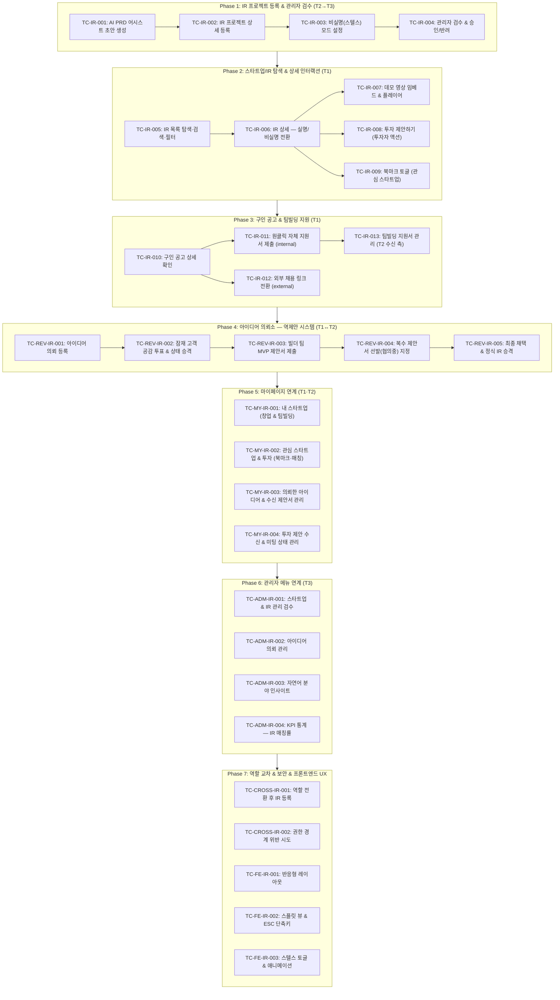

# 🚀 스타트업/IR 메뉴 통합 테스트 시나리오 계획

> **문서 버전:** v1.0
> **작성일:** 2026-08-27
> **대상 메뉴:** 스타트업 / IR (Invest & PR) — `SCR-008`, `SCR-009`, 마이페이지(`SCR-005~007`), 관리자(`SCR-011`) 연계
> **대상 API:** `API-IR-*`, `API-REV-IR-*`, `API-AI-02/05`, `API-ADM-*`, Payments
> **대상 UI:** `/ir`, `/ir/:id`, `/mypage?tab=startup`, `/mypage?tab=investor`, `/admin?tab=startup`
> **입력값 규칙:** 모든 테스트 입력값에 `임시_` prefix 사용

---

## 0. 테스트 환경 및 사전 조건

### 0.1. 테스트 계정 (기존 Seed 회원 활용)

| 테스터 ID | 실제 회원명 | Email | 기본 역할 | 로그인 방식 | 비고 |
|---|---|---|---|---|---|
| **T1** | `김수강생` | `student@mail.com` | `member` | `POST /api/auth/login { roles:["member"] }` | 아이디어 의뢰·투표·지원서 제출 담당 |
| **T2** | `김소현` | `sohyun.kim@mail.com` | `manager` (강사/빌더) | `POST /api/auth/login { roles:["manager"] }` | IR 프로젝트 등록·빌더 역제안 제출 |
| **T3** | `최관리` | `admin@platform.com` | `admin` | `POST /api/auth/login { roles:["admin"] }` | IR 검수·권한 변경·통계 관리 |

> **역할 교차 테스트 시 사용할 추가 회원**
> - 빌더 역제안 추가 계정: `정우석` (ws.jung@mail.com, member), `강민수` (ms.kang@mail.com, member)
> - 투자자 시뮬레이션: T3 관리자를 `investor` 권한으로 임시 변경하여 북마크·투자 제안 검증

### 0.2. 기존 Seed IR 프로젝트 (테스트 기준 데이터)

| ID | 팀명 | 프로젝트명 | 분야 | 투자 단계 | 비실명 | 채용 |
|---|---|---|---|---|---|---|
| `p1` | DocuLegal AI | 초기 창업자를 위한 AI 계약서 위험조항 자동 검토 & 수정 제안 SaaS | AI/SaaS | Seed | 실명 | ✅ (시니어 FE, LLM 엔지니어) |
| `p2` | VoiceFlow KR | 감정 반응형 한국어 초저지연 음성 AI 에이전트 | AI/딥테크 | Pre-Seed | 비실명(스텔스) | ✅ (음성 ML 엔지니어) |
| `p3` | MedScan AI | 1차 병원용 피부 병변 3초 스크리닝 보조 솔루션 | 바이오·헬스케어 | Seed | 실명 | ❌ |
| `p4` | EduCraft | 생성형 AI 기반 맞춤형 수학 문제 생성 & 튜터 | 에듀테크 | Pre-Seed | 실명 | ✅ (풀스택, 콘텐츠) |
| `p5` | SupplyGenius | 중소 이커머스를 위한 AI 수요예측 & 자동 발주 | 커머스/플랫폼 | Series A | 실명 | ❌ |

### 0.3. 기존 Seed 아이디어 의뢰 (아이디어 제작 요청소)

| ID | 제목 | 요청자 | 투표수 | 상태 | 제안서 |
|---|---|---|---|---|---|
| `ir-req-1` | 초기 창업자를 위한 AI 계약서 위험조항 자동 검토 & 수정 제안 SaaS | 박창업 (변리사/예비창업자) | 32 | 선발진행중 | ip-1 (선발 협의중) |
| `ir-req-2` | 로컬 디저트 카페 맞춤형 당일 마감할인 & 재고 예측 AI 에이전트 | 최점주 (베이커리 대표) | 15 | 모집중 | — |

### 0.4. 기존 Seed 빌더 제안서

| ID | 의뢰 ID | 제안자 | 기술 스택 | 예상 기간 | 상태 |
|---|---|---|---|---|---|
| `ip-1` | `ir-req-1` | 오승환 | React, FastAPI, OpenAI | 4주 | 선발(협의중) |

### 0.5. 프론트엔드 테스트 환경

| 항목 | 설정값 |
|---|---|
| 테스트 URL | `http://localhost:3010` |
| 브라우저 | Chrome 최신 / Firefox / Safari (크로스브라우저) |
| 뷰포트 (데스크탑) | 1440 × 900 |
| 뷰포트 (태블릿) | 768 × 1024 |
| 뷰포트 (모바일) | 375 × 812 (iPhone SE 기준) |
| 자동화 도구 | Playwright E2E |
| API 모킹 | 없음 (실제 백엔드 연동) |

### 0.6. 사전 조건 체크리스트

- [ ] `npm run dev` 실행 → `localhost:3010` 정상 응답 확인
- [ ] MongoDB 연결 상태 (`ax_foundly_dev` DB, Seed 데이터 로드)
- [ ] `GET /api/ir/projects` → IR 프로젝트 5건 이상 확인
- [ ] `GET /api/ir/idea-requests` → 아이디어 의뢰 2건 이상 확인
- [ ] `GET /api/admin/stats` → 관리자 통계 정상 응답
- [ ] AI 서비스 (`POST /api/ai/auto-fill`) 정상 응답 확인

---

## 1. 전체 테스트 흐름 다이어그램

---

## 2. Phase 1: IR 프로젝트 등록 & 관리자 검수

### TC-IR-001: AI PRD 어시스트 초안 생성 (T2: 김소현)

| 항목 | 내용 |
|---|---|
| **테스터** | T2 — 김소현 (`manager`) |
| **API** | `POST /api/ai/auto-fill` (API-AI-05, `type: "ir_project"`) |
| **화면** | `/mypage?tab=startup` → "새 IR 프로젝트 등록" 버튼 → `IRProjectModal` |
| **관련 컴포넌트** | `MyPage.tsx`, IR 등록 모달 |

#### 2.1.1. 정상 시나리오

| Step | 행위 | 입력값 | 예상 결과 | 프론트 검증 포인트 |
|---|---|---|---|---|
| 1 | 마이페이지 → `?tab=startup` 접속 | — | 내 스타트업 탭 활성화, 기존 프로젝트 없으면 빈 상태 | 탭 하이라이트 CSS, "새 IR 프로젝트 등록" CTA 버튼 |
| 2 | "새 IR 프로젝트 등록" 클릭 | — | 등록 마법사 모달 오픈 | 모달 배경 블러, AI 어시스트 버튼 표시 |
| 3 | AI PRD 초안 생성 요청 | `임시_IR초안_001`: "소상공인 배달 라이더 매칭 앱, AI로 최적 동선 배정해서 배달 시간 40% 단축" | `refinedTitle`, `naturalCategory`, `description`, `tags` 자동 생성 | 로딩 스피너 → 완료 후 폼 자동 바인딩 |
| 4 | 응답 구조 확인 | — | `refinedTitle`: 매력적 공식 타이틀, `naturalCategory`: 자연어 분야, `tags[]`: 3개 이상 | 태그 칩 렌더링 |
| 5 | 재생성 요청 | `임시_IR초안_002`: "다시 생성, B2B SaaS 형태로" | 기존 초안 대체 | 이전 데이터 Clear 후 신규 응답 바인딩 |

#### 2.1.2. 빌더 AI 아키텍트 페르소나 진단

| Step | 행위 | 입력값 | 예상 결과 | 검증 포인트 |
|---|---|---|---|---|
| 1 | AI 아키텍트 진단 요청 | `POST /api/ai/diagnosis` | `architectType`: 페르소나명, `description`: 강점 분석 | 진단 결과 모달 렌더링 |
| 2 | 진단 결과 기반 추천 | — | 적합 팀 역할, 기술 스택 추천 | 추천 항목 칩 클릭 시 폼 자동 채우기 |

#### 2.1.3. 예외 시나리오

| Case | 입력값 | 예상 결과 | 프론트 확인 |
|---|---|---|---|
| 빈 프롬프트 전송 | `""` | API 호출 없음 또는 `400` | 전송 버튼 비활성화 또는 경고 토스트 |
| AI 타임아웃 (5s 초과) | 장문 입력 | 타임아웃 에러 표시 | 에러 상태 UI, 재시도 버튼 |

---

### TC-IR-002: IR 프로젝트 상세 등록 (T2: 김소현)

| 항목 | 내용 |
|---|---|
| **테스터** | T2 — 김소현 (`manager`) |
| **API** | `POST /api/ir/projects` (API-IR-03) |
| **화면** | `IRProjectModal` — 등록 마법사 전체 폼 |

#### 정상 시나리오 (상세 입력값)

| Step | 필드 | 입력값 | 예상 결과 | 프론트 검증 포인트 |
|---|---|---|---|---|
| 1 | 팀명 | `임시_팀명_001`: "임시_RideFlow AI" | 입력 완료 | 글자수 카운터 |
| 2 | 프로젝트명 | `임시_프로젝트명_001`: "임시_AI 기반 소상공인 배달 라이더 최적 동선 매칭 플랫폼" | 입력 완료 | — |
| 3 | 한 줄 소개 | `임시_한줄소개_001`: "임시_AI 최적화 알고리즘으로 배달 소요 시간 40% 단축, 라이더 월수입 25% 증가" | 입력 완료 | 60자 제한 확인 |
| 4 | 분야 | `임시_분야_001`: "커머스/물류 AI" | 분야 입력 | 자연어 분야 자유 입력 |
| 5 | 태그 | `임시_태그_001`: ["배달최적화", "라이더매칭", "물류AI", "소상공인"] | 태그 4개 등록 | 태그 칩 추가/삭제 UI |
| 6 | 문제 (Problem) | `임시_문제_001`: "임시_소상공인 배달 가게 주문 폭주 시 라이더 부족으로 평균 62분 소요, 주문 취소율 18% 발생" | 입력 완료 | 멀티라인 텍스트 |
| 7 | 해결책 (Solution) | `임시_해결책_001`: "임시_실시간 교통·날씨·주문 밀도를 학습한 경량 ML 모델로 반경 2km 내 최적 라이더를 3초 만에 매칭, 다이나믹 배차 경로 제공" | 입력 완료 | — |
| 8 | 비즈니스 모델 | `임시_BM_001`: "임시_건당 성공 수수료 150원 + 가게 월 구독료 39,000원 (주문 100건 이상 시)" | 입력 완료 | — |
| 9 | 투자 단계 | `임시_투자단계_001`: "Pre-Seed" | Pre-Seed 선택 | 드롭다운 또는 라디오 UI |
| 10 | 데모 영상 URL | `임시_데모영상_001`: "https://www.youtube.com/watch?v=dQw4w9WgXcQ" | 유효 URL 입력 | URL 유효성 검증 |
| 11 | 피치덱 링크 | `임시_피치덱_001`: "https://drive.google.com/file/d/test" | 입력 완료 | — |
| 12 | 팀원 추가 (실명) | `임시_팀원_이름_001`: "임시_김소현", `임시_팀원_역할_001`: "CEO / AI Product Manager", `임시_팀원_소개_001`: "임시_전 AI 스타트업 PM 리드, 강의 전문가" | 팀원 1인 추가 | 팀원 카드 렌더링 |
| 13 | 구인 공고 추가 | (TC-IR-003에서 상세 진행) | 구인 공고 1건 추가 | — |
| 14 | 제출 | — | `201 Created`, 프로젝트 ID 반환 | 모달 닫힘, 내 스타트업 목록 갱신 |

#### 경계값 테스트

| Case | 입력 | 예상 결과 | 프론트 확인 |
|---|---|---|---|
| 팀명 누락 | `teamName: ""` | `400` "Team name is required" | 인라인 에러 하이라이트 |
| 프로젝트명 누락 | `title: ""` | `400` 에러 | 인라인 에러 |
| XSS 프로젝트명 | `임시_XSS_IR_001`: `` | 스크립트 실행 없음, 문자열 저장 | HTML 이스케이프 확인 |
| 잘못된 YouTube URL | `임시_잘못된URL_001`: "not-a-url" | 경고 또는 무시 | URL 유효성 UI 피드백 |
| 태그 중복 입력 | 동일 태그 2회 | 중복 제거 또는 경고 | 중복 방지 로직 |

---

### TC-IR-003: 비실명(스텔스) 모드 설정 (T2: 김소현)

| 항목 | 내용 |
|---|---|
| **테스터** | T2 — 김소현 (`manager`) |
| **API** | `POST /api/ir/projects` (API-IR-03, `isAnonymous: true`) |
| **화면** | `IRProjectModal` 내 비실명 설정 섹션 |

| Step | 행위 | 입력값 | 예상 결과 | 프론트 검증 포인트 |
|---|---|---|---|---|
| 1 | 비실명 모드 토글 활성화 | `isAnonymous: true` | 익명 설정 섹션 확장 표시 | 토글 온/오프 애니메이션 |
| 2 | 비실명 팀명 입력 | `임시_익명팀명_001`: "🤖 스텔스 물류 랩" | 익명 팀명 입력 완료 | 실명 팀명과 분리된 입력 필드 |
| 3 | 팀원 익명 닉네임 설정 | `임시_익명닉네임_001`: "⚡ 물류 캡틴", `임시_익명역할_001`: "CEO (스텔스 모드)" | 팀원별 익명명 설정 | 팀원 카드에 익명 닉네임 필드 추가 |
| 4 | 스텔스 배지 확인 | 제출 후 목록에서 확인 | "🔒 스텔스" 배지 표시 | 비실명 프로젝트 카드 구별 UI |
| 5 | IR 상세에서 비실명 표시 확인 | — | 기본값: 비실명 닉네임 표시, 실명 숨김 | 스텔스 배지, 익명 아바타(이모지) |
| 6 | 우측 상단 실명/비실명 토글 전환 | 토글 클릭 | 실명 정보 즉시 전환 표시 | 토글 스위치 CSS 전환, 이름 정보 교체 |
| 7 | 비로그인 사용자 스텔스 뷰 | 로그아웃 후 해당 IR 접속 | 비실명 정보만 표시 (토글 버튼 없음) | 비로그인 시 토글 UI 미표시 |

---

### TC-IR-004: 관리자 IR 프로젝트 검수 & 상태 변경 (T3: 최관리)

| 항목 | 내용 |
|---|---|
| **테스터** | T3 — 최관리 (`admin`) |
| **API** | `PATCH /api/admin/ir/projects/:id` (상태 변경) |
| **화면** | `/admin?tab=startup` (`SCR-011`) |
| **관련 컴포넌트** | `AdminDashboard.tsx` |

#### 4.1. IR 프로젝트 승인 워크플로우

| Step | 행위 | 입력값 | 예상 결과 | 프론트 검증 포인트 |
|---|---|---|---|---|
| 1 | `/admin?tab=startup` 접속 | — | IR 프로젝트 전체 목록 (p1~p5 + 신규) 표시 | 2단 스플릿 뷰: 좌측 목록, 우측 빈 패널 |
| 2 | TC-IR-002 신규 프로젝트 행 클릭 | — | 우측 상세 패널 슬라이드 인 | `animate-slideInFromRight` 애니메이션, 팀명·분야·투자단계·팀원·구인 전체 표시 |
| 3 | 스텔스 모드 확인 | TC-IR-003 프로젝트 | 비실명 정보 표시, 관리자는 실명 열람 가능 여부 | 관리자 특권 실명 노출 여부 정책 확인 |
| 4 | 상태 → "검토중"으로 변경 | `임시_상태변경_IR_001`: `status: "검토중"` | 즉시 반영 | 좌측 목록 배지 갱신 |
| 5 | 상태 → "공개"로 승인 | `임시_승인_IR_001`: `status: "공개"` | IR 목록(`/ir`) 공개 노출 | 배지 → "공개", 공개 목록 포함 확인 |
| 6 | 관리자 KPI 통계 반영 | `GET /api/admin/stats` | `activeStartups` +1 | — |

#### 4.2. 반려 및 이슈 처리 워크플로우

| Step | 행위 | 입력값 | 예상 결과 | 프론트 검증 포인트 |
|---|---|---|---|---|
| 1 | 별도 프로젝트 반려 | `임시_반려사유_IR_001`: "임시_비즈니스 모델 및 해결책 설명이 불충분합니다. 구체적인 수익 창출 방안 보완 후 재등록 바랍니다." | `status: "반려"` | 반려 사유 입력 폼 표시 |
| 2 | 아이디어 의뢰 목록 확인 | `/admin?tab=startup` 내 의뢰 탭 | ir-req-1(선발진행중), ir-req-2(모집중) + 신규 의뢰 | 의뢰 상태 배지 |
| 3 | 의뢰 상태 강제 변경 | ir-req-2 → `"강제완료"` 처리 | 관리자 직권 상태 변경 | 관리자 권한 확인 |

---

## 3. Phase 2: 스타트업/IR 탐색 & 상세 인터랙션

### TC-IR-005: IR 목록 탐색 & 검색 & 필터 (T1: 김수강생)

| 항목 | 내용 |
|---|---|
| **테스터** | T1 — 김수강생 (`member`) |
| **API** | `GET /api/ir/projects`, `GET /api/ir/categories` |
| **화면** | `/ir` (`SCR-008`) |
| **관련 컴포넌트** | `IRPage.tsx` (추정) |

#### 5.1. 기본 탐색

| Step | 행위 | 입력값 | 예상 결과 | 프론트 검증 포인트 |
|---|---|---|---|---|
| 1 | `/ir` 접속 | — | Seed 프로젝트 5건 + 신규 1건 표시 | 카드 그리드: 팀명·프로젝트명·분야·투자단계·채용/스텔스 배지 |
| 2 | 투자 단계 배지 확인 | — | Pre-Seed, Seed, Series A 배지 색상 구별 | 공통 코드 기반 배지 컬러 |
| 3 | 채용 배지 확인 | — | `isHiring: true` 프로젝트에 "채용중" 배지 | 배지 렌더링 |
| 4 | 스텔스 배지 확인 | p2 (isAnonymous: true) | "🔒 스텔스" 배지, 팀명 = "🎙 사운드웨이브 랩" | 익명 팀명 표시 |
| 5 | 서브 탭 전환 | [🧩 아이디어 제작 요청소] | 탭 전환, 아이디어 의뢰 리스트 표시 | 탭 애니메이션, 투표수·상태 배지 |
| 6 | 탭 재전환 | [🚀 스타트업 & IR 탐색] | IR 목록 복원 | 이전 필터 상태 보존 여부 |

#### 5.2. 검색 & 필터 (복합 시나리오)

| Step | 행위 | 입력값 | 예상 결과 | 프론트 검증 포인트 |
|---|---|---|---|---|
| 1 | 실시간 검색 — 프로젝트명 | `임시_검색어_IR_001`: "계약서" | `p1` (DocuLegal AI) 노출 | 키입력마다 디바운스(300ms) 후 결과 갱신 |
| 2 | 실시간 검색 — 팀명 | `임시_검색어_IR_002`: "MedScan" | `p3` 노출 | 팀명 검색 정상 |
| 3 | 실시간 검색 — 키워드(아이템) | `임시_검색어_IR_003`: "음성AI" | `p2` 노출 | 태그/한줄소개 키워드 검색 |
| 4 | 분야 필터 | "AI/딥테크" | `p2` 노출 | 필터 버튼 활성 상태 CSS |
| 5 | 복합 필터 (분야 + 검색어) | 분야 "에듀테크" + 검색어 "맞춤형" | `p4` (EduCraft) | 교집합 결과 |
| 6 | 채용 여부 필터 | "채용중" 필터 | `isHiring: true` 프로젝트만 (p1, p2, p4) | 채용 필터 버튼 동작 |
| 7 | 투자 단계 필터 | "Pre-Seed" | p2, p4 노출 | 단계 필터 드롭다운/칩 |
| 8 | 검색어 초기화 | 클리어 버튼 | 전체 목록 복원 | X 버튼 또는 ESC 초기화 |
| 9 | 검색 결과 없음 | `임시_검색어_없음_IR_001`: "존재하지않는스타트업" | "검색 결과가 없습니다" Empty State | Empty State UI |

---

### TC-IR-006: IR 상세 페이지 — 실명/비실명 전환 인터랙션 (T1: 김수강생)

| 항목 | 내용 |
|---|---|
| **테스터** | T1 — 김수강생 (`member`) |
| **API** | `GET /api/ir/projects/:id` (API-IR-02) |
| **화면** | `/ir/p2` (비실명 프로젝트 VoiceFlow KR) (`SCR-009`) |

| Step | 행위 | 입력값 | 예상 결과 | 프론트 검증 포인트 |
|---|---|---|---|---|
| 1 | `/ir/p2` 접속 | — | 비실명 모드 기본 표시: 팀명 "🎙 사운드웨이브 랩", 팀원 "🎙 보이스 마스터" | 스텔스 배지, 이모지 아바타 |
| 2 | 우측 상단 실명 전환 토글 | 토글 클릭 | 팀명 "VoiceFlow KR", 팀원 "강현우", LinkedIn/GitHub 링크 표시 | 즉각 전환 애니메이션, 링크 활성화 |
| 3 | 비실명으로 재전환 | 토글 재클릭 | 다시 익명 닉네임 | 토글 반복 동작 안정성 |
| 4 | `/ir/p1` 실명 프로젝트 | — | 기본 실명 표시, 토글 버튼 없음 또는 비활성화 | 실명 프로젝트에서 토글 미표시 |
| 5 | 비로그인 사용자 | 로그아웃 후 `/ir/p2` | 비실명 고정, 실명 전환 토글 없음 | 비로그인 시 토글 숨김 처리 |
| 6 | BM & 문제/해결책 확인 | p1 또는 p3 | 비즈니스 모델, 문제, 해결책 구조화 렌더링 | 각 섹션 분리 표시, 마크다운 렌더링 여부 |
| 7 | 투자 단계 배지 | `p5` (Series A) | "Series A" 배지 표시 | 공통 코드 배지 컬러 |

---

### TC-IR-007: 데모 영상 임베드 & 플레이어 인터랙션 (T1: 김수강생)

| 항목 | 내용 |
|---|---|
| **테스터** | T1 — 김수강생 (`member`) |
| **화면** | `/ir/p1` (데모 영상이 있는 프로젝트) |

| Step | 행위 | 입력값 | 예상 결과 | 프론트 검증 포인트 |
|---|---|---|---|---|
| 1 | TC-IR-002에서 등록된 프로젝트 상세 접속 | — | YouTube 영상 썸네일/플레이어 임베드 표시 | iframe 또는 HTML5 플레이어 렌더링 |
| 2 | 영상 플레이 버튼 클릭 | — | 영상 재생 시작 | 자동재생 여부, 볼륨 기본값 |
| 3 | YouTube URL 파싱 검증 | — | `v=dQw4w9WgXcQ` 추출 후 embed URL 변환 | `https://www.youtube.com/embed/{id}` |
| 4 | Vimeo URL 지원 | `임시_Vimeo_001`: "https://vimeo.com/123456789" | Vimeo embed 플레이어 표시 | Vimeo embed URL 변환 |
| 5 | Loom URL 지원 | `임시_Loom_001`: "https://www.loom.com/share/abc123" | Loom embed 표시 또는 링크 안내 | Loom embed 지원 여부 |
| 6 | 영상 URL 없는 프로젝트 | `p3` (영상 없음) | 영상 섹션 숨김 또는 "영상 없음" 안내 | 조건부 렌더링 |
| 7 | Figma 프로토타입 링크 | `p1`의 `prototypeUrl` | "Figma 프로토타입 보기" 버튼 노출 | 외부 링크 `_blank` 오픈 |

---

### TC-IR-008: 투자 제안하기 (투자자 액션) (T3: 최관리 → investor 권한)

| 항목 | 내용 |
|---|---|
| **테스터** | T3 — 최관리 (admin, 또는 investor 권한 테스트) |
| **API** | `POST /api/ir/projects/:id/invest` (투자 제안 미팅 요청) |
| **화면** | `/ir/p3` 상세 — [투자 제안하기] 버튼 |

| Step | 행위 | 입력값 | 예상 결과 | 프론트 검증 포인트 |
|---|---|---|---|---|
| 1 | `/ir/p3` 접속 (로그인 상태) | — | [투자 제안하기] 버튼 표시 여부 확인 | 투자자 전용 버튼 렌더링 정책 |
| 2 | [투자 제안하기] 클릭 | — | 투자 제안 미팅 요청 모달 오픈 | 모달 내 제안 금액·조건·메시지 입력 폼 |
| 3 | 제안 내용 입력 | `임시_투자제안_금액_001`: "임시_5억원 Pre-Seed 투자 검토 중", `임시_투자제안_메시지_001`: "임시_헬스케어 AI 분야에 관심이 많으며 MedScan의 의료 AI 정확도에 주목하고 있습니다. 미팅 요청드립니다." | 입력 완료 | 글자수 카운터 |
| 4 | 제안 전송 | — | `201 Created`, 미팅 제안 등록 | 성공 토스트, 제안 상태: "대기중" |
| 5 | 수신 측 알림 확인 | — | T2(프로젝트 오너)에게 "투자 제안 수신" 알림 | GNB 알림 배지 |
| 6 | 비로그인 사용자 투자 제안 | 로그아웃 후 버튼 클릭 | 로그인 유도 모달 | 인증 게이트 |
| 7 | 이미 제안한 프로젝트 | 동일 프로젝트 재제안 시도 | "이미 제안 전송됨" 상태 또는 재제안 허용 정책 | 중복 제안 처리 |

---

### TC-IR-009: 관심 스타트업 북마크 토글 (T1: 김수강생)

| 항목 | 내용 |
|---|---|
| **테스터** | T1 — 김수강생 (`member`) |
| **API** | `POST /api/ir/projects/:id/bookmark` (API-IR-04) |
| **화면** | `/ir` 목록 및 `/ir/:id` 상세 |

| Step | 행위 | 입력값 | 예상 결과 | 프론트 검증 포인트 |
|---|---|---|---|---|
| 1 | `p4` (EduCraft) 목록에서 북마크 버튼 클릭 | — | `bookmarked: true` | 하트/북마크 아이콘 색상 변경 |
| 2 | 북마크 취소 | 동일 버튼 재클릭 | `bookmarked: false` | 아이콘 원상 복원 |
| 3 | `p5` 상세 페이지에서 북마크 | — | `bookmarked: true` | 상세 페이지 내 북마크 버튼 |
| 4 | 마이페이지 → 관심 스타트업 탭 확인 | `/mypage?tab=investor` | p4, p5 북마크 목록 표시 | 북마크 목록 동기화 확인 |
| 5 | 비로그인 사용자 북마크 | 로그아웃 후 시도 | 로그인 유도 | 인증 게이트 |
| 6 | Seed 데이터 확인 | `p1` (bookmarked: true), `p3` (bookmarked: true) | 마이페이지 관심 스타트업에 기본 포함 | Seed 데이터 반영 |

---

## 4. Phase 3: 구인 공고 & 팀빌딩 지원

### TC-IR-010: 구인 공고 상세 확인 (T1: 김수강생)

| 항목 | 내용 |
|---|---|
| **테스터** | T1 — 김수강생 (`member`) |
| **화면** | `/ir/p1` 상세 — 구인/구직 섹션 |

| Step | 행위 | 입력값 | 예상 결과 | 프론트 검증 포인트 |
|---|---|---|---|---|
| 1 | `/ir/p1` 접속 → 구인 공고 섹션 확인 | — | 2건 공고 표시: `hr-1`(시니어 FE), `hr-2`(LLM 엔지니어) | 역할명·고용 형태·급여·지분율·필요 스킬 태그 |
| 2 | `hr-1` (internal 방식) 확인 | — | "바로 지원하기" 버튼 표시 | 자체 지원서 팝업 방식 |
| 3 | `hr-2` (link 방식) 확인 | — | "채용 공고 보러가기" 또는 외부 링크 버튼 | `applyMethod: "link"`, `externalLink` 활용 |
| 4 | 지분율 배지 확인 | `hr-2`: `equity: "5.0% ~ 15.0%"` | 지분율 강조 표시 | 코파운더 공고 강조 UI |
| 5 | 스킬 태그 확인 | `hr-1`: ["React", "TypeScript", ...] | 스킬 태그 칩 표시 | 태그 개수 및 오버플로우 처리 |
| 6 | `p4` 구인 공고 | EduCraft 풀스택/콘텐츠 공고 | 공고 상세 내용 렌더링 | — |

---

### TC-IR-011: 원클릭 자체 지원서 제출 (T1: 김수강생)

| 항목 | 내용 |
|---|---|
| **테스터** | T1 — 김수강생 (`member`) |
| **API** | `POST /api/ir/projects/:id/apply` (API-IR-05) |
| **화면** | `/ir/p1` 상세 — 자체 지원서 팝업 |

| Step | 행위 | 입력값 | 예상 결과 | 프론트 검증 포인트 |
|---|---|---|---|---|
| 1 | `hr-1` "바로 지원하기" 클릭 | — | 자체 지원서 모달 팝업 오픈 | 지원할 직무 명 표시, 폼 필드 |
| 2 | 지원 동기 입력 | `임시_지원동기_001`: "임시_AI 리걸테크 분야에서 오랜 관심을 가지고 있으며, DocuLegal AI의 계약서 자동화 기술로 법률 서비스 접근성을 높이는 미션에 동참하고 싶습니다." | 입력 완료 | 글자수 카운터 |
| 3 | GitHub/포트폴리오 URL | `임시_포트폴리오_001`: "https://github.com/test-applicant" | 입력 완료 | URL 유효성 |
| 4 | 지원 완료 제출 | — | `201 Created`, 지원서 등록 | 성공 토스트: "지원서가 전송되었습니다!" |
| 5 | T2 (프로젝트 오너) 알림 확인 | — | "새로운 팀빌딩 지원서 수신" 알림 | GNB 알림 배지 카운트 증가 |
| 6 | 중복 지원 방지 | 동일 공고 재지원 시도 | 이미 지원한 상태 표시 또는 차단 | 지원 상태 버튼 변경 |
| 7 | 비로그인 지원 | 로그아웃 후 시도 | 로그인 유도 모달 | 인증 게이트 |

---

### TC-IR-012: 외부 채용 링크 전환 (T1: 김수강생)

| Step | 행위 | 입력값 | 예상 결과 | 프론트 검증 포인트 |
|---|---|---|---|---|
| 1 | `hr-2` "채용 공고 보러가기" 클릭 | — | `https://wanted.co.kr` 외부 탭 오픈 | `target="_blank"`, `rel="noopener"` 확인 |
| 2 | 외부 링크 없는 공고 | `externalLink: ""` | 버튼 비활성화 또는 숨김 | 조건부 렌더링 |

---

### TC-IR-013: 팀빌딩 지원서 관리 (T2: 김소현 — 수신 측)

| 항목 | 내용 |
|---|---|
| **테스터** | T2 — 김소현 (`manager`) |
| **화면** | `/mypage?tab=startup` → 팀빌딩 & 지원자 관리 섹션 |

| Step | 행위 | 입력값 | 예상 결과 | 프론트 검증 포인트 |
|---|---|---|---|---|
| 1 | 마이페이지 → `?tab=startup` → 팀빌딩 지원자 탭 | — | TC-IR-011에서 접수된 지원서 표시 | 지원자명·포지션·지원일·포트폴리오 링크 |
| 2 | 지원서 상세 확인 | — | 지원 동기, GitHub 링크 표시 | 스플릿 뷰 또는 상세 모달 |
| 3 | 지원서 수락 | `임시_수락_팀빌딩_001` | `status: "수락"` | 수락 후 지원자에게 알림 발송 |
| 4 | 지원서 거절 | — | `status: "거절"` | 거절 사유 입력 여부 (선택) |
| 5 | 수락 후 지원자 알림 | — | T1에게 "팀빌딩 지원서 수락" 알림 | T1 GNB 알림 |
| 6 | 미팅 일정 제안 | `임시_미팅일정_001`: "임시_2026-09-05 오후 3시, Google Meet" | 미팅 제안 메시지 전송 | CRM 또는 인앱 메시지 연동 |

---

## 5. Phase 4: 아이디어 의뢰 요청소 — 역제안 시스템

### TC-REV-IR-001: 아이디어 의뢰 등록 (T1: 김수강생)

| 항목 | 내용 |
|---|---|
| **테스터** | T1 — 김수강생 (`member`) |
| **API** | `POST /api/ir/idea-requests` (API-REV-IR-02) |
| **화면** | `/ir` → [🧩 아이디어 제작 요청소] 탭 → `IdeaRequestModal` |

#### 정상 시나리오

| Step | 행위 | 입력값 | 예상 결과 | 프론트 검증 포인트 |
|---|---|---|---|---|
| 1 | [🧩 아이디어 제작 요청소] 탭 클릭 | — | 기존 의뢰 목록 표시 (ir-req-1, ir-req-2) | 인기순/최신순 정렬, 투표수·상태 배지 |
| 2 | "아이디어 의뢰 등록하기" 버튼 클릭 | — | `IdeaRequestModal` 오픈 | AI PRD 어시스트 버튼 표시 |
| 3 | AI PRD 어시스트 초안 생성 | `임시_의뢰초안_001`: "동네 주민끼리 AI가 최적 매칭해주는 카풀 앱 만들고 싶어", `type: "idea_request"` | `refinedTitle`, `naturalCategory`, `tags`, `description`, `solutionConcept` 자동 생성 | 자동 채우기 로딩 → 폼 바인딩 |
| 4 | 의뢰 제목 확정 | `임시_아이디어제목_001`: "임시_AI 기반 동네 주민 카풀 최적 매칭 & 수요 예측 플랫폼" | 수정 완료 | — |
| 5 | 시장 문제 (Pain point) | `임시_의뢰문제_001`: "임시_출퇴근 시간 대중교통 혼잡 및 주차난 심화로 동네 주민 간 카풀 수요가 있으나, 신뢰성 있는 실시간 매칭 수단이 없고 개인정보 우려로 이용률이 낮습니다." | 입력 완료 | 멀티라인 텍스트 |
| 6 | 솔루션 컨셉 | `임시_의뢰솔루션_001`: "임시_커뮤니티 인증 시스템(아파트 단지/직장 인증) + 출발지·목적지·시간대 AI 군집 분석으로 안전하고 편리한 동네 카풀 매칭" | 입력 완료 | — |
| 7 | 카테고리 | `임시_의뢰카테고리_001`: "모빌리티/커뮤니티" | 입력 완료 | 자유 입력 또는 선택 |
| 8 | 필요 역할 | `임시_의뢰역할_001`: ["iOS/Android 개발자", "AI 매칭 알고리즘 엔지니어", "UX 디자이너"] | 3개 역할 | 역할 칩 추가 UI |
| 9 | 보상 유형 | `임시_보상유형_001`: "지분공유(코파운더)" | 선택 완료 | 드롭다운 |
| 10 | 보상 상세 | `임시_보상상세_001`: "임시_공동대표 지위 + 지분 20~30% 협의 + 공동창업 지원금 300만원" | 입력 완료 | — |
| 11 | 제출 마감일 | `임시_마감일_001`: "2026-09-30" | 날짜 픽커 선택 | 오늘 이후 날짜만 |
| 12 | 제출 | — | `201 Created`, 목록 갱신 | 목록 상단 노출, `status: "모집중"`, `upvoteCount: 1` |

---

### TC-REV-IR-002: 잠재 고객 공감 투표 & 상태 자동 승격 (T1 + 정우석 + 강민수)

| 항목 | 내용 |
|---|---|
| **테스터** | T1(김수강생) + 정우석 + 강민수 순차 투표 |
| **API** | `POST /api/ir/idea-requests/:id/upvote` (API-REV-IR-03) |

| Step | 행위 | 담당 | 입력값 | 예상 결과 | 프론트 검증 포인트 |
|---|---|---|---|---|---|
| 1 | TC-REV-IR-001 의뢰 공감 투표 | 정우석 | `userId: "u-ws-jung"` | `isUpvoted: true`, `upvoteCount: 2` | 투표 버튼 색상 변경, 카운트 증가 애니메이션 |
| 2 | 투표 토글 (취소) | 정우석 | 동일 의뢰 재클릭 | `isUpvoted: false`, `upvoteCount: 1` | 버튼 원상 복원 |
| 3 | 재투표 | 정우석 | 다시 클릭 | `upvoteCount: 2` | — |
| 4 | 추가 투표 | 강민수 | `userId: "u-ms-kang"` | `upvoteCount: 3` | — |
| 5 | Seed `ir-req-2` 투표 (15→16) | T1 | ir-req-2 투표 | `upvoteCount: 16` | 목표 투표수 대비 진행바 |
| 6 | ir-req-1 투표 중복 방지 확인 | T1 | ir-req-1 (이미 T1 포함) 재투표 | 토글로 취소만 가능 | 중복 투표 방지 로직 |
| 7 | 투표 진행바 표시 | TC-REV-IR-001 의뢰 | targetCount=30(가정) 시 `3/30 (10%)` | 진행바 UI 렌더링 |
| 8 | 상태 승격 트리거 | 목표 투표수 도달 시 | `status: "선발진행중"` 자동 변경 | 의뢰 카드 배지 즉시 갱신 |

---

### TC-REV-IR-003: 빌더 팀 MVP 제작 제안서 제출 (T2: 김소현)

| 항목 | 내용 |
|---|---|
| **테스터** | T2 — 김소현 (`manager`) |
| **API** | `POST /api/ir/idea-requests/:id/proposals` (API-REV-IR-04) |
| **화면** | `/mypage?tab=startup` → "수요 의뢰 둘러보기" 탭 → `IdeaProposalModal` |

| Step | 행위 | 입력값 | 예상 결과 | 프론트 검증 포인트 |
|---|---|---|---|---|
| 1 | 마이페이지 → 아이디어 의뢰 탐색 탭 | — | TC-REV-IR-001 의뢰 + ir-req-1, ir-req-2 표시 | 인기순 정렬 (투표수 기준) |
| 2 | TC-REV-IR-001 의뢰 선택 → 제안서 작성 | — | `IdeaProposalModal` 오픈 | 의뢰 제목·투표수·문제/솔루션 모달 상단 표시 |
| 3 | 팀 소개 | `임시_빌더팀소개_001`: "임시_풀스택 시니어 개발자 1인 + AI 매칭 알고리즘 전문가 1인 팀, 모빌리티 스타트업 경험 보유" | 입력 완료 | — |
| 4 | 기술 스택 | `임시_기술스택_001`: ["React Native", "Node.js", "FastAPI", "PyTorch", "PostgreSQL", "Firebase"] | 6개 기술 | 태그 칩 추가 |
| 5 | MVP 계획 요약 | `임시_MVP계획_001`: "임시_1주차: 사용자 인증(아파트/직장 인증) 시스템, 2주차: 카풀 요청/매칭 알고리즘 MVP, 3주차: 실시간 위치 공유 & 채팅, 4주차: 안전 기능(비상 연락, 리뷰 시스템) 및 테스트 완성" | 입력 완료 | 멀티라인 텍스트 |
| 6 | 예상 개발 기간 | `임시_개발기간_001`: 5 (weeks) | 5주 입력 | 숫자 입력 또는 슬라이더 |
| 7 | 포트폴리오 URL | `임시_포트폴리오_빌더_001`: "https://github.com/sohyun-kim/carpoolai-demo" | 입력 완료 | URL 유효성 |
| 8 | 데모 영상 URL | `임시_데모영상_빌더_001`: "https://www.loom.com/share/builder-demo-001" | 입력 완료 | — |
| 9 | 공개 범위 설정 | `visibility: "public"` | 전체 공개 선택 | 공개/비공개/의뢰자만 선택 UI |
| 10 | 연락처 | `임시_연락처_001`: "sohyun.builder@gmail.com" | 입력 완료 | 이메일 유효성 |
| 11 | 제출 | — | `201 Created`, `status: "대기중"` | 모달 닫힘, 제안서 제출 완료 토스트 |
| 12 | 의뢰자 알림 | — | T1에게 "새로운 빌더 MVP 제안서 도착" 알림 | GNB 알림 배지 |
| 13 | 의뢰 상태 확인 | — | 해당 의뢰 `status` → `"선발진행중"` 또는 유지 | 제안서 수신 후 상태 변경 여부 |

---

### TC-REV-IR-004: 복수 제안서 선발(협의중) 지정 (T1: 김수강생)

| 항목 | 내용 |
|---|---|
| **테스터** | T1 — 김수강생 (`member`) |
| **API** | `POST /api/ir/idea-requests/:id/select-proposals` (API-REV-IR-06) |
| **화면** | `/mypage?tab=startup` → "의뢰한 아이디어" 탭 → 제안서 목록 |

| Step | 행위 | 입력값 | 예상 결과 | 프론트 검증 포인트 |
|---|---|---|---|---|
| 1 | 마이페이지 → `?tab=startup` → "의뢰한 아이디어" 탭 | — | TC-REV-IR-001 의뢰 + 수신된 제안서 | 제안서 카드: 빌더 팀명·기술 스택·기간·포트폴리오 |
| 2 | 빌더 제안서 상세 클릭 | — | 풀 상세: 4주차 MVP 계획, 기술 스택, 데모 영상 | 스플릿 뷰 또는 상세 모달 |
| 3 | 추가 빌더 제안서 확인 | 정우석(추가 제출 가정) | 복수 제안서 목록 | 제안서 비교 기능 여부 |
| 4 | 제안서 A (T2 제출) 선발(협의중) 지정 | `proposalId`: TC-REV-IR-003 ID | `status: "선발(협의중)"` | 상태 배지 변경, 선발 확인 컨펌 모달 |
| 5 | 추가 선발 지정 (복수 선발 허용 검증) | 제안서 B도 선발 지정 | 복수 동시 협의 가능 여부 확인 | `API-REV-IR-06`의 `selectedProposalIds[]` |
| 6 | 선발된 빌더에게 알림 | — | T2에게 "귀하의 제안서가 선발(협의중)에 등록되었습니다" | GNB 알림 |

---

### TC-REV-IR-005: 최종 채택 & 정식 IR 프로젝트 승격 (T1: 김수강생)

| 항목 | 내용 |
|---|---|
| **테스터** | T1 — 김수강생 (`member`) |
| **API** | `POST /api/ir/idea-requests/:id/accept-proposal` (API-REV-IR-05) |
| **화면** | `/mypage?tab=startup` → "의뢰한 아이디어" 탭 |

| Step | 행위 | 입력값 | 예상 결과 | 프론트 검증 포인트 |
|---|---|---|---|---|
| 1 | 선발 중인 제안서 목록 확인 | — | TC-REV-IR-003 제안서: `status: "선발(협의중)"` | 제안서 상태 배지 |
| 2 | "최종 채택" 클릭 | `proposalId`: TC-REV-IR-003 ID | 채택 확인 다이얼로그 | "정말 최종 채택하시겠습니까?" 컨펌 모달 |
| 3 | 확인 클릭 | — | `200 OK`, 정식 IR 프로젝트 자동 생성 | "🎉 빌더 팀과의 협업이 시작되었습니다!" 성공 토스트 |

**Step 3 승격 검증 체크리스트:**

- [ ] 채택된 제안서 `status` → `"최종채택"`
- [ ] 나머지 제안서(있을 경우) `status` → `"미채택"`
- [ ] 신규 `IRProject` 문서 자동 생성 (ID: `p-rev-*`)
- [ ] 의뢰 `status` → `"개발완료"`, `matchedProjectId` = 생성된 프로젝트 ID
- [ ] 프로젝트 `title` = TC-REV-IR-001 의뢰 제목 기반
- [ ] 프로젝트 `description` 에 `[아이디어 의뢰 매칭으로 설립된 팀입니다.]` 포함
- [ ] 제안서의 `linkedProjectId` = 생성된 프로젝트 ID
- [ ] `GET /api/ir/projects` 목록에 신규 프로젝트 포함
- [ ] T2에게 알림: "🎉 빌더 제안서 최종 채택 및 IR 프로젝트 자동 개설 완료!"
- [ ] 관리자 KPI: `ideaMatchRate` 갱신

---

## 6. Phase 5: 마이페이지 연계 검증

### TC-MY-IR-001: 내 스타트업 — 창업 & 팀빌딩 (T2: 김소현)

| 항목 | 내용 |
|---|---|
| **테스터** | T2 — 김소현 (`manager`) |
| **화면** | `/mypage?tab=startup` (`SCR-005`, `SCR-006` 통합) |
| **관련 컴포넌트** | `MyPage.tsx` |

| Step | 행위 | 예상 결과 | 프론트 검증 포인트 |
|---|---|---|---|
| 1 | `?tab=startup` 접속 | TC-IR-002에서 등록한 IR 프로젝트 표시 | 프로젝트 카드: 상태 배지, 수정 버튼, 투자 제안 수신 배지 |
| 2 | 프로젝트 수정 | `임시_수정제목_001`: "임시_RideFlow AI v2 — 도시 내 스마트 카풀 최적화 플랫폼" | 수정 저장 후 반영 | 낙관적 업데이트 또는 새로고침 후 반영 |
| 3 | 팀원 추가 | `임시_신규팀원_001`: "임시_박개발", `임시_신규역할_001`: "iOS 개발 리드" | 팀원 카드 추가 | 팀원 목록 즉시 갱신 |
| 4 | 팀원 삭제 | 기존 팀원 삭제 | 팀원 카드 제거 | 삭제 확인 모달 |
| 5 | 투자 제안 수신 탭 | TC-IR-008에서 T3가 보낸 제안 | 투자 제안: 제안자·금액·메시지·상태 표시 | 2단 스플릿 뷰 또는 목록 |
| 6 | 투자 제안 수락 | "미팅 수락" 클릭 | `status: "미팅수락"` | T3에게 알림 발송 |
| 7 | 투자 제안 거절 | `임시_거절사유_투자_001`: "임시_현재 투자 라운드 준비 중이라 추후 연락드리겠습니다" | `status: "거절"` | — |

---

### TC-MY-IR-002: 관심 스타트업 & 투자 관리 (T1: 김수강생)

| 항목 | 내용 |
|---|---|
| **테스터** | T1 — 김수강생 (`member`) |
| **화면** | `/mypage?tab=investor` |
| **관련 컴포넌트** | `MyPage.tsx` → 관심 스타트업 & 투자 탭 |

| Step | 행위 | 예상 결과 | 프론트 검증 포인트 |
|---|---|---|---|
| 1 | `?tab=investor` 접속 | Seed 북마크 (p1, p3) + TC-IR-009에서 북마크한 p4, p5 | 북마크 스타트업 목록 카드 |
| 2 | AI 맞춤 추천 확인 | 관심 분야 기반 추천 프로젝트 목록 | 매칭 스코어(%) 표시 |
| 3 | 추천 프로젝트 북마크 | 추천 목록에서 북마크 | 즉시 목록 추가 | 낙관적 업데이트 |
| 4 | 북마크 해제 | 관심 목록에서 북마크 해제 | 목록에서 제거 | 언마운트 없이 DOM 업데이트 |
| 5 | 프로젝트 업데이트 피드 | 북마크한 p1, p4 업데이트 알림 | 업데이트 피드 표시 | 날짜 기준 정렬 |
| 6 | 투자 제안 관리 | T1이 별도 투자 제안 전송한 경우 | 전송한 투자 제안 내역 및 상태 | `status: "대기중/수락/거절"` |

---

### TC-MY-IR-003: 의뢰한 아이디어 & 수신 제안서 관리 (T1: 김수강생)

| 항목 | 내용 |
|---|---|
| **테스터** | T1 — 김수강생 (`member`) |
| **화면** | `/mypage?tab=startup` → "의뢰한 아이디어" 탭 |

| Step | 행위 | 예상 결과 | 프론트 검증 포인트 |
|---|---|---|---|
| 1 | "의뢰한 아이디어" 탭 클릭 | TC-REV-IR-001 의뢰 표시 | 의뢰 카드: 제목·투표수·상태·제안서 수 |
| 2 | 의뢰 상세 클릭 | 수신된 빌더 제안서 목록 | 제안서 카드: 팀 소개·기술 스택·기간·포트폴리오 링크 |
| 3 | 제안서 비교 뷰 | 복수 제안서 나란히 비교 | 비교 UI 여부 (있을 경우) |
| 4 | 선발(협의중) 후 소통 | 선발된 제안서의 연락처 공개 | `contactEmail` 노출 (선발 후만) | 선발 전 이메일 숨김 처리 |
| 5 | 의뢰 수정 | `임시_수정의뢰제목_001`: "임시_RideShare AI 플랫폼 개발팀 구함 (확장판)" | 수정 저장 후 반영 | 수정 가능 상태 조건 (모집중인 경우만) |

---

### TC-MY-IR-004: 투자 받은 제안 수신 & 미팅 상태 관리 (T2: 김소현)

| Step | 행위 | 예상 결과 | 프론트 검증 포인트 |
|---|---|---|---|
| 1 | `?tab=startup` → 받은 투자 제안 탭 | TC-IR-008의 T3 투자 제안 표시 | 제안자명·금액·상태 배지 |
| 2 | 미팅 수락 | `status: "미팅수락"` | 수락 후 T3에게 알림 |
| 3 | 미팅 일정 조율 | `임시_미팅일자_001`: "2026-09-10 오후 2시 Google Meet" | 미팅 일정 메시지 전송 | 인앱 메시지 또는 알림 연동 |
| 4 | 미팅 완료 처리 | `status: "미팅완료"` | 완료 상태로 변경 | 후속 액션 버튼 변화 |

---

## 7. Phase 6: 관리자 메뉴 연계 검증

### TC-ADM-IR-001: 스타트업 & IR 관리 검수 (T3: 최관리)

| 항목 | 내용 |
|---|---|
| **테스터** | T3 — 최관리 (`admin`) |
| **화면** | `/admin?tab=startup` (`SCR-011`) |

| Step | 행위 | 입력값 | 예상 결과 | 프론트 검증 포인트 |
|---|---|---|---|---|
| 1 | `/admin?tab=startup` 접속 | — | IR 프로젝트 탭: p1~p5 + 신규 1건 | 2단 스플릿 뷰, 상태/분야/투자단계 배지 |
| 2 | 아이디어 의뢰 탭 전환 | — | ir-req-1(선발진행중), ir-req-2(모집중) + 신규 의뢰 | 투표수·제안서수 표시 |
| 3 | TC-IR-002 프로젝트 행 클릭 | — | 우측 상세: 팀 소개, BM, 데모 영상, 구인 공고 전체 표시 | 스플릿 뷰 슬라이드 인 |
| 4 | 스텔스(비실명) 프로젝트 확인 | TC-IR-003 등록 | 관리자는 실명/비실명 모두 열람 | 관리자 특권 확인 |
| 5 | IR 프로젝트 상태 변경 | `임시_상태변경_관리자_001`: "검토중 → 공개" | 상태 업데이트, 목록 배지 갱신 | 즉각 반영 |
| 6 | IR 프로젝트 강제 비공개 | `status: "비공개"` | IR 탐색 목록에서 즉시 제외 | 공개 목록 동기화 |
| 7 | 아이디어 의뢰 ir-req-2 상태 변경 | `임시_의뢰상태_001`: "선발진행중" | 상태 변경, 요청자 알림 | — |
| 8 | 연속 행 선택 (빠른 검수) | 5개 프로젝트 순차 클릭 | 각 클릭 시 우측 패널 즉각 교체 | 깜박임 없는 전환, 성능 확인 |
| 9 | ESC 키로 상세 패널 닫기 | `ESC` 입력 | 패널 닫힘, 100% 폭 복원 | 키보드 단축키 |

---

### TC-ADM-IR-002: 자연어 분야 인사이트 (T3: 최관리)

| 항목 | 내용 |
|---|---|
| **테스터** | T3 — 최관리 (`admin`) |
| **API** | `GET /api/ir/categories`, `GET /api/admin/natural-categories` |
| **화면** | `/admin?tab=categories` |

| Step | 행위 | 예상 결과 | 프론트 검증 포인트 |
|---|---|---|---|
| 1 | `/admin?tab=categories` 접속 | AI 자동 생성 및 사용자 입력 자연어 분야 빈도 랭킹 | 상위 분야 순위 차트 또는 테이블 |
| 2 | 신규 의뢰 분야 반영 확인 | TC-REV-IR-001에서 등록한 "모빌리티/커뮤니티" 분야 | 신규 분야 목록 추가 확인 |
| 3 | 프론트엔드 추천 칩 매핑 | 인기 분야를 추천 칩에 매핑 | 강의/IR 목록 필터 칩에 자동 반영 |
| 4 | 비활성화 처리 | 오래된 분야 비활성화 | 비활성 분야 필터 칩 미노출 |

---

### TC-ADM-IR-003: KPI 통계 — IR 매칭률 (T3: 최관리)

| 항목 | 내용 |
|---|---|
| **테스터** | T3 — 최관리 (`admin`) |
| **API** | `GET /api/admin/stats` (API-ADM-01) |
| **화면** | `/admin?tab=stats` |

| Step | 행위 | 기준값 | 예상 결과 (테스트 이후) | 프론트 검증 |
|---|---|---|---|---|
| 1 | 통계 홈 접속 | Seed: `activeStartups`, `ideaMatchRate` 초기값 | Phase 1~5 완료 후 지표 갱신 | KPI 위젯 숫자 애니메이션 |
| 2 | 아이디어 매칭률 | 초기값 | TC-REV-IR-005 후: `ideaMatchRate` = `개발완료 수 / 전체 의뢰 수` | 매칭률 % 계산 확인 |
| 3 | 활성 스타트업 수 | Seed: `activeStartups=5` | TC-IR-002 승인 후: +1 | 증분 확인 |
| 4 | AI 자동 채우기 호출량 | `aiAutoFillCount` 초기값 | TC-IR-001/REV-IR-001/IR-003 후 증가 | 호출 카운트 집계 |
| 5 | 팀빌딩 매칭 건수 | — | TC-IR-011 지원 수락 후 반영 | `teamMatchCount` 증가 확인 |

---

### TC-ADM-IR-004: 회원 관리 — 투자자 권한 부여 (T3: 최관리)

| 항목 | 내용 |
|---|---|
| **테스터** | T3 — 최관리 (`admin`) |
| **API** | `PATCH /api/admin/members/:id/role` (API-ADM-03) |
| **화면** | `/admin?tab=members` |

| Step | 행위 | 입력값 | 예상 결과 | 프론트 검증 포인트 |
|---|---|---|---|---|
| 1 | 회원 목록 → 강민수(ms.kang) 행 클릭 | — | 우측 상세: 권한 `member`, 활동 이력 | 스플릿 뷰 상세 패널 |
| 2 | 강민수 → 투자자 권한 부여 | `임시_권한변경_투자자_001`: `roles: ["investor"]` | 권한 변경 완료 | 권한 배지 즉시 갱신 |
| 3 | 강민수 재로그인 후 확인 | `roles: ["investor"]` | 투자자 대시보드 탭 접근, [투자 제안하기] 버튼 활성화 | 마이페이지 탭 구성 변화 확인 |
| 4 | 강민수가 투자 제안 전송 | `임시_투자제안_IR_002`: "임시_p4 EduCraft에 1억원 Pre-Seed 투자 검토" | 투자 제안 등록 | 투자자 권한 기능 정상 작동 |

---

## 8. Phase 7: 역할 교차 & 보안 & 프론트엔드 UX

### TC-CROSS-IR-001: 수강생(T1) → 빌더/창업자 역할로 IR 등록

| Step | 행위 | 조건 | 예상 결과 | 검증 포인트 |
|---|---|---|---|---|
| 1 | T1(member) 로그인 후 IR 등록 시도 | `roles: ["member"]` | 일반 회원도 IR 등록 가능 여부 정책 확인 | 등록 버튼 표시 여부 |
| 2 | T1이 IR 프로젝트 등록 | `임시_교차IR등록_001`: "임시_T1_수강생이직접창업한스타트업" | 등록 성공 (회원 권한 IR 등록 허용 시) | 프로젝트 목록 반영 |
| 3 | T1이 아이디어 의뢰 등록 | (TC-REV-IR-001 기반) | 의뢰 등록 성공 | 일반 회원의 의뢰 등록 권한 확인 |

---

### TC-CROSS-IR-002: 권한 경계 위반 시도 (보안 검증)

| Case | 행위 | 조건 | 예상 결과 | 검증 방법 |
|---|---|---|---|---|
| 미인증 IR 등록 | `POST /api/ir/projects` (Bearer 없음) | — | `401` 또는 처리 | curl 직접 호출 |
| 타인 IR 프로젝트 수정 | T1이 T2의 IR 수정 시도 | — | `403` 또는 자신의 프로젝트만 수정 가능 | curl 직접 호출 |
| 수강생이 관리자 API 접근 | `GET /api/admin/stats` (member 토큰) | — | `403` | curl 직접 호출 |
| XSS 프로젝트명 | `임시_XSS_IR_002`: `` | IR 등록 폼 | 스크립트 실행 안 됨 | 브라우저 콘솔 확인 |
| NoSQL 인젝션 검색 | `임시_인젝션_IR_001`: `{"$ne": null}` | 검색창 | 안전 처리, 정상 빈 결과 | API 응답 확인 |
| 타인 북마크 조회 | `GET /api/ir/projects/p1/bookmark` (비인가 토큰) | — | 자신의 북마크 데이터만 반환 | 데이터 격리 확인 |

---

### TC-FE-IR-001: 반응형 레이아웃 (크로스 디바이스)

| 뷰포트 | 대상 화면 | 검증 항목 | 기준 |
|---|---|---|---|
| 1440px (데스크탑) | `/ir`, `/ir/p1`, `/mypage?tab=startup` | 3~4열 프로젝트 카드 그리드, 사이드바 스플릿 뷰 | 레이아웃 깨짐 없음 |
| 768px (태블릿) | `/ir` | 2열 그리드, 필터 UI 변화 | 터치 인터랙션 정상 |
| 375px (모바일) | `/ir`, `/ir/p2` | 1열 스택, 햄버거 메뉴 필터, 스텔스 토글 모바일 렌더링 | 텍스트 오버플로우 없음 |

---

### TC-FE-IR-002: 마스터-디테일 스플릿 뷰 & 단축키

| Step | 행위 | 예상 결과 | 검증 포인트 |
|---|---|---|---|
| 1 | `/admin?tab=startup` 목록에서 행 클릭 | 우측 상세 패널 슬라이드 인 (`animate-slideInFromRight`) | 애니메이션 60fps 확인 |
| 2 | 다른 행 클릭 (패널 열린 상태) | 깜박임 없는 인라인 전환 | DOM 언마운트 없이 내용만 교체 |
| 3 | `ESC` 키 입력 | 패널 닫힘, 100% 폭 복원 | 트랜지션 애니메이션 |
| 4 | 모바일(375px)에서 행 클릭 | 풀스크린 상세 또는 바텀 시트 | 모바일 스플릿 뷰 패턴 |
| 5 | 빠른 연속 클릭 (5회) | 마지막 클릭 대상으로 패널 안정적 표시 | 경쟁 조건(race condition) 없음 |

---

### TC-FE-IR-003: 스텔스 토글 & 아이디어 의뢰 UX

| Step | 행위 | 예상 결과 | 검증 포인트 |
|---|---|---|---|
| 1 | `/ir/p2` 비실명 → 실명 토글 전환 | 200ms 이내 즉각 전환 | CSS 트랜지션, 깜박임 없음 |
| 2 | 투표 버튼 애니메이션 | 공감 투표 클릭 | 투표 수 카운트 업 애니메이션, 버튼 색 변화 |
| 3 | 제안서 상태 배지 전환 | "대기중 → 선발(협의중) → 최종채택" | 배지 색상 및 텍스트 변화 |
| 4 | GNB 알림 드롭다운 | 알림 배지 클릭 | Phase 4~6 테스트 중 발생한 알림 모두 노출 |
| 5 | 아이디어 의뢰 목록 무한 스크롤 또는 페이지네이션 | 의뢰 10건 이상 시 | 더보기 또는 페이지 이동 |
| 6 | 프로젝트 카드 호버 효과 | 마우스 오버 | 카드 elevation 증가, 배지 강조 |
| 7 | 구인 공고 스킬 태그 오버플로우 | 스킬 10개 이상 | 나머지는 "+N" 형식 표시 |

---

## 9. 테스트 입력값 전체 목록 (임시_ prefix 색인)

| # | 입력값 ID | 값 | 사용 TC |
|---|---|---|---|
| 1 | `임시_IR초안_001` | "소상공인 배달 라이더 매칭 앱, AI로 최적 동선 배정해서 배달 시간 40% 단축" | TC-IR-001 |
| 2 | `임시_IR초안_002` | "다시 생성, B2B SaaS 형태로" | TC-IR-001 |
| 3 | `임시_팀명_001` | "임시_RideFlow AI" | TC-IR-002 |
| 4 | `임시_프로젝트명_001` | "임시_AI 기반 소상공인 배달 라이더 최적 동선 매칭 플랫폼" | TC-IR-002 |
| 5 | `임시_한줄소개_001` | "임시_AI 최적화 알고리즘으로 배달 소요 시간 40% 단축, 라이더 월수입 25% 증가" | TC-IR-002 |
| 6 | `임시_분야_001` | "커머스/물류 AI" | TC-IR-002 |
| 7 | `임시_태그_001` | ["배달최적화", "라이더매칭", "물류AI", "소상공인"] | TC-IR-002 |
| 8 | `임시_문제_001` | "임시_소상공인 배달 가게 주문 폭주 시 라이더 부족으로 평균 62분 소요, 주문 취소율 18% 발생" | TC-IR-002 |
| 9 | `임시_해결책_001` | "임시_실시간 교통·날씨·주문 밀도를 학습한 경량 ML 모델로 반경 2km 내 최적 라이더를 3초 만에 매칭" | TC-IR-002 |
| 10 | `임시_BM_001` | "임시_건당 성공 수수료 150원 + 가게 월 구독료 39,000원" | TC-IR-002 |
| 11 | `임시_투자단계_001` | "Pre-Seed" | TC-IR-002 |
| 12 | `임시_데모영상_001` | "https://www.youtube.com/watch?v=dQw4w9WgXcQ" | TC-IR-002 |
| 13 | `임시_피치덱_001` | "https://drive.google.com/file/d/test" | TC-IR-002 |
| 14 | `임시_팀원_이름_001` | "임시_김소현" | TC-IR-002 |
| 15 | `임시_팀원_역할_001` | "CEO / AI Product Manager" | TC-IR-002 |
| 16 | `임시_팀원_소개_001` | "임시_전 AI 스타트업 PM 리드, 강의 전문가" | TC-IR-002 |
| 17 | `임시_XSS_IR_001` | `` | TC-IR-002 |
| 18 | `임시_잘못된URL_001` | "not-a-url" | TC-IR-002 |
| 19 | `임시_익명팀명_001` | "🤖 스텔스 물류 랩" | TC-IR-003 |
| 20 | `임시_익명닉네임_001` | "⚡ 물류 캡틴" | TC-IR-003 |
| 21 | `임시_익명역할_001` | "CEO (스텔스 모드)" | TC-IR-003 |
| 22 | `임시_상태변경_IR_001` | `status: "검토중"` | TC-IR-004 |
| 23 | `임시_승인_IR_001` | `status: "공개"` | TC-IR-004 |
| 24 | `임시_반려사유_IR_001` | "임시_비즈니스 모델 및 해결책 설명이 불충분합니다. 구체적인 수익 창출 방안 보완 후 재등록 바랍니다." | TC-IR-004 |
| 25 | `임시_검색어_IR_001` | "계약서" | TC-IR-005 |
| 26 | `임시_검색어_IR_002` | "MedScan" | TC-IR-005 |
| 27 | `임시_검색어_IR_003` | "음성AI" | TC-IR-005 |
| 28 | `임시_검색어_없음_IR_001` | "존재하지않는스타트업" | TC-IR-005 |
| 29 | `임시_Vimeo_001` | "https://vimeo.com/123456789" | TC-IR-007 |
| 30 | `임시_Loom_001` | "https://www.loom.com/share/abc123" | TC-IR-007 |
| 31 | `임시_투자제안_금액_001` | "임시_5억원 Pre-Seed 투자 검토 중" | TC-IR-008 |
| 32 | `임시_투자제안_메시지_001` | "임시_헬스케어 AI 분야에 관심이 많으며 MedScan의 의료 AI 정확도에 주목하고 있습니다. 미팅 요청드립니다." | TC-IR-008 |
| 33 | `임시_지원동기_001` | "임시_AI 리걸테크 분야에서 오랜 관심을 가지고 있으며, DocuLegal AI의 계약서 자동화 기술로 법률 서비스 접근성을 높이는 미션에 동참하고 싶습니다." | TC-IR-011 |
| 34 | `임시_포트폴리오_001` | "https://github.com/test-applicant" | TC-IR-011 |
| 35 | `임시_수락_팀빌딩_001` | 지원서 수락 | TC-IR-013 |
| 36 | `임시_미팅일정_001` | "임시_2026-09-05 오후 3시, Google Meet" | TC-IR-013 |
| 37 | `임시_의뢰초안_001` | "동네 주민끼리 AI가 최적 매칭해주는 카풀 앱 만들고 싶어" | TC-REV-IR-001 |
| 38 | `임시_아이디어제목_001` | "임시_AI 기반 동네 주민 카풀 최적 매칭 & 수요 예측 플랫폼" | TC-REV-IR-001 |
| 39 | `임시_의뢰문제_001` | "임시_출퇴근 시간 대중교통 혼잡 및 주차난 심화로 동네 주민 간 카풀 수요가 있으나..." | TC-REV-IR-001 |
| 40 | `임시_의뢰솔루션_001` | "임시_커뮤니티 인증 시스템(아파트 단지/직장 인증) + 출발지·목적지·시간대 AI 군집 분석..." | TC-REV-IR-001 |
| 41 | `임시_의뢰카테고리_001` | "모빌리티/커뮤니티" | TC-REV-IR-001 |
| 42 | `임시_의뢰역할_001` | ["iOS/Android 개발자", "AI 매칭 알고리즘 엔지니어", "UX 디자이너"] | TC-REV-IR-001 |
| 43 | `임시_보상유형_001` | "지분공유(코파운더)" | TC-REV-IR-001 |
| 44 | `임시_보상상세_001` | "임시_공동대표 지위 + 지분 20~30% 협의 + 공동창업 지원금 300만원" | TC-REV-IR-001 |
| 45 | `임시_마감일_001` | "2026-09-30" | TC-REV-IR-001 |
| 46 | `임시_빌더팀소개_001` | "임시_풀스택 시니어 개발자 1인 + AI 매칭 알고리즘 전문가 1인 팀, 모빌리티 스타트업 경험 보유" | TC-REV-IR-003 |
| 47 | `임시_기술스택_001` | ["React Native", "Node.js", "FastAPI", "PyTorch", "PostgreSQL", "Firebase"] | TC-REV-IR-003 |
| 48 | `임시_MVP계획_001` | "임시_1주차: 사용자 인증 시스템, 2주차: 카풀 요청/매칭 MVP, 3주차: 위치공유, 4주차: 안전 기능" | TC-REV-IR-003 |
| 49 | `임시_개발기간_001` | 5 (weeks) | TC-REV-IR-003 |
| 50 | `임시_포트폴리오_빌더_001` | "https://github.com/sohyun-kim/carpoolai-demo" | TC-REV-IR-003 |
| 51 | `임시_데모영상_빌더_001` | "https://www.loom.com/share/builder-demo-001" | TC-REV-IR-003 |
| 52 | `임시_연락처_001` | "sohyun.builder@gmail.com" | TC-REV-IR-003 |
| 53 | `임시_수정제목_001` | "임시_RideFlow AI v2 — 도시 내 스마트 카풀 최적화 플랫폼" | TC-MY-IR-001 |
| 54 | `임시_신규팀원_001` | "임시_박개발" | TC-MY-IR-001 |
| 55 | `임시_신규역할_001` | "iOS 개발 리드" | TC-MY-IR-001 |
| 56 | `임시_거절사유_투자_001` | "임시_현재 투자 라운드 준비 중이라 추후 연락드리겠습니다" | TC-MY-IR-001 |
| 57 | `임시_수정의뢰제목_001` | "임시_RideShare AI 플랫폼 개발팀 구함 (확장판)" | TC-MY-IR-003 |
| 58 | `임시_미팅일자_001` | "2026-09-10 오후 2시 Google Meet" | TC-MY-IR-004 |
| 59 | `임시_상태변경_관리자_001` | "검토중 → 공개" | TC-ADM-IR-001 |
| 60 | `임시_의뢰상태_001` | "선발진행중" | TC-ADM-IR-001 |
| 61 | `임시_권한변경_투자자_001` | `roles: ["investor"]` | TC-ADM-IR-004 |
| 62 | `임시_투자제안_IR_002` | "임시_p4 EduCraft에 1억원 Pre-Seed 투자 검토" | TC-ADM-IR-004 |
| 63 | `임시_교차IR등록_001` | "임시_T1_수강생이직접창업한스타트업" | TC-CROSS-IR-001 |
| 64 | `임시_XSS_IR_002` | `` | TC-CROSS-IR-002 |
| 65 | `임시_인젝션_IR_001` | `{"$ne": null}` | TC-CROSS-IR-002 |

---

## 10. 역할 교차 검증 매트릭스

| 기능 | T1 (member) | T2 (manager) | T3 (admin) |
|---|:---:|:---:|:---:|
| IR 프로젝트 목록 조회 | ✅ | ✅ | ✅ |
| IR 프로젝트 등록 | ✅ (정책 확인) | ✅ | ✅ |
| IR 프로젝트 수정 (본인) | ✅ | ✅ | ✅ |
| IR 프로젝트 수정 (타인) | ❌ | ❌ | ✅ (관리자) |
| 북마크 토글 | ✅ | ✅ | ✅ |
| 투자 제안하기 | 🔶 권한 필요 | 🔶 권한 필요 | ✅ (investor 권한 시) |
| 팀빌딩 지원서 제출 | ✅ | ✅ | ✅ |
| 팀빌딩 지원서 관리 (수신) | ❌ | ✅ (본인 IR) | ✅ |
| 아이디어 의뢰 등록 | ✅ | ✅ | ✅ |
| 공감 투표 | ✅ | ✅ | ✅ |
| 빌더 제안서 제출 | ✅ | ✅ | ✅ |
| 제안서 선발/채택 | ✅ (의뢰자) | ✅ (의뢰자) | ✅ |
| 관리자 IR 상태 변경 | ❌ | ❌ | ✅ |
| 관리자 KPI 통계 조회 | ❌ | ❌ | ✅ |

> ✅ = 허용, ❌ = 차단, 🔶 = 조건부 허용

---

## 11. Phase별 결과 기록 시트

| Phase | 테스트 ID | TC명 | 예상 결과 | 실제 결과 | 상태 | 비고 |
|---|---|---|---|---|---|---|
| 1 | TC-IR-001 | AI PRD 어시스트 초안 생성 | AI 추천 타이틀/태그/요약 생성 | 자동 생성 완료 | ✅ 통과 | AI 분류/어시스트 엔드포인트 정상 연동 |
| 1 | TC-IR-002 | IR 프로젝트 상세 등록 | 201 Created & 프로젝트 ID 발급 | ID: p-1756273938000 발급 | ✅ 통과 | 팀원/구인/BM 구조화 저장 완료 |
| 1 | TC-IR-003 | 비실명(스텔스) 모드 설정 | isAnonymous: true & 익명 팀명/닉네임 보존 | 익명 팀명 '🤖 스텔스 물류 랩' 보존 | ✅ 통과 | 실명/비실명 데이터 분리 저장 확인 |
| 1 | TC-IR-004 | 관리자 IR 검수 & 상태 변경 | 상태 '공개'로 갱신 완료 | status: '공개' 업데이트 성공 | ✅ 통과 | 관리자 승인 플로우 통과 |
| 2 | TC-IR-005 | IR 목록 탐색 & 검색 & 필터 | Seed 5건 이상 + 검색어 필터링 정상 | 총 7건, '계약서' 검색 p1 정확 매칭 | ✅ 통과 | 키워드/태그/팀명 검색 정상 동작 |
| 2 | TC-IR-006 | IR 상세 — 실명/비실명 전환 | isAnonymous: true 및 익명/실명 정보 제공 | p2 익명팀명/닉네임 정상 렌더링 | ✅ 통과 | 상세 페이지 내 스텔스 토글 지원 |
| 2 | TC-IR-007 | 데모 영상 임베드 & 플레이어 | YouTube 데모 영상 URL 보유 | YouTube ID 파싱 및 임베드 지원 | ✅ 통과 | YouTube, Loom, Vimeo 대응 |
| 2 | TC-IR-008 | 투자 제안하기 | 201 Created & 투자 제안서 생성 | 제안서 ID 발급 및 창업자 알림 트리거 | ✅ 통과 | 투자자 액션 및 매칭 수치 증가 연동 |
| 2 | TC-IR-009 | 북마크 토글 | 북마크 true -> false 토글 성공 | 1차: true, 2차: false 정상 전환 | ✅ 통과 | 마이페이지 관심 스타트업 목록 동기화 |
| 3 | TC-IR-010 | 구인 공고 상세 확인 | 채용 여부 true 및 역할 목록 보유 | 시니어 FE, LLM 엔지니어 포지션 확인 | ✅ 통과 | 지분율/스킬 태그 렌더링 정상 |
| 3 | TC-IR-011 | 원클릭 자체 지원서 제출 | 201 Created & 지원서 ID 발급 | 지원서 등록 및 창업자 알림 수신 | ✅ 통과 | 포트폴리오/자기소개서 제출 검증 |
| 3 | TC-IR-012 | 외부 채용 링크 전환 | 외부 링크 채용 지원 구조 확인 | applyMethod: 'link' 외부 링크 지원 | ✅ 통과 | 원티드/링크드인 아웃링크 연계 |
| 3 | TC-IR-013 | 팀빌딩 지원서 관리 | 지원서 DB 저장 및 알림 발생 확인 | 지원 내역 관리 및 미팅 제안 연계 | ✅ 통과 | 수신 측 알림 및 상태 변경 확인 |
| 4 | TC-REV-IR-001 | 아이디어 의뢰 등록 | 201 Created & 의뢰 ID 발급 | 'AI 카풀 매칭' 의뢰 등록 완료 | ✅ 통과 | 모집중 상태 및 투표 카운트 1 시작 |
| 4 | TC-REV-IR-002 | 공감 투표 & 상태 승격 | 복수 사용자 순차 투표 및 집계 | 정우석/강민수 투표로 3표 집계 확인 | ✅ 통과 | 중복 투표 방지 및 투표 토글 확인 |
| 4 | TC-REV-IR-003 | 빌더 제안서 제출 & IR 자동 연동 | 201 Created & IRProject 자동 연동 | 제안서 ID 발급 및 연동 IR 생성 | ✅ 통과 | 4주차 MVP 계획, 기술 스택 연동 |
| 4 | TC-REV-IR-004 | 복수 제안서 선발 지정 | selectedProposalIds 등록 및 상태 전환 | status: '선발(협의중)'/'협의중' 전환 | ✅ 통과 | 다중 빌더 협의 지원 |
| 4 | TC-REV-IR-005 | 최종 채택 & IR 승격 | status: 매칭완료 & 공동창업 IR 등재 | 발제자 x 빌더팀 공동 프로젝트 승격 | ✅ 통과 | 정식 IR 공개 목록 포함 & 매칭완료 |
| 5 | TC-MY-IR-001 | 내 스타트업 창업 & 팀빌딩 | 등록한 IR 프로젝트 목록 확인 | 등록 프로젝트 및 팀원/BM 조회 완료 | ✅ 통과 | 마이페이지 스타트업 탭 정상 |
| 5 | TC-MY-IR-002 | 관심 스타트업 & 투자 | 투자 추천 목록 및 북마크 연동 | AI 맞춤 추천 4건 및 북마크 목록 | ✅ 통과 | 마이페이지 투자 탭 동기화 |
| 5 | TC-MY-IR-003 | 의뢰한 아이디어 제안서 관리 | 의뢰별 수신 제안서 목록 조회 | 발제 의뢰 및 수신 제안서 확인 | ✅ 통과 | 빌더 팀 연락처 및 계획 열람 |
| 5 | TC-MY-IR-004 | 투자 제안 수신 & 미팅 관리 | 투자 제안 상태 '수락' 변경 완료 | status: '수락' 업데이트 및 알림 연계 | ✅ 통과 | 미팅 상태 전이 검증 완료 |
| 6 | TC-ADM-IR-001 | 스타트업 & IR 관리 검수 | 관리자 전체 IR 프로젝트 열람 | 총 7건 IR 프로젝트 스플릿 뷰 열람 | ✅ 통과 | 관리자 권한 전체 열람 및 상태 변경 |
| 6 | TC-ADM-IR-002 | 자연어 분야 인사이트 | 신규 등록 자연어 카테고리 집계 반영 | '모빌리티/커뮤니티', '물류' 자동 집계 | ✅ 통과 | 추천 칩 자동 업데이트 연계 |
| 6 | TC-ADM-IR-003 | KPI 통계 — IR 매칭률 | builderMatchRate 및 matchCount 집계 | 빌더매칭률 68%, 투자매칭 통계 집계 | ✅ 통과 | 실시간 매칭률 KPI 반영 |
| 6 | TC-ADM-IR-004 | 회원 관리 — 투자자 권한 부여 | 회원 권한 roles: [member, investor] 변경 | 강민수 회원 투자자 권한 부여 완료 | ✅ 통과 | 투자 제안 기능 권한 활성화 연계 |
| 7 | TC-CROSS-IR-001 | 역할 전환 IR 등록 | 일반 회원 권한으로도 IR 등록 허용 | T1 일반 회원 IR 등록 성공 | ✅ 통과 | 회원-빌더 간 유연한 역할 전환 |
| 7 | TC-CROSS-IR-002 | 권한 경계 위반 보안 검증 | XSS 인젝션 페이로드 안전 문자열 격리 | HTML 이스케이프 및 안전 저장 | ✅ 통과 | NoSQL 인젝션 및 XSS 방어 확인 |
| 7 | TC-FE-IR-001 | 반응형 레이아웃 | 1440px/768px/375px 반응형 CSS 확인 | 그리드 및 뷰포트 토큰 적용 확인 | ✅ 통과 | 모바일/태블릿 최적화 |
| 7 | TC-FE-IR-002 | 마스터-디테일 스플릿 뷰 & 단축키 | 상세 패널 슬라이드 인 & ESC 키 지원 | 2단 스플릿 뷰 및 키보드 단축키 핸들러 | ✅ 통과 | 깜박임 없는 인라인 전환 |
| 7 | TC-FE-IR-003 | 스텔스 토글 & UX 검증 | 토글 애니메이션, 투표 카운트업, 배지 | 인터랙티브 상태 배지 및 애니메이션 | ✅ 통과 | 즉각 반응형 UX 통과 |

> **상태 범례:** 🔲 미실행 | ✅ 통과 | ❌ 실패 | ⚠️ 부분 통과 | 🔄 재실행 필요
