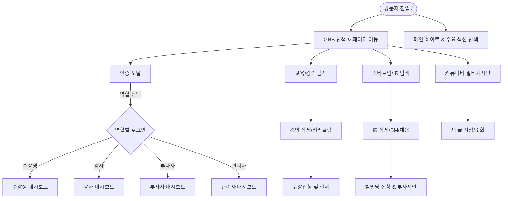

# 「AI로 창업하라」 (Project Launch Bizs) E2E 테스트 계획서

> **문서 버전**: v1.0.0  
> **작성일자**: 2026-08-14  
> **테스트 대상 환경**: Local / CI (`http://localhost:3000`)  
> **테스트 프레임워크**: Playwright Test (`@playwright/test`)  
> **참조 가이드**: `docs/bizs/menus.md`, `docs/bizs/biz_flows.md`, `docs/agent/rules/07_TEST.md`, `playwright-test-planner.md`

---

## 1. 개요 및 테스트 목표

본 E2E 테스트 계획서는 「AI로 창업하라」 올인원 창업 플랫폼의 전체 사용자 여정(교육 → 팀 빌딩 → IR/투자 → 대시보드 → 관리자 통제) 및 백엔드 API의 무결성을 검증하기 위해 작성되었습니다.

### 핵심 목표
1. **Critical Path 완결성 검증**: 핵심 비즈니스 흐름(로그인, 강의 수강신청, IR 스타트업 팀빌딩 지원, 커뮤니티 작성, 관리자 승인)의 정상 작동 보장.
2. **역할 기반 접근 제어(RBAC) 검증**: 4종 사용자 역할(`student`, `instructor`, `investor`, `admin`)별 UI/기능 권한 격리 및 비인가 접근 차단 확인.
3. **Negative & Edge Cases 포괄**: 비로그인 접근 차단, 유효하지 않은 폼 제출, 검색 결과 없음(Empty State), API 오류 응답 처리 검증.
4. **독립적·안정적 실행 보장**: 테스트 간 상태 의존성 없이 병렬 및 임의 순서로 실행 가능하도록 설계.

---

## 2. 테스트 아키텍처 및 환경 구성

### 2.1 실행 환경
- **웹 서버**: Express.js + Vite 개발 서버 (`http://localhost:3000`)
- **브라우저 엔진**: Chromium (Playwright 기본 구성)
- **테스트 디렉토리**: `./tests/e2e/*.spec.ts`
- **테스트 명세 위치**: `./tests/e2e_test_plan.md`, `./tests/integration_spec.md`

### 2.2 공통 로케이터 및 단정(Assertion) 원칙
- **User-Centric Locator 우선**: `getByRole()`, `getByText()`, `getByPlaceholder()`, `locator('h1, h2, h3')` 등 실제 사용자가 인지하는 요소 기준 선택.
- **Auto-Waiting 활용**: 임의의 `sleep()`이나 `networkidle` 대기를 금지하고, 요소의 가시성(`toBeVisible()`), 텍스트 포함(`toContainText()`) 등 명시적 비동기 단정문 사용.
- **독립성(Isolation)**: 각 테스트 케이스는 `test.beforeEach`에서 초기 페이지(`page.goto('/')`)로 이동하여 독립된 컨텍스트에서 수행.

---

## 3. 핵심 사용자 흐름 (Critical Paths) 매핑



---

## 4. 모듈별 상세 E2E 테스트 시나리오

---

### 시나리오 1. GNB 네비게이션 및 공통 레이아웃

- **테스트 파일 대상**: `tests/e2e/gnb_navigation.spec.ts`
- **대상 경로**: `http://localhost:3000/`
- **주요 검증 포인트**:
  - GNB 로고, 핵심 메뉴 4종(`홈`, `교육/강의`, `스타트업/IR`, `커뮤니티`), 로그인 버튼 노출 여부
  - 각 메뉴 클릭 시 해당 화면으로의 상태 전환(`currentPage`) 및 Active 스타일 적용
  - 비로그인 상태에서 [대시보드] 메뉴가 미노출되는지 확인

#### 1.1 Happy Path
1. **단계**: 메인 페이지 접속 (`/`)
2. **동작**: GNB의 `교육/강의` 버튼 클릭
3. **기대 결과**: URL 화면에 "교육 / 강의" 타이틀과 카테고리 필터가 표시됨.
4. **동작**: GNB의 `스타트업/IR` 버튼 클릭
5. **기대 결과**: 화면에 "스타트업 / IR" 타이틀과 스타트업 카드 목록이 표시됨.
6. **동작**: GNB의 `커뮤니티` 버튼 클릭
7. **기대 결과**: 화면에 "커뮤니티" 타이틀과 멀티 게시판 탭이 표시됨.
8. **동작**: GNB의 로고 또는 `홈` 버튼 클릭
9. **기대 결과**: 메인 랜드 페이지의 히어로 배너("AI로 창업의 모든 것을")로 복귀함.

---

### 시나리오 2. 메인 랜드 페이지 & 비즈니스 진입점

- **테스트 파일 대상**: `tests/e2e/main_page.spec.ts`
- **대상 경로**: `http://localhost:3000/`
- **주요 검증 포인트**:
  - 히어로 배너 텍스트, CTA 버튼(`강의 둘러보기`, `무료 가입하기`)
  - 진행 중인 주요 강의 섹션 카드 및 `[전체 보기]` 클릭 시 강의 페이지 이동
  - 주목받는 스타트업 섹션 카드 및 `[전체 보기]` 클릭 시 IR 페이지 이동
  - 최근 소식/공지사항 섹션 및 `[전체 보기]` 클릭 시 커뮤니티 이동

#### 2.1 Happy Path
1. **단계**: 메인 페이지 접속
2. **동작**: 히어로 배너 내 `[강의 둘러보기]` 버튼 클릭
3. **기대 결과**: `교육/강의` 페이지로 즉시 전환되고 강좌 목록이 나타남.
4. **동작**: `홈`으로 복귀 후 '주목받는 스타트업' 섹션의 첫 번째 스타트업 카드 클릭
5. **기대 결과**: 해당 스타트업의 상세 IR 페이지로 전환됨.

---

### 시나리오 3. 인증(Auth) 및 4종 역할 기반 접근 제어 (RBAC)

- **테스트 파일 대상**: `tests/e2e/auth_roles.spec.ts`
- **대상 경로**: GNB `[로그인]` 모달
- **주요 검증 포인트**:
  - 로그인/회원가입 모달 열기/닫기 인터랙션
  - 4개 역할(`수강생`, `강사`, `투자자`, `관리자`) 데모 빠른 로그인 동작
  - 로그인 성공 후 GNB 프로필 뱃지 변경 및 권한별 메뉴 활성화
  - 로그아웃 후 비로그인 상태로 복귀 및 세션 데이터 초기화

#### 3.1 Happy Path
- **수강생 로그인**:
  1. `[로그인]` 클릭 → 모달 내 `[수강생]` 빠른 로그인 클릭
  2. 모달이 닫히고 GNB에 `수강생` 뱃지 및 `[대시보드]` 메뉴 활성화
  3. `[대시보드]` 클릭 시 "수강생 대시보드" 및 `내 강의실`, `프로젝트 & 팀 빌딩` 탭 노출
- **강사 로그인**:
  1. `[로그인]` 클릭 → `[강사]` 빠른 로그인 클릭
  2. `[대시보드]` 클릭 시 "강사 대시보드" 및 `내 강의`, `수강생 관리 (CRM)`, `정산 관리` 탭 노출
- **투자자 로그인**:
  1. `[로그인]` 클릭 → `[투자자]` 빠른 로그인 클릭
  2. `[대시보드]` 클릭 시 "투자자 대시보드" 및 `관심 스타트업`, `AI 추천 매칭` 탭 노출
- **관리자 로그인**:
  1. `[로그인]` 클릭 → `[관리자]` 빠른 로그인 클릭
  2. GNB에 `[관리자]` 전용 메뉴 노출 및 클릭 시 "플랫폼 관리자 대시보드" 노출

#### 3.2 Negative & Edge Cases
- **비로그인 대시보드 접근 차단**:
  1. 비로그인 상태에서 GNB에 대시보드 메뉴가 보이지 않음을 검증.
- **모달 닫기 제어**:
  1. 로그인 모달 오픈 후 우측 상단 `X` 버튼 클릭 시 모달이 닫히고 화면이 정상 유지됨.

---

### 시나리오 4. 교육/강의 탐색, 필터링 및 수강신청/결제

- **테스트 파일 대상**: `tests/e2e/courses.spec.ts`
- **대상 경로**: `currentPage = 'courses'`
- **주요 검증 포인트**:
  - 카테고리 필터링 (`전체`, `AI 모델링`, `비즈니스 기획`, `마케팅`, `개발`, `디자인`)
  - 실시간 키워드 검색 (Search)
  - 강의 상세 페이지 전환 (커리큘럼 탭, 수강후기 탭)
  - 비로그인 / 로그인 사용자별 `[수강 신청하기]` 분기 처리

#### 4.1 Happy Path
1. **단계**: `교육/강의` 탭 이동
2. **동작**: `AI 모델링` 필터 버튼 클릭
3. **기대 결과**: "AI 프로덕트 매니저 부트캠프" 등 해당 카테고리 강의만 필터링되어 노출됨.
4. **동작**: 강의 카드 클릭하여 상세 화면 진입
5. **기대 결과**: 강의 타이틀, 강사 정보, 커리큘럼 주차별 목록 표시.
6. **동작**: `수강생`으로 로그인된 상태에서 `[수강 신청하기]` 클릭
7. **기대 결과**: 수강 신청 확인 및 결제 팝업 오픈 → `[결제하기]` 클릭 시 수강신청 완료 처리.

#### 4.2 Negative & Edge Cases
- **비로그인 수강 신청 차단**:
  1. 비로그인 상태에서 강의 상세 진입 후 `[수강 신청하기]` 클릭
  2. **기대 결과**: 결제 팝업 대신 로그인 모달이 강제 오픈됨.
- **검색 결과 없음**:
  1. 검색 입력창에 존재하지 않는 강의명(예: `XYZ123NonExistent`) 입력
  2. **기대 결과**: "검색 결과가 없습니다" 메시지 노출.

---

### 시나리오 5. 스타트업/IR 탐색, 북마크 및 팀빌딩/채용 지원

- **테스트 파일 대상**: `tests/e2e/ir_pitching.spec.ts`
- **대상 경로**: `currentPage = 'ir'`
- **주요 검증 포인트**:
  - 분야별 필터링 (`AI/ML`, `핀테크`, `헬스케어`, `에듀테크`, `SaaS` 등)
  - 스타트업 상세 정보 (비즈니스 모델, 해결하는 문제, 솔루션, 팀원 구성)
  - 북마크(찜) 토글 동작
  - 채용 중인 스타트업 대상 `[팀원 모집 신청]` 또는 `[투자 제안하기]` 모달 인터랙션

#### 5.1 Happy Path
1. **단계**: `스타트업/IR` 탭 이동
2. **동작**: 분야 필터 `헬스케어` 클릭
3. **기대 결과**: 헬스케어 관련 스타트업 카드만 필터링됨.
4. **동작**: 스타트업 카드 클릭하여 상세 페이지 진입
5. **기대 결과**: 팀 소개, 해결하는 문제, 비즈니스 모델, 팀원 목록 정상 렌더링.
6. **동작**: 투자자 계정으로 로그인 후 `[투자 제안하기]` 클릭
7. **기대 결과**: 투자 제안 모달 오픈 → 제안 내용 입력 후 제출 → "제안이 성공적으로 전송되었습니다" 안내 확인.

#### 5.2 Negative & Edge Cases
- **비로그인 지원/제안 차단**:
  1. 비로그인 상태에서 `[팀원 모집 신청]` 클릭 시 로그인 모달 오픈 확인.
- **검색 결과 없음**:
  1. 검색창에 임의의 텍스트 입력 시 빈 상태 UI 검증.

---

### 시나리오 6. 커뮤니티 멀티 게시판 & 새 글 작성

- **테스트 파일 대상**: `tests/e2e/community.spec.ts`
- **대상 경로**: `currentPage = 'community'`
- **주요 검증 포인트**:
  - 멀티 게시판 탭 (`전체`, `공지사항`, `팀 빌딩`, `Q&A 자유게시판`) 필터링
  - 비로그인 상태에서 글쓰기 버튼 클릭 시 동작
  - 로그인 상태에서 `[새 글 작성]` 모달 열기, 입력, 등록 후 목록 즉시 반영

#### 6.1 Happy Path
1. **단계**: `수강생`으로 로그인 후 `커뮤니티` 탭 이동
2. **동작**: `[새 글 작성]` 버튼 클릭
3. **기대 결과**: 작성 모달 오픈 (게시판 선택 드롭다운, 제목 입력창, 내용 입력창).
4. **동작**: 제목에 "E2E 자동화 테스트 게시글", 내용에 "Playwright 검증용 본문" 입력 후 `[등록]` 클릭
5. **기대 결과**: 모달이 닫히고 게시글 목록 상단에 작성한 게시글이 즉시 렌더링됨.

#### 6.2 Negative & Edge Cases
- **비로그인 글작성 차단**:
  1. 비로그인 상태에서 `[새 글 작성]` 클릭 시 로그인 모달 노출.
- **빈 입력값 제출 방지**:
  1. 제목이나 내용이 빈 상태에서 등록 버튼 클릭 시 등록되지 않고 폼이 유지됨.

---

### 시나리오 7. 역할별 대시보드 종합 기능

- **테스트 파일 대상**: `tests/e2e/dashboards.spec.ts`
- **주요 검증 포인트**:
  1. **수강생 대시보드**: 수강 강좌 진도율 바, 프로젝트 관리, 알림 내역 확인
  2. **강사 대시보드**: 내 강의 목록, 수강생 CRM 진도 현황, 정산 통계, `[신규 강좌 개설]` 모달
  3. **투자자 대시보드**: 북마크한 스타트업 목록, AI 추천 매칭 스코어 표시, 보낸 제안 상태
  4. **관리자 대시보드**: 플랫폼 KPI 지표 카드, 회원 권한 변경 드롭다운, 강의 승인/반려 버튼, 멀티 게시판 생성기 모달

#### 7.1 Happy Path
- **강사 신규 강좌 개설**:
  1. 강사 로그인 → 대시보드 이동 → `[신규 강좌 개설]` 클릭
  2. 강좌 등록 모달 오픈 확인
- **관리자 회원 관리 및 강의 승인**:
  1. 관리자 로그인 → `[관리자]` 탭 이동
  2. `회원 관리` 탭에서 특정 회원의 권한 변경 드롭다운 조작
  3. `강의/콘텐츠 관리` 탭에서 승인 대기 강의 승인 처리 확인
  4. `게시판 관리` 탭에서 `[새 게시판 만들기]` 모달 오픈 확인

---

### 시나리오 8. 백엔드 REST API 무결성 및 AI 연동

- **테스트 파일 대상**: `tests/e2e/api_integration.spec.ts`
- **엔드포인트**:
  - `GET /api/health`
  - `POST /api/diagnosis`
  - `POST /api/innovation-chat`
- **주요 검증 포인트**:
  - 헬스 체크 정상 200 OK `{ status: "healthy" }` 반환
  - 필수 파라미터 누락 시 400 Bad Request 에러 반환 및 에러 메시지 검증

#### 8.1 API Test Cases
- `GET /api/health`: 200 OK 및 JSON 객체 반환 검증
- `POST /api/diagnosis`: 페이로드 누락 시 400 status & `Survey answers are required.` 메시지 검증
- `POST /api/innovation-chat`: 빈 메시지 전송 시 400 status & `Message is required.` 메시지 검증

---

## 5. E2E 테스트 케이스 추적성 매트릭스 (Traceability Matrix)

| 번호 | 테스트 스위트 파일 | 연관 화면 / 컴포넌트 | 테스트 케이스 수 | 주요 대상 |
|---|---|---|:---:|---|
| **TC-01** | `gnb_navigation.spec.ts` | GNB, Header, Footer | 4 | GNB 탭 이동, 반응형 메뉴, 로고 링크 |
| **TC-02** | `main_page.spec.ts` | MainPage (홈 화면) | 3 | 히어로 배너, 주요 강의 슬라이더, 스타트업 바로가기 |
| **TC-03** | `auth_roles.spec.ts` | AuthModal, RBAC Router | 6 | 로그인/회원가입 토글, 4종 역할 빠른 로그인, 로그아웃 |
| **TC-04** | `courses.spec.ts` | CoursePage, PaymentModal | 5 | 카테고리 필터링, 검색, 상세 커리큘럼/리뷰, 수강신청 |
| **TC-05** | `ir_pitching.spec.ts` | IRPage, TeamModal | 5 | 스타트업 탐색, 분야 필터, BM 상세, 북마크, 팀빌딩 지원 |
| **TC-06** | `community.spec.ts` | CommunityPage, WriteModal | 4 | 멀티 게시판 탭 전환, 새 글 작성, 유효성 검사 |
| **TC-07** | `dashboards.spec.ts` | 4종 Dashboards, Admin | 5 | 수강생/강사/투자자/관리자 대시보드 탭 및 관리 액션 |
| **TC-08** | `api_integration.spec.ts` | Express Server API | 3 | `/api/health`, `/api/diagnosis`, `/api/innovation-chat` |

---

## 6. 테스트 자동화 실행 및 CI/CD 운영 지침

### 6.1 로컬 실행 명령어
```bash
# 1. 전체 E2E 테스트 일괄 실행 (Headless)
npm run test:e2e

# 2. 특정 시나리오 파일 단독 실행
npx playwright test tests/e2e/auth_roles.spec.ts

# 3. 브라우저 디버그 모드로 단계별 실행
npx playwright test --debug

# 4. 테스트 결과 HTML 리포트 확인
npx playwright show-report
```

### 6.2 실패 시 자가 치유(Self-Healing) 규칙
- 실패 발생 시 `playwright-test-healer` 가이드에 따라 다음 3단계를 수행:
  1. **실패 지점 로케이터 검증**: 텍스트 변경(예: `강의` ➔ `교육/강의`) 여부 확인
  2. **비동기 대기 조건 정비**: `waitFor`, `toBeVisible` 등 조건부 단정 추가
  3. **재실행 검증**: 단일 테스트 재실행 후 전체 테스트 스위트 회귀 검증

---
